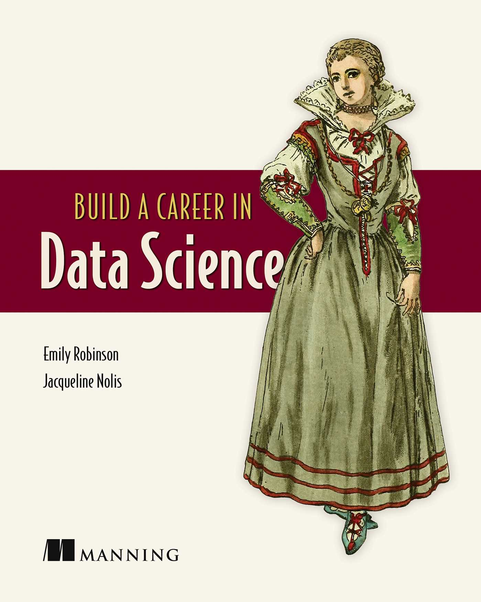
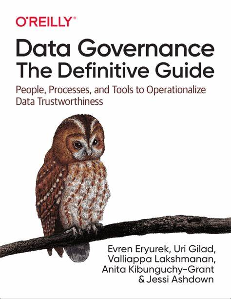

# QMB6617S25

QMB6617: Business Analytics for Managers

## Course Description

The focus of this course is on the use of business analytics from the perspective of the manager. The first half of the course concentrates on the management of business analytics projects, assuming that resources are available to carry out the project, with a focus on planning the analytical workflow, tracking progress, evaluating models, interpreting results, and monitoring performance of models in production. The second half of the course concentrates on leadership within business analytics organizations, to ensure that resources are available to carry out analytical projects, from the infrastructure required to the employees conducting the analysis.

## Course Overview

In the first two weeks of the course, we will provide an overview of the end-to-end model-building process through several examples. We will review the various roles and responsibilities within a team of analysts. We will plan the workflow for an analytical project designed to answer a business question. In the next two weeks, we will then discuss the execution of the plan, followed by evaluation, testing, model selection, and interpretation of the results. 

Many models are estimated for a single business decision; others are used on a continuous basis, which is the focus during the next two weeks. Once a model is put into production, the manager must monitor the performance of the model over time. This monitoring takes place over three dimensions: the distribution of the inputs to the model, the variation in the coefficients within the model, and the accuracy of the predictions of the model. The results of these procedures are used to make a recommendation to either rebuild a model or make modifications in response to any degradation of performance. We conclude the course with retrospective exercises to foster a cycle of improvement for future projects.

In the second half of the course, we will first cover an overview of the competitive landscape within the analytics profession. We will start with an overview of the various roles and responsibilities within a team of analysts, and follow the career progression from interviewing, onboarding, and performance, as well as fostering the progression to leadership positions within a company. In later weeks, we will focus on data governance: the processes for the management of data within an organization. These procedures ensure the quality of data, as well as the security and privacy of customer data. The course concludes with a tour of the roles and responsibilities of leaders within the analytics profession. 

## Learning Objectives

After completing this course, the student is expected to be able to: 

-	Understand the competitive landscape within the business analytics profession, as well as the lifecycle of adoption of analytics technologies, 

-	Understand the various roles and responsibilities within a team of analysts,
-	Plan an analytical project to answer a business question

-	Evaluate the accuracy of the statistical analysis produced by your employees, 

-	Understand the procedures for implementing a model into production, 

-	Monitor the performance of a model once put into production, and

-	Understand the broader strategic considerations of your project, including the relationship to downstream decisions, as well as matters of ethics and privacy in the handling of data. 

-	Manage the technical implications of working within a complex ecosystem of analytics, including the pipeline from model-building to production, 

-	Specify a system of procedures to ensure the security of data and model assets, and

-	Understand the broader strategic considerations of managing a portfolio of analytical projects, including the interactions among large teams and between various processes, as well as matters of ethics and privacy in the handling of data.  

## Enrollment Requirements

Admission to the Business Analytics Track of the Professional MBA (PMBA) program, with previous coursework including ECO6416: Applied Business Research Tools, QMB6315-6: R and Python for Business Analytics, QMB 6304: Data Visualization. 

## Textbooks

*Managing Machine Learning Projects*, by Simon Thompson. Manning Publications Co.: Shelter Island, NY, 2023 (ISBN: 978-1633439023).

*Build a Career in Data Science*, by Emily Robinson and Jacqueline Nolis. Manning Publications Co.: Shelter Island, NY, 2020 (ISBN-13: 978-1617296246, ISBN-10: 1617296244).

*How to Lead in Data Science*, by Jike Chong and Yue Cathy Chang. Manning Publications Co.: Shelter Island, NY, 2021 (ISBN: 978-1617298899).

*Data Governance: The Definitive Guide*, by Eryurek, Gilad, Lakshmanan, Kibunguchy-Grant, and Ashdown. O’Reilly Media, Inc.: Sebastopol, CA, 2021 (ISBN: 978-1-492-06349-0).

## After This Course

What can you do with the skills you learn in this course? 
There are quite a few options to apply Python and R programming to 
business problems, 
and many opportunities for those who can manage teams of employees with these skills. 
The landscape of business analytics roles can be
classified according to the following taxonomy of positions. 

The hourglass shape indicates the relative proportions of performers in each role
(and, in fact, understates the proportions to a large degree). 
Although many of you would like to attain a position with a prestigious job title, 
there is plenty of work out there in some of the less glamorous jobs that need to be done, with some job titles you haven't heard of. 

Many of the positions available to students of this series of courses can apply the skills to two main areas. 
One is to use SQL and File IO skills to organize data for measuring business success
and for statistical modeling. 
This is more closely related to the administration of databases and the "Data Engineering" role. 
They keep the plumbing working, so to speak, keeping the data flowing through the pipes.

On the other side, closer to the business operation, 
many analysts use data to answer business questions and to make decisions. 
These roles can be broadly labeled as "Business Analyst" but often have titles
relating to a particular business function, such as marketing or operations. 
These analysts are typically the consumers of the database
who organize and analyze data for statistical modeling 
to answer business questions
and monitor business performance. 

As a junior job-seeker, fresh out of college, 
your goal should be to find a position *somewhere* on this landscape
and then make sure your on-the-job performance record
will open the doors to the next position. 
This may be as some responsible for analyzing data, such as a statistician, 
data analyst, or data scientist, or someone responsible for preparing data, 
such as a data analyst or data engineer. 
As a senior job-seeker, you might be charged with managing a team of 
statisticians, data scientists, or data engineers, who apply these skills to solve business problems.

