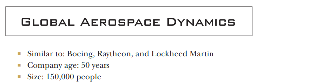

# Chapter 2: Data Science Companies

## Introduction

This chapter covers
- Types of companies hiring data scientists
- The pros and cons of each company type 
- The tech stacks you may see at different jobs

### Introduction to Data Science Roles

Data science includes various roles: 
- research scientist, 
- machine learning engineer, 
- business intelligence analyst, etc.

Work varies by role and is influenced by the company.

Influence of Company Characteristics:
- Company size (big vs. small), 
- industry (tech vs. traditional), and 
- age (young vs. established) 

These characteristics affect:
- Project focus
- Supporting technology
- Team culture

### Aim of the Chapter:

To provide insight into typical companies for data scientists.

Presentation of Fictional Companies:
- Five fictional companies will be showcased that hire data scientists.
- These companies are based on research and experiences.
- The examples illustrate principles applicable across the industry.
- Understanding these archetypes aids in assessing potential employers.

## MTC: Massive tech company

Company Overview
- MTC is a tech company with a large presence.
- Sells cloud services and consumer productivity software (e. g. , text editor).
- Offers server hardware and various business solutions.
- Has accumulated significant wealth to invest in R&D.

Research and Development
- Funds unusual R&D projects like self-driving scooters and VR technology.
- R&D efforts often make headlines.

Technical Workforce
- Most employees are engineers.
- Focus on incremental product improvements and feature additions.
- Work on user interface enhancements and new product versions.

### Your team: One of many in MTC

Data Science Teams at MTC
- Nearly a thousand data scientists are spread across the company.
- Data scientists are grouped into teams by product or division, or placed individually in non-data science teams.
- Examples of specific teams include:
- VR headset data scientists
- Marketing data scientists
- VR-headset marketing data scientists
- VR-headset supply chain data scientist

Onboarding Process
- New members are onboarded quickly with standard processes.
- New hires receive a laptop, data access, and training on special tools.

Team Dynamics
- Teams are large, consisting of experienced data scientists with varied tasks.
- Example tasks include:
- Creating reports and charts for executives
- Building machine learning models for software developers
- Team size presents challenges:
- Collaboration with many experts
- Limited familiarity with specific individual tasks
- Established hierarchy exists, where senior members often have more influence.

Work Balance and Innovation
- Team work includes routine tasks like reports and updates, alongside innovative projects.
- Managers balance requests for immediate data science work with long-term innovative initiatives.
- MTC's financial resources allow for greater investment in innovation and research and development.

### The tech: Advanced, but siloed across the company

Overview of Technology Diversity at MTC

- MTC is a large organization that relies on various technologies.
- Different departments utilize different data storage technologies.
- Example: One uses Microsoft SQL Server; another uses Apache Hive.
- Data indexing varies by department, leading to disjointed records.

Challenges for Data Scientists at MTC

- Data scientists must learn MTC-specific querying and data usage methods.
- Knowledge gained is often not transferable to other companies.

Tools and Technologies Used

- Data scientists may use multiple tools, including:
- Major programming languages like R and Python (widely supported).
- Less common languages, depending on managerial approval (e. g. , Haskell).
- Rare usage of paid languages like SAS or SPSS.

Machine Learning Stack Variability

- The machine learning stack differs across departments.
- Some teams use advanced methods (microservices, containers) for model deployment.
- Others rely on outdated systems.

### The pros and cons of MTC

Job Overview at MTC
- Working at MTC as a data scientist is prestigious.
- There is a clear understanding of the data scientist role within the company.
- Support network exists due to a high number of data scientists.
- Access to required resources is generally straightforward.
- Rarely experience isolation or difficulty in getting help.

Challenges of the Role
- Complex tech stack makes navigation difficult.
- Projects may use languages or systems you aren’t familiar with.
- Harder to stand out due to a large number of data scientists.
- Fewer unique project opportunities as many are already started.

Job Security
- MTC offers more job security than a startup environment.
- Layoffs are possible but less common.
- Managers usually prefer reassigning employees over firing them.

Specialization
- Many specialized roles exist within the company (e. g. , data engineers, market researchers).
- This allows for delegation of tasks outside your expertise.
- Limits opportunities to expand your skill set.

Bureaucracy
- Getting approvals for projects and resources can be time-consuming.
- Projects may be canceled due to internal conflicts among executives.

Opportunities
- Great for data scientists interested in solving big problems with new techniques.
- Budget available for innovative solutions.
- Contributions are valued, even if not in a decision-making role.

Suitability for Decision-Makers
- Not ideal for data scientists wanting to lead or decide independently.
- Must adhere to established protocols and structures.

## HandbagLOVE: The established Retailer

Company Overview
- HandbagLOVE is a retail chain with 250 locations in the U. S.
- Specializes in selling purses and clutches.
- Known for expertise in store layout and customer experience.

Technology Adoption
- Slow to adopt new technology.
- Took time to establish its first website and app.

Sales Decline
- Recent sales drop due to competition from Amazon and online retailers.
- Acknowledgment of the need for technological improvement.

Recent Initiatives
- Investing in an online app and an Amazon Alexa skill.
- Utilizing data for better insights.

Data Science Team Development
- New data science team formed from existing financial analysts.
- Supplemented by trained data scientists for more advanced insights.
- Implements sophisticated products like monthly forecasts and interactive dashboards.
- Developed customer segmentation for marketing purposes.

Machine Learning Efforts
- Created machine learning models for reports and analysis.
- Still reliant on third-party machine learning products for recommendations.
- Uncertainty about the timeline for developing internal machine learning capabilities.

### Your team: A small group struggling to grow

Data Science Team Structure and Skills
- Team focuses on data scientists who can do reporting
- Members often self-teach modern statistical and machine learning methods
- Self-learning leads to interesting techniques but may result in inefficiencies or inaccuracies

Career Progression
- HandbagLOVE provides general paths for data scientists to advance to senior roles
- Career paths are not specific to data science; they are borrowed from other fields
- Promotion depends on convincing managers and getting their approval
- Growth of the team may allow members to quickly become seniors

Team Influence and Respect
- Data science team provides reports and models for various departments
- Team is well-known and respected within the company
- High camaraderie among team members
- Data scientists have more influence compared to similar positions in other companies
- Team members often meet and converse with top-level executives

### The tech: A legacy stack that's starting to change

Technology at HandbagLOVE
- Common phrase: "Well, that’s how it’s always been. "
- Order and customer data stored in Oracle database for 20 years.
- System has many modifications and is pushed beyond its limits but still functions.

Data Collection and Storage
- Additional data collected from website, customer care calls, and marketing emails.
- All data stored on-premises, not in the cloud.
- IT team responsible for system maintenance.

Data Management
- Central database allows freedom to connect and analyze data.
- Queries can be slow and may overload the system, but workarounds exist.
- Most analyses performed on personal laptops.
- Difficulty in accessing powerful computers for model training.

Machine Learning
- Company lacks a machine learning tech stack.
- No in-house machine learning capabilities.

### The pros and cons of HandbagLOVE

Company Dynamics
- HandbagLOVE offers significant influence and responsibility for data scientists.
- Employees can propose, build, and implement ideas with minimal persuasion needed.
- The company size and the newness of data science contribute to this empowering environment.
- Limited support from colleagues means individuals must solve problems independently.

Technology Challenges
- The tech stack is outdated, leading to time-consuming workarounds.
- Lack of technical support prevents the adoption of newer technologies.
- If new technologies cannot be set up independently, employees must manage with existing tools.

Salary Expectations
- Data scientist salaries at HandbagLOVE are lower compared to larger tech companies.
- Limited budget means the company cannot offer high paychecks.
- Salaries are above average for similar roles within the company.

Work Environment
- Ideal for data scientists who prefer freedom and standard statistical methods.
- Basic skills are sufficient; advanced machine learning expertise may not be utilized.
- Those seeking cutting-edge projects or colleagues with advanced knowledge may not find a fit.

## Seg-Metra: The early-stage startup

Company Overview
- Seg-Metra is a young company.
- Sells a product for optimizing websites for unique customer segments.
- Targets business clients, not consumers.

Initial Success
- Secured a few big-name clients early on.
- This success attracted venture capital funding.
- Now has millions of dollars to scale and improve the product.

Proposed Improvement
- Founders are advocating for the addition of basic machine learning methods.
- Pitched to investors as "cutting-edge AI. "

Hiring Needs
- Looking for machine learning engineers to develop the proposed improvements.
- Need decision scientists to report on product usage and guide future improvements.

### Your team (what team?)

First Data Scientist Role
- A newly hired data scientist may be the first or among the first in the company.
- They likely report to the first data science hire.
- The team will have few or no established protocols or practices.

Leadership and Team Culture
- Direction comes from the first data scientist hire.
- If the leader is open and collaborative, team decisions will be collective.
- If the leader is controlling, decisions will be made unilaterally.

Team Dynamics
- An unstructured environment can foster strong camaraderie among team members.
- However, power dynamics may lead to potential emotional abuse.
- Small company size results in little accountability.

Work Experience
- The work can be fascinating or frustrating, varying from day to day.
- Data scientists may engage in pioneering analyses and engineering tasks.
- Some tasks can be grueling, especially under pressure (e. g. , preparing for investor demos).
- Poor data infrastructure may hinder usability despite available data.
- The chaotic work environment allows for rapid skill development.

### The tech: Cutting-edge technology that's taped together

Company Overview
- Seg-Metra is a young company.
- Not limited by old legacy technology.
- Aims to impress investors with its tech stack.

Technology Stack
- Utilizes modern software development methods.
- Employs advanced data storage and collection techniques.
- Data analysis and reporting tools are state-of-the-art.
- Data stored in cloud technologies, no on-prem solutions.
- Data scientists connect to databases for building machine learning models.
- Models run on AWS virtual machines with GPU processing.
- Uses modern software engineering for model deployment.

Challenges
- Fast growth leads to integration issues among technologies.
- Missing data in cloud storage causes delays.
- Overworked data engineers may not be readily available.
- Lack of a dedicated DevOps team hampers operations.
- Rapid installation of technology complicates monitoring efforts.

### The pros and cons of Seg-Metra

Advantages of Working at Seg-Metra
- Growing company offering interesting data science work
- Opportunities to learn quickly and develop essential skills
- Enhanced communication skills with non-data scientists
- Ability to make informed project decisions
- Exposure to the latest technologies
- Enjoyable job experience with newer tech
- Boost to résumé from learning cutting-edge tools
- Potential for valuable stock options if the company succeeds

Disadvantages of Working at Seg-Metra
- Long work hours, typically 50-60 hours per week
- High expectations for contributions from all employees
- Risk of a toxic work environment and employee burnout
- Low job security due to reliance on new clients and investors
- Possibility of layoffs or company closure without warning
- Younger workforce demographics may lack experience and diversity

Overall Assessment
- Great opportunity for rapid learning and tech exposure
- High workload and potential toxicity
- Suitable mainly for data scientists seeking experience before moving on

## Videory: The late-stage, successful tech startup

Company Overview
- Videory is a late-stage tech startup
- Operates a video-based social network
- Users can upload and share 20-second videos
- Recently went public, causing excitement

Performance
- Not as large as MTC but performing well
- Growing customer base each year

Data Analysis
- Data-savvy company
- Likely had data analysts or scientists since the start
- Data scientists conduct analyses and reporting to support the business
- Create machine learning models to match people with artists for commissions

### The team: Specialized but with room to move around

Company Overview: Videory
- Small company with all data scientists in one large department.
- Centralized data science model where all report to a data science manager.
- Central team assists other groups while setting its own priorities.

Role and Learning Opportunities
- Startup environment fosters daily learning and application of new concepts.
- Focus on setting up scalable data science processes to empower team.
- HR field requires spending time educating clients on solutions.
- Coordination with client IT departments for data pipeline integration is necessary.

Data Science Team Dynamics
- Specialization exists in machine learning, statistics, and analytics.
- Small size allows for flexibility in switching between specializations over time.
- Regular interactions through training sessions, meetings, and Slack channel.
- Some team members involved in long-term academic research with no immediate benefits.
- Subteams use different tools and some have PhDs, focusing on theoretical work.

### The tech: Trying to avoid getting bogged down in legacy code

Company Overview
- Videory has a lot of legacy code and technology.
- Likely has some internally developed tools.
- Aims to keep up with technological developments.

Planned Changes
- Plans to switch to a new system or supplement existing ones.

Data Science Environment
- Data scientists will query a SQL database for data.
- Business intelligence tools are present for non-data science users.
- Expect to learn new skills as a data scientist.
- Big data systems are in place to handle large volumes of data.

Technical Requirements
- SQL alone is insufficient; billions of events need processing monthly.
- May use Hadoop or Spark for custom data extraction beyond SQL.

Programming Languages and Tools
- Data science is typically conducted in R or Python.
- Assistance from experts is available if challenges arise.
- Machine learning is deployed using modern software development practices like microservices.

Work Environment
- Companies employ talented individuals using cutting-edge approaches.
- Videory is recognized as a successful startup.

### The pros and cons of Videory

Overview of Videory for Data Scientists

- Size: Good balance for mentorship and support among data scientists.
- Team Dynamic: Small enough to know everyone; fosters collaboration.
- Company Recognition: Work acknowledged by upper management (VPs and C-suite).
- Data Support: Data engineers available, but issues with data pipelines are not the data scientists' responsibility.

Challenges in a Large Organization

- Political Issues: Potential pressure to produce favorable numbers and face unrealistic expectations.
- Task Relevance: Risk of working on tasks that do not align with business needs.
- Direction: Possible feelings of wasted time and lack of direction amid changing priorities.

Opportunities for Growth

- Expertise Development: Chance to become an expert in specific areas, like time series analysis.
- Mentorship: Opportunities for teaching others if one enjoys mentoring.
- Continuous Learning: Availability of resources like papers or courses but may not align with personal focus areas.

Overall Assessment

- Benefits: Blends advantages of different company archetypes; supportive environment without excessive bureaucracy.
- Learning Opportunities: Ample learning chances, but role specialization limits exploration of all areas.
- Ideal for: Data scientists seeking a growing yet manageable environment without overwhelming options.

## Global Aerospace Dynamics: The giant government contractor

Company Overview
- Global Aerospace Dynamics (GAD) is a large and profitable company.
- Generates tens of billions in revenue through government contracts.
- Develops a range of products including fighter jets and intelligent traffic-light systems.
- Operates across the country with various divisions that often do not communicate.

Work Culture and Challenges
- GAD has a long history and many long-term employees.
- Slow to adopt data science practices despite data collection.
- Engineering divisions struggle to apply data in existing processes.
- High standards for code quality and testing make implementing machine learning models challenging.
- Company culture contrasts with the fast pace of the tech industry.

Emerging Changes
- Increase in articles about AI and machine learning.
- Executives at GAD are interested in hiring data scientists.
- Data scientists are being integrated into teams for:
- Analyzing engineering data for improved reporting.
- Building machine learning models for products.
- Assisting GAD customers with troubleshooting.

### The team: A data scientist in a sea of engineers

Roles and Responsibilities

- Average data scientist typically works alone on a team of engineers.
- May be two or three data scientists on a team.
- Responsible for analysis, model building, and product delivery.
- Engineers on the team often lack a strong understanding of data science.

Challenges Faced

- Limited resources when issues arise.
- Few people fully understand the data scientist's role.
- Many engineers have longstanding tenure and institutional knowledge.
- Resistance to change due to established practices and mindsets.

Work Environment

- Defense industry culture leads to less urgency in work.
- Employees often work less than 40 hours weekly.
- Stress arises from lack of tasks or boredom rather than overload.

Promotions and Raises

- Promotion and raise processes are formulaic to minimize bias.
- Advancement is largely based on tenure rather than performance.
- Hard work may lead to slight improvements in promotion timing or bonuses.
- High job security with rare firings among employees.

### The tech: Old, hardened, and on security lockdown

Technology Stack in GAD
- Technology is generally old and on-premise, not cloud-based
- Security protocols are strictly implemented
- Data includes sensitive topics like fighter-jet performance
- Prevention of data leaks is essential
- Legal accountability is prioritized over open-source solutions

Database Management
- Microsoft SQL Server is preferred despite its higher cost compared to PostGRES SQL
- GAD values support from Microsoft for security issues
- Data is stored in SQL Server databases managed by a cautious IT team
- Access to data is highly restricted

Data Scientist Operations
- Data scientists can access data but must use limited-access servers for Python
- Servers have restricted internet access to prevent data from being sent abroad
- Approval for open-source software is unlikely from IT and security
- This restriction complicates the work of data scientists

Deployment of Code
- Code is deployed using traditional methods
- GAD is slowly starting to adopt modern practices for deploying machine learning code

### The pros and cons of GAD

Pros of Working at GAD
- Data science jobs are slow, comfortable, and secure.
- Less rigorous pace leaves energy for evening activities.
- Ample free time during work to read data science blogs and articles without complaints.
- Fewer people questioning your work due to limited knowledge of data science.
- Job security is high; difficult to be fired due to legal liability concerns.

Cons of Working at GAD
- Limited opportunities to learn new skills compared to other companies.
- Likely to be assigned to a single project for many years.
- Technologies and tools can become mundane over time.
- Skills learned may be for outdated technology not useful elsewhere.
- Difficult to achieve promotions, even with job security.

Overall Impression of GAD
- Suitable for individuals who enjoy their team projects and prefer a comfortable work life.
- Many employees stay for decades due to comfort and job satisfaction.
- Not ideal for those seeking challenges and growth in their careers.

## Summary

When you’re looking at companies to work for, you’ll find that many of them are similar
to these companies in various ways. As you go through job applications and interviews,
it can be helpful to try to understand the strengths and weaknesses of working
at these companies (table 2.1).

