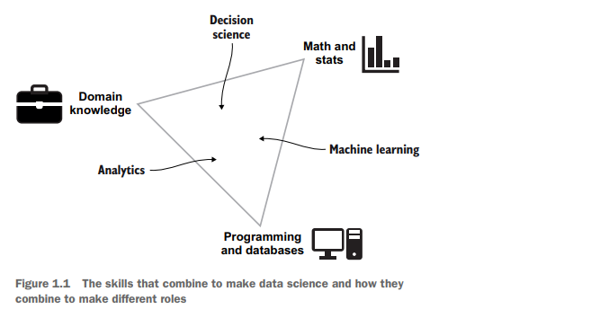
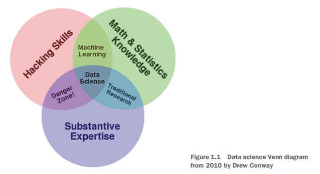
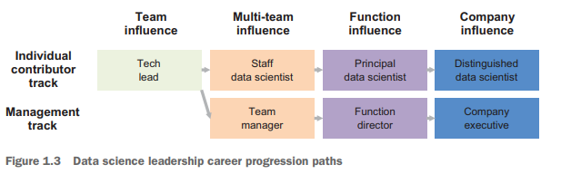

# Roles in Business Analytics

## Introduction

This chapter covers three topics
- An overview of the jobs in data science
- Learning what is expected of data scientists
- Examining the challenges of a data scientist’s
career progression

# Sec. 1.2: Data Science Jobs

## Different types of data science jobs 

Core Skills of Data Science
- Three core skills: analytics, machine learning, and decision science
- Skills can be mixed and matched for various data science jobs
- Each area serves a different purpose and delivers unique outcomes

Job Search Insights
- Focus on job descriptions over titles when looking for data science jobs
- Pay attention to interview questions
- Examine the backgrounds of individuals in data science roles
- Similar job titles may have different responsibilities
- Variation in titles may exist across companies

### Analytics

Role of an Analyst
- Takes data and presents it to relevant stakeholders
- Formats information for management to track progress on yearly goals
- Builds dashboards with features to filter data by country or product type
- Involves data cleaning and preparation
- Spotting and fixing data quality issues is part of the job
- Main decision-making is done by business partners

Skills and Responsibilities
- The role might be seen as outside data science due to less emphasis on statistics and machine learning
- Developing visualizations and data transformations requires skills akin to data science
- Tasks include creating automated dashboards to track subscriber changes over time
- Must determine appropriate data and transformation methods for clarity
- Creates compelling dashboards that update daily without errors

Summary of Analyst’s Work
- An analyst creates dashboards and reports that deliver data.

### Machine learning

Role of a Machine Learning Engineer
- Develops machine learning models and puts them into production.
- Optimizes algorithms for search results on e-commerce sites.
- Creates recommendation systems.
- Monitors model performance to ensure quality after deployment.
- Focuses more on programming work rather than visualizations.

Differences from Other Data Science Roles
- Work is primarily for machine use, not for human analysis.
- Often creates APIs for machine interaction.
- Closer to software development than traditional data science roles.

Coding Practices
- Must follow best coding practices for performance and collaboration.
- Code should be tested and easy for others to understand.
- Many come from a computer science background.

Example Task
- May need to create a model that predicts customer behavior on a website in real time.
- Involves using historical data, training a model, turning it into an API, and deploying it.
- Responsible for fixing issues if the model fails.

Summary Statement
- A machine learning engineer creates models that run continuously.

### Decision science

Role of a Decision Scientist
- Translates raw data into useful information for decision-making
- Requires deep knowledge of mathematical and statistical methods
- Familiar with business decision-making processes
- Creates visualizations to aid understanding for nontechnical audiences
- Code is often run once for specific analyses, allowing for inefficiencies

Understanding Company Needs
- Listens to the needs of other company members
- Generates beneficial information based on requests
- Example: Assists marketing director in selecting products for a holiday gift guide
- Investigates product sales, collaborates with research teams, and applies behavioral science

Deliverables
- Produces reports or presentations for product managers and executives

Statistical Decision-Making
- Uses statistics to aid decision-making under uncertainty
- Manages company’s experimentation analytics system
- Conducts A/B tests to assess effectiveness of changes

A/B Testing
- Randomly assigns users to different conditions (control vs treatment)
- Compares actions taken by users in each group
- Cautions against premature conclusions based on slight differences in metrics

Conclusion
- Decision scientists create analyses that lead to actionable recommendations.

### Related jobs

Additional Data Science Roles

- There are other data science roles beyond the main three types discussed.
- It is helpful to be aware of these distinct positions.
- Collaboration may be necessary with colleagues in these roles.
- The book content may be less pertinent for those interested in these additional roles.

#### BUSINESS INTELLIGENCE ANALYST

Business Intelligence Analyst Overview
- Role is similar to that of an analyst
- Uses less statistical and programming skills
- Common tool is Excel instead of Python
- Creates less complex outputs due to tool limitations

Job Considerations
- Frustration for those wanting to do machine learning or programming
- Limited opportunities for skill development
- Typically lower pay and prestige than data science jobs

Career Path
- Good entry point to becoming a data scientist
- Recommended for those with no business data experience
- Look for positions offering skill development in programming languages like R or Python

#### DATA ENGINEER

Data Engineer Role

- Focuses on maintaining data in databases
- Ensures accessibility of data for users
- Does not run reports, make analyses, or develop models
- Keeps data stored and formatted in well-structured databases

Responsibilities

- Maintains customer records in cloud databases
- Adds new tables as requested
- Builds backend components for internal experimentation systems
- Updates data processing flows for efficiency
- Develops and monitors batch and streaming environments

Skills Required

- Strong computer science skills required
- Many data engineers have backgrounds as software engineers

Comparison to Data Scientists

- Data engineers differ significantly from data scientists
- Data engineers are more rare and in demand

#### RESEARCH SCIENTIST

Research Scientist Role
- Develops and implements new tools, algorithms, and methodologies
- Tools primarily used by other data scientists in the company

Education Requirements
- Typically requires a PhD
- Common fields include computer science, statistics, quantitative social science, or related areas

Research Activities
- May spend weeks researching methods to enhance online experiments
- Aims for improvements like 1% more accuracy in image recognition for self-driving cars
- May develop new deep learning algorithms

Publication of Research
- Writes research papers that may not be used internally
- Helps increase company prestige and advance the field

# Chapter 1: What makes a successful data scientist?

## Sec 1.1: Data scientist expectations

The Data Science Venn Diagram:
- Drew Conway introduced the diagram in 2010.
- It highlights three essential skills for success in data science.

Three Pillars of Data Science Skills:
- Math and statistics knowledge.
- Hacking skills.
- Substantive expertise.

Dr. Conway later founded multiple technology companies, including Datakind, Sum,
and Alluvium. Countless blogs and books have since referenced the Venn diagram he
introduced. By 2021, over 200,000 DS practitioners worldwide earned the title of data
scientist. How has the field evolved?

### The Venn diagram a decade later

Updates on DS Venn Diagram
- Many original terms from 2010 are still valid but have seen updates and debates.
- Variations of the DS Venn diagram are plentiful in image searches.

Expansion of Data Scientist Role
- The role of a data scientist has significantly broadened since its start.
- By 2021, math and statistics knowledge has evolved into a general technology capability.
- Technology capability includes tools for effective project leadership, problem framing, data understanding, feature engineering, modeling strategies, and setting success expectations.

Hacking Skills Evolution
- Hacking skills have expanded to execution capabilities.
- Now includes practices for defining projects from vague requirements.
- Also involves prioritizing and planning projects while balancing trade-offs like speed vs. quality and safety vs. accountability.

Substantive Expertise Development
- Substantive expertise now means having expert knowledge to align projects with organizational goals.
- Must understand data source nuances and navigate structural challenges for successful project launches.

Challenges in Finding Qualified Data Scientists
- Difficult to find individuals who excel in all three pillars of a data scientist.
- Data scientists with academic backgrounds may only be strong in technology.
- Industry-experienced data scientists can learn execution practices but might lack in other areas.
- Seasoned practitioners with both domain expertise and experience are rare but highly valuable.

### What is missing?

Hiring Challenges in Data Science Teams
- Hiring practices had blind spots.
- Candidates often vetoed in final interviews or needed to be managed out.
- Failures were often labeled as “not a cultural fit. ”
- Important to analyze what “cultural fit” means in the Data Science (DS) field.

Understanding Culture in Data Science
- Distinction between DS culture, organizational culture, and industry culture is necessary.
- This book expands the assessment of data scientists beyond capabilities to include virtues.

Virtues in Data Science

Virtues are habits developed over time, 
with three key dimensions of virtues emphasized:
- Ethics: Standards of conduct to avoid breakdowns in work ethic.
- Rigor: Craftsmanship ensuring trust in results; results should be repeatable and testable.
- Attitude: Approach to workplace situations, emphasizing positivity, curiosity, and respect.

Practicing Virtues
- Virtues should be practiced in moderation.
- Excessive rigor can lead to analysis paralysis; too little can produce flawed conclusions.

## Sec. 1.2: Career progression in data science

Work Environment of Data Scientists

- In 2020, around 33% of data scientists worked in companies with 30 or more data scientists.
- Large companies, with mature processes for interviewing and career growth, make up 1% of all companies employing data scientists.
- 67% of data scientists are in companies with fewer than 30 team members, representing 99% of these companies.

Career Progression Challenges

- Career paths for data scientists in the majority of companies may not be clear.
- Many companies organize their data science functions in centralized or distributed structures.
- Distributed structures can limit career progression, as data scientists are often viewed as a support function.
- Lack of managers with data science expertise in distributed teams hinders growth opportunities.

Centralized Teams and Career Clarity

- In centralized teams, career progression may still be unclear without moving into management roles.
- The distinction in career stages is based on the scope of influence and positive organizational impact.

As of 2021, very few companies have established a formal DS career track, let alone
a DS individual contributor career development track.

# Chapter 16: Moving Up the ladder

The management option is what most people think of when they think about
career growth. Managers are the people who lead teams, including hiring and promoting,
setting strategy, and giving career mentoring. Principal data scientists are
people who are masters of their field, and companies rely on them to solve difficult
technical problems. Independent consultants are data scientists who have enough
skills and a large-enough network to be able to freelance for a living.

## The management track

Overview of Data Science Management

- Many data scientists consider management as a natural career path.
- Management roles often seem unclear despite common exposure to managers.

Key Responsibilities of a Data Science Manager

Determining the team’s work:
- Strategic decisions on large projects.
- Tactical decisions on specific product features.

Selecting team members:
- Responsible for hiring and layoffs with HR approval.
- Involves coordinating and participating in the interview process.

Mentoring team members:
- Assists individuals with unique challenges.
- Regular check-ins and guidance offered to team members.

Resolving team issues:
- Addresses obstacles that hinder the team's progress.
- Works to find solutions for issues like data access problems.

Managing projects:
- Keeps track of team work and ensures timelines are met.
- Maintains oversight even if a project manager is assigned.

Nature of Management Work

- Involves ongoing communication with team and external parties.
- Requires awareness of team and project status.
- Encompasses significant responsibilities and workload.
- Managers primarily focus on team support rather than technical tasks.
- Becoming a manager often means stepping away from hands-on data work.

### Benefits of being a manager

Perks of Being a Manager
- Influence the work being done, reducing unnecessary tasks
- Assign team projects that align with your vision
- Experience fulfillment from team success
- Significant say in team direction
- Limited control due to higher management and team inputs

Career Advancement
- Movement to management usually results in an initial pay raise
- Opens opportunities for senior roles (senior manager, director, vice president)
- Higher roles provide increased pay and broader leadership
- Potential to oversee fields beyond data science, like customer research or software development

Teaching and Helping Others
- Management role is ideal for those who enjoy teaching
- Focus on helping team members succeed and overcoming challenges
- Acts as a "business therapist" for team support

Sphere of Influence
- Final decision-making power on product development and expansion
- Greater influence with higher company positions
- Possibility to run a company in the future

### Drawbacks of being a manager

Lack of Time for Data Science
- Focus on talking about, mentoring, and strategizing data science, not doing it.
- Daily responsibilities include meetings for strategy, stakeholder relations, and employee support.

Loss of Passion and Skill
- Transition away from hands-on data science work after training.
- Risk of becoming out of practice and disconnected from new developments in the field.

Constraints from Higher Management
- Possible rejection of good team strategy ideas by superiors.
- Need to uphold a positive attitude despite disagreement, risking team morale.

Increased Worries and Stress
- Responsible for personal performance and team's performance.
- Concerns about career satisfaction, funding, and project stability.
- Management can be stressful for those who struggle with work-life balance.

New Skill Requirements
- Managing people requires different skills than those used in data science.
- Transitioning to management involves starting over as a beginner, which can be stressful.
- The path to becoming a proficient manager is challenging and time-consuming.

## The principal data scientist track

Overview of Principal Data Scientist Role
- A principal data scientist is an expert in data science within an organization.
- They assist others with technical tasks while also performing their own data science work.
- The role includes mentoring and supporting junior data scientists.

Career Progression
- Typically starts as a junior data scientist, advances to senior data scientist, and grows into the principal role.
- Experience gained leads to a better understanding of problem-solving and solutions.
- They assist colleagues across the company with data science-related issues.

Key Responsibilities

Influencing Data Science Strategy
- Develops plans for addressing data science problems.
- Makes decisions on feasibility of methodologies like models or neural networks.

Mentoring Junior Data Scientists
- Shares knowledge and expertise with less experienced team members.
- Supports their growth and development in the field.

Finding Solutions to Difficult Problems
- Responsible for solving challenging technical issues or declaring them unsolvable.

Working Environment
- The role retains a focus on data science work, suitable for those passionate about the field.
- Involves participation in conferences and engagement with the data science community.

Work Dynamics
- Rarely engages in individual-contributor tasks like single analyses or model creation.
- Focuses on coordinating and overseeing projects worked on by junior and senior data scientists.
- Requires maturity, responsibility, and quick adaptability to new areas in data science.

### Benefits of being a principal data scientist

Main Role and Responsibilities

- Principal data scientists work on interesting and unique problems.
- Involved in trying new data science approaches not attempted before.
- Participate in integrating complex technical stacks.
- Assist when projects struggle to make models work.
- Experiences can be fulfilling and validating.

Team and Manager Relationships

- Team recognizes principal data scientists' limited time for simple tasks.
- Managers value the importance of keeping up with technology.
- Likely funding for conferences and exploring new technologies.
- Opportunities to present at conferences to promote the company.
- Trust from the manager to use time and budget effectively.

Mentorship and Collaboration

- Opportunity to mentor junior data scientists.
- Share different approaches and help refine their ideas.
- Identify potential problems in data science methods.

Empowerment in Decision-Making

- Empowered to make key decisions on models and project structure.
- Higher likelihood of projects succeeding due to expertise.
- Junior data scientists may not have the same level of decision-making power.

### Drawbacks of being a principal data scientist

Responsibilities and Challenges of a Principal Data Scientist

- Lack of immediate help: No mentor or senior data scientist available for guidance.
- Unique problems: Often face unusual issues with no existing solutions online.
- Independent work: Must solve problems without delegating to others.

Engagement with Data Problems

- Involvement in interesting issues: Exposure to complex data science challenges.
- Frustrating tasks: Handle poorly formatted datasets and unknown schemas.

Workload and Work-Life Balance

- High demand: Vast knowledge leads to a busy schedule with more work than time.
- Delegation limits: Cannot pass on interesting projects due to workload.
- Risk of overworking: Easy to work longer hours and still feel unproductive.
- Difficulty in taking breaks: Hard to maintain a typical workweek or vacations without work interruptions.
