# Planning of Business Analytics Projects

## Introduction

### Project Complexity

Drivers of ML Project Complexity and Challenge

- ML projects must address challenges within specific domains (e. g. , business, healthcare).
- Handling complex data resources and sophisticated models adds to project complexity.

Data Dependency

- ML systems rely heavily on data quality and structure for model creation.
- Data assets are often large, complex, and may contain sensitive information.
- Teams must develop processes to understand and manage complex and noisy data at both system and statistical levels.

Model Creation and Management

- ML projects involve creating and using models that need to be measured and understood.
- Understanding model properties is essential for system design and evaluation.
- Model lifecycle management is crucial, including both technical and business evaluation.

Alignment with Requirements

- ML systems should consider scientific, stakeholder, and societal needs.
- Ethical considerations must be integrated throughout the development process.

Figure 1.2 shows how these three concerns can be represented as a Venn diagram. This
diagram is helpful because we can use it to map out the work and responsibilities in an
ML project.

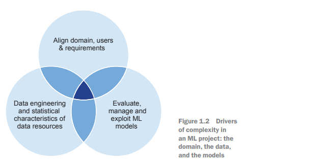

Challenges in ML Projects

- Addressing various tasks is essential for a timely, efficient, and high-quality outcome.
- Four main needs are identified for successful ML project delivery:

Identifying Risk and Opportunity
- Quickly recognize risks and opportunities during the project.
- Understanding project risk in ML requires time and effort.

Team Adaptability
- Teams must react and adapt quickly to unexpected issues.
- Ability to pivot is crucial as user requirements evolve and model performance issues arise.

Customer Engagement
- Involve the customer throughout the project process.
- Building engagement, sponsorship, and soliciting feedback enhances project effectiveness.

System Maintenance and Documentation
- Deliver all components necessary for understanding, using, running, and maintaining the ML system.
- Provide proper documentation to assist future teams in managing the code and models.

Overall Summary of ML Projects
- ML projects are challenging and models often lack precision.
- High uncertainty and risk are present compared to traditional software development.
- Strong dependence on large data resources, which often contain biases.
- Human interaction with ML systems can lead to unexpected behavioral loops and challenges in managing data efficiently.

### Project Management Paradigms

History of Software Development
- Software systems have been created for over 50 years.
- Machine Learning (ML) systems have also been developed during this time.
- For many years, software development was organized around planned predictions, known as the waterfall approach.

Waterfall Approach
- The waterfall approach involved gathering information, creating a design, programming, testing, and user acceptance.
- As software systems grew more complex, the waterfall approach became less effective.
- Users found waterfall-developed software irrelevant to their needs due to a disconnect in the process.
- Project managers struggled to estimate complexity and costs because of separation from implementation.

Disillusionment with Waterfall Approach
- High costs of structured waterfall methodologies and unclear value led to widespread disillusionment.
- This prompted a reevaluation of waterfall to more iterative methodologies.
- New approaches included Spiral methodology and V models.

Shift to Agile Development
- Agile development emerged as the most popular alternative.
- Emphasizes early delivery of working software and customer collaboration.
- Focuses on managing change and discovery effectively.

Evolution of Agile: DevOps
- DevOps aims to bridge developers and support teams.
- Highlights the operations team's expertise in software.
- Addresses the mismatch in understanding between development and operational environments.
- Develops automation in software development processes for focus on development.

Impact of DevOps
- Supports rapid and adaptive software development.
- Reduces cost and risk of late-stage changes in software development.
- Flexibility late in the project significantly enhances the quality of the delivered software.

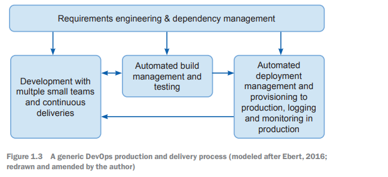

### Design Considerations

Different perspectives and considerations should be applied 
when developing a production system by contrasting the needs of research implementations. 
An overview of design considerations (performance requirements and compute requirements) 
consists of four phases
(figure 1.4):
-	Project setup is the process of figuring out as much detail as possible about the 
problem at hand. The methods of doing this are couched as a discussion in a 
technical interview, and the source of information is seen as the interviewer. 
Goals, user experience, performance constraints, evaluation, personalization, 
and project constraints (people, compute power, and infrastructure) are identified as significant elements to be considered. 
-	The data pipeline element considers privacy and bias, storage, preprocessing, 
and availability.
-	Modelling is considered in terms of model selection, training, debugging, hyperparameter tuning and scaling (in the sense of covering a large amount of training data). 
-	Serving is framed in terms of the evaluation of the model and the assumptions 
that we need to understand when running the model in the field.

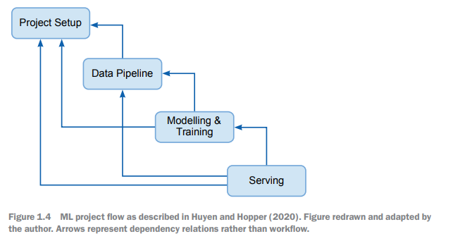

## Summary

- The explosion of data and computing in the last 10 years proves that machine
learning (ML) has become an important technology.
- There have been problems in terms of both successfully delivering ML projects
and the negative impacts that these can have when they are delivered.
- ML projects are different because they depend on complex data, require the
team to produce and manage models created from the data, and need to be carefully
aligned with the needs of the users and stakeholders.
- A successful ML project drives out risk from requirements and data, captures
nonfunctional and functional requirements, and develops capabilities for handling
and evaluating models.
- The ML project needs to be aligned with the needs of society and stakeholders
throughout its lifecycle to avoid undesirable outcomes.
- We can borrow ideas from agile software and the DevOps community to help us
develop the projects.

# Chapter 2: Pre-Project: From Opportunity to Requirements

This chapter covers
-	Understanding the project type and the 
stakeholders' expectations of scale and 
structure
-	Setting up a pre-sales/pre-project process
-	Understanding requirements for model 
performance 
-	Understanding data assets
-	Understanding the project's general 
requirements
-	Coming to grips with the tools and 
infrastructure to deliver successfully

Project Definition and Challenges
- Success and failure of a project depend on pre-project and presales activities.
- Transition from opportunity for payment to a feasible job is a challenge.
- Purpose: Understand feasibility and usefulness of an ML project.
- Determine required effort and responsible parties for project completion.

Pre-Project Activities
- Organizations may hesitate to invest time/money before contracts are signed.
- Organizational commitment is often lacking until funding is secured.
- Work done prior to funding is less comprehensive and impactful.
- Focus on pre-project processes lowers project risks.

Risk Understanding
- Not grasping business requirements can lead to misallocated efforts and underbidding.
- Lack of understanding of available data hinders project approach and success assessment.
- Ignoring security, privacy, and ethical considerations can expose teams to liabilities.
- Addressing these facets now leads to better decision-making.

Specific Risks for ML Projects
- Developing models with the right properties for business problems is challenging.
- Poor-quality or inaccessible data can stall project progress.
- Ethical or legal constraints may arise from data sourcing and usage.
- Predicting ML algorithm performance is difficult; results can be underwhelming.
- Misunderstanding IT architecture may render project results unusable.

Mitigation Strategies
- Work to address these risks will be discussed later in the chapter and in chapter 3.
- A pre-project backlog of tasks will be provided for essential pre-project activities.
- Discussion on setting up activities and understanding client requirements follows.
- Subsequent topics will cover data resources, security, privacy, ethics, and IT architecture.

##  Pre-project backlog

Table 2.1 provides a summary of the activities required to create the outcome for a
successful pre-project. We can use this list as a pre-sale (PS) backlog. Each item can be
a ticket in a system like Jira or GitLab, which then allows us to track progress, which
prevents forgotten tasks. Using a ticketing system to track progress comes in handy
because it will be easy to determine when a meeting should be run and to see who was
responsible for each task and what they did.

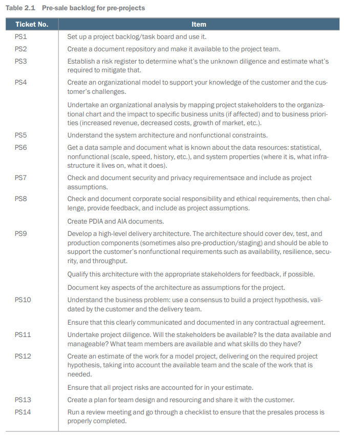

We cover tickets PS1 through PS9 in this chapter, which deals with identifying and documenting
the requirements for the project. We cover tickets PS10 to PS14 in chapter
3, which uses those requirements to create estimates and proposals. This secures the
funding and gets the project ready to go. The first thing to undertake is PS1.

This is an example of a project or task board that keeps track of 
features of a project, from a backlog of ideas, to work in progress, 
to finished work, ready for review and approval, and incorporation
into a production system. 

##  Project management infrastructure

PS2 and PS3 are the tickets that set up the project management infrastructure, bringing
it into use. As such, they’re a good place to start. As a reminder, they're listed here.

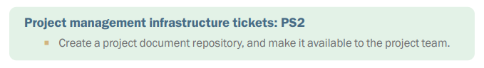

We all know what that is: GItHub is one such repository!
You might also have a central place to store documentation relating to the project:
data dictionaries, project requirements, and so on.  

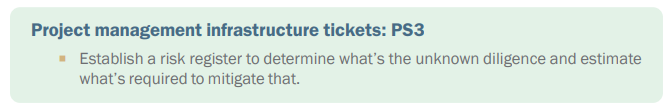

Pre-Sales Process Overview

- Create a shared project document repository for all presales activity.
- Documentation may migrate to a customer-owned repository due to data management needs.
- Organized documentation is crucial for the entire project lifecycle.

Document Retention Policies

- Check your organization's document retention policy.
- Policies may require documentation to be deleted after a certain period or archived.
- Pre-sales documents remain valuable even if the project doesn't go ahead, aiding future opportunities.

Value of Documentation

- Captured documentation supports team development and work practices.
- Past experiences documented can provide advantages for future projects.

Risk Management

- Set up a risk register on day one to identify and manage potential project risks.
- A risk register prevents critical issues from being overlooked.
- Successfully managing risks allows for continuous improvement on the project.

Questions as a Risk Management Tool

- Convert risks into questions for exploration, reducing project risk.
- Identifying uncertainties helps establish business value and informs customers about exploration needs.

Risk Register Implementation

- A risk register is a simple document tracking project risks and actions.
- Successful actions against risks are recorded, showing mitigated risks.

Ongoing Risk Management

- Regularly manage risks during the project, including weekly meetings with stakeholders.
- All parties must agree on new risks and their management.
- Pre-sales team closely oversees risks, which influence project estimates and client decisions.

##  Project requirements

Having set up a working project infrastructure with the ticketing system, document
repository, and the risk register, the real work starts. PS4 and PS5 call for developing
the project's requirements.

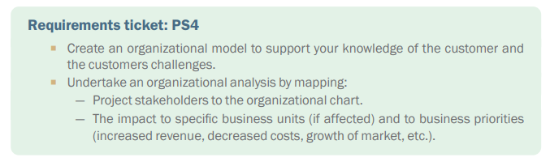

Get to know your customer. Figure out what they need in order to call this project a
success by the time their budget is spent. This knowledge enables you to sign off on the
spirit of the project as well as the letter of the contract, and it makes negotiating and
managing change much easier and less fraught.

###  Funding model 

Understanding the Funding Model for Projects

- There are three types of projects: fixed-price, time-and-materials, and mission-driven.
- Fixed-price and time-and-materials projects have a specific outcome defined upfront.
- Mission-driven projects are exploratory and aim to improve or transform a business area.

Project Types and Management Implications

- Fixed-price projects require delivering defined results by a set time, with the delivery organization bearing the risk.
- Risks for fixed-price projects include team overwork and escalated costs damaging business.
- Fixed-price contracts face challenges when using agile approaches, with some experts deeming them problematic.

Advantages and Disadvantages of Fixed-Price Projects

- Fixed-price contracts enable clear payment mechanisms for customers.
- They provide transparency and clarity for both the team and the customer.
- The risk of fixed-price projects often falls on the delivery team, necessitating thorough preparation.

Time-and-Materials Projects

- Customers pay for projects based on completion or budget limits.
- Time-and-materials projects can lead to unrealistic expectations and late realization of goals.
- Risk for these projects often shifts toward client stakeholders.

Mission-Driven Projects

- Mission-driven projects involve a high-level mission and agenda, fostering team engagement.
- These projects can lead to opportunities or problems as the team progresses.
- Team achievements may be acknowledged or overshadowed by other initiatives.

Structured Pre-Project Process Importance

- For fixed-price projects, it provides evidence for bidding.
- For time-and-materials, it helps reduce budget pressures and team frustration.
- For mission-driven, it organizes focus on strategic opportunities.

### Business requirements

Funding Model and Pre-project Investigation
- Established funding model for the project
- Decided on structured pre-project investigation
- Focus on understanding customer’s business objectives

Requirements Analysis
- Viewed as part of “big design upfront” in software development
- Important for machine learning (ML) projects to address specific issues
- Challenges include model performance on old processors and optimization costs

Types of Requirements
- Functional Requirements
- Define what the system will do and for whom
- Identify functions of the model (classification, recommendation, labeling)
- Determine performance criteria (accuracy, robustness, reliability)

- Nonfunctional Requirements
- Assess execution speed and throughput needs
- Examine latency requirements for model responsiveness
- Consider costs in terms of finances and carbon footprint

- System Requirements
- Identify where the model will operate and maintenance needs
- Define integration with existing systems
- Determine how model results will be consumed
- Plan for resilience and business continuity measures

Process for Requirements Gathering
- Clarification and reflection needed rather than strict order
- Deep understanding of specifics and implications required
- Initial step: listen to the client’s wants
- Client input may vary from high-level to detailed specifications
- Further inquiries on client’s needs: ask why, who, and what

#### Business requirements: Why?

Understanding Customer Needs

- Ask why the customer has specific needs and objectives.
- Understanding these needs allows for the following:
- Aligning customer requirements with feasible solutions.
- Enhancing customer requirements to add more value.
- Creating multiple alternative routes to value for project exploration.

Example: Smart Building Project

- Customer goal: Use sensor data for better heating and air conditioning control.
- Possible reasons for this goal:
- Reduce costs.
- Enhance the environment for building users.
- Lower carbon consumption.
- Minimize specific chemicals in air conditioning.
- Improve company image.
- Mandated requirement.

#### Business requirements: Who?

One simple thing to do is to obtain an organizational chart from the customer: what
is the organization that you are delivering to and where does the customer fit in?

Introduction to Organizational Model Development

- Start with an org chart to identify contacts and roles.
- Use formal tactics to gain deeper understanding.
- Build an organizational model based on CommonKADS knowledge methodology.

Key Elements of Organizational Model

- Problems and Opportunities:
- List issues and opportunities justifying customer engagement.

- Organizational Context:
- Understand the organization’s mission and vision.
- Consider external factors: competition, regulation, economy.
- Identify organization’s strategy and value chain (suppliers and customers).

- Solutions:
- Generate potential ideas for solutions that could be offered.

Stakeholder Identification

- Obtain knowledge from various stakeholders within the organization.
- Recognize outdated hierarchy; consider modern stakeholder roles:
- Budget Holders: Decision-makers on spending.
- Business Experts: Domain specialists connecting systems to business.
- End Users: Those who will use and be impacted by the system.
- Security Signoff: Ensures compliance with security standards.
- System Signoff: Approves design and implementation.
- Data Admin: Provides data access.
- Data Protection Signoff: Confirms compliance in data handling.
- QA Signoff: Verifies quality and functionality of the system.

Stakeholder Engagement Challenges

- Veto power of stakeholders can determine project success or failure.
- Prioritize stakeholders and their demands for effective engagement.
- Ensure you have necessary permissions to engage with identified contacts.

Considerations for Internal Projects

- Be aware of internal politics, as funding can be competitive.
- Approaching the wrong stakeholder can derail the project.

Gathering Additional Information

- Organizational context questions:
- What is the mission of the unit?
- What pressures are influencing business (regulation, competition)?
- How do customers justify their existence in the organization?

- Problems and opportunities questions:
- Why does the contact need a solution?
- Are they facing productivity issues or information overload?

- Identify needs and opportunities to clarify functional requirements, recognizing complexities in needs and synthesizing proposed ideas.

#### Business requirements: What?

Understanding IT Architecture

- Begin with understanding the IT architecture of the client organization.
- Grasp nonfunctional requirements related to scale and speed.
- It’s challenging to create a clear chart of a large organization’s IT setup.
- Organizations may have hundreds to thousands of applications.
- Key tasks include understanding current policies and facilities.
- Assess legacy assets that might influence the project.

Key Questions to Address

- Identify the data systems in use (e. g. , Hadoop, Oracle, SAP).
- Determine if there is a vendor-specific policy or a more flexible approach.
- Check the availability of processing systems (e. g. , SPARK, Kubernetes).
- Identify any missing infrastructure that could impact the project.
- Clarify the organization's cloud usage and related policies.
- Be aware of any legacy components that need interaction.

Understanding the Business Challenge

- Assess the scale of the business challenge:
- Number of customers.
- Average spending per customer.
- Daily transaction volume.
- Number of parties involved in typical transactions.
- Key trading hours.

Creating an Operating Environment Picture

- Anticipate additional questions as you analyze.
- Develop an understanding of the operational landscape for the system.
- This knowledge guides the creation of the project hypothesis.

Defining the Project Goal

- Establish the project’s solution goal for the customer and team.
- This will aid in framing user stories and refining specific requirements.
- Evaluate if the project is feasible within machine learning (ML) contexts.
- Focus on the types of data involved in the project (detailed in section 2. 4).

## Data

People doing ML projects need to understand the data. By getting information about
the data early, it's possible to gain insight into the scale and depth of the challenges
that the team will face and what they can really do. There’s understanding the characteristics
of the data in statistical terms, but also the data engineering that's required
to set the implementation up, and what the limitations or potentials of that are. PS6
requires that you get an insight into the data that you are going to use in this project.

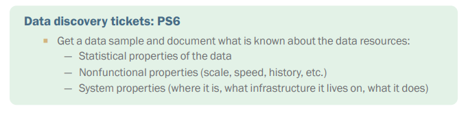

Understanding Client Data for ML Model Training

- Importance of exploring client data thoroughly to develop ML solutions
- Four benefits of detailed client data exploration:
- Uncover unexpected data sources through open-ended questions
- Validate known data sets even in a simple way initially
- Identify deficiencies in the client’s data to consider supplementing from external sources
- Gather insights regarding data quality and necessary cleaning efforts

Data Sampling and Availability

- Aim to acquire a sample of the data for initial work:
- Full data sets may be difficult to obtain due to technical or contractual barriers
- Full data may include confidential information and require contracts
- Obtaining a representative sample is crucial and may reveal issues with the client's understanding of their data
- If full data set is available, consider moving EDA (exploratory data analysis) tasks to the pre-project phase for better risk management

Questions to Explore in the Data Sample

- Statistical properties questions:
- Is the sample truly representative across time and source systems?
- What is the range and density of values in the sample?
- How was the data collected (e. g. , survey, experiment)?
- Does the data resemble other known datasets suitable for ML algorithms?

- Nonfunctional questions to consider:
- What is the scale of the available data and how representative is the sample?
- Number of different data assets that created the sample, and associated costs and time
- Rate of data change and update frequency
- Schema of data assets used and potential ETL process challenges

- Systems-related questions:
- Platforms that host the data and team skills for accessing it
- Significant lifecycle events affecting data sets (e. g. , migrations, quality improvements)
- Ownership of source tables and data management systems
- Documentation of the sample preparation process for understanding manual steps

Challenges in Data Access

- Customers may lack the ability or willingness to disclose real data for various reasons:
- Contractual issues or infrastructure challenges
- Lack of knowledge on how to access required data

- Record unidentified risks on the risk register or in the statement of work during contracts
- Push for short projects to assess ML readiness and secure data access while ensuring privacy and security compliance

Importance of Data Understanding

- Essential to comprehend and document the data model the team will be working with
- Insufficient data knowledge poses risks to the ML project
- Include contingency considerations in project estimates to account for potential data-related issues
- Recognize that ambiguity about the data indicates possible underlying problems needing resolution

##  Security and privacy

ML projects are tightly coupled to data resources, often sensitive and important data
resources that many business processes depend on or that contain details that are both
protected in law and private to individuals. This leads us to PS7 in our pre-sale backlog.

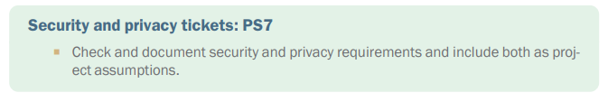

Importance of Security in ML Projects
- Insecure projects can create vulnerabilities for organizations.
- ML projects must meet the security requirements of collaborating organizations.

Engagement with Security Infrastructure
- Engage with security infrastructure of target organizations early in the project.
- Gather information in the pre-sales phase to assess security constraints and requirements.

Stakeholder Involvement
- Security sign-off may be handled by different organizations.
- Security may be separate from IT, with a CSO reporting to the CEO.
- Aim to identify a single security stakeholder; often, multiple stakeholders are involved.

Identifying Security Stakeholders
- Establish relevant security stakeholders for core data sets, organizations, and IT platforms.
- Understand initial data privacy issues and requirements.
- Negotiate necessary processes and requirements.

Anticipating Security Problems
- Establish potential security issues with stakeholders.
- If security personnel indicate straightforward requirements, it may not signal a problem; reluctance suggests potential issues.
- Document identified problems in the project risk register.

Contractual Assumptions and Financial Considerations
- Problem resolutions may become contractual assumptions allowing flexibility.
- If unresolved, issues could pose financial concerns affecting project viability and cost.

## Corporate responsibility, regulation, and ethical considerations

As for security, many readers reach this part of the book and say, "This should be the
first thing that's considered," and they are somewhat correct. It's hard to think about
CSR (corporate social responsibility) and ethics before you understand the project.
Once the project hypothesis is clear, it's time to think critically and ethnically about
what you are doing. This is the task in PS8.

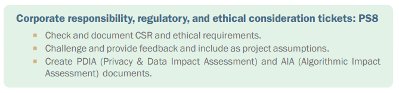

Importance of Ethics in Machine Learning Projects

- Ethics are crucial in machine learning (ML) projects.
- Laws like the European General Data Protection Regulation (GDPR) limit project considerations.
- Current legislation on ML systems is unclear and evolving.
- Teams must understand and follow applicable laws.
- Ignorance of legislation is as serious as deliberately violating it.
- Familiarize yourself with relevant regulations for your project and team.

Domain-Specific Laws and Guidelines

- Be aware of laws specific to your working domain (e. g. , healthcare, finance).
- Investigate any applicable domain-specific legislation for your ML system.
- Compliance with laws alone is insufficient for project success.

ICO Framework for AI and ML Systems

- The UK's Information Commissioner’s Office (ICO) provides an audit framework.
- AI and ML systems must be accountable for data protection.
- Systems should:
- Allow customer compliance responsibility.
- Enable risk assessment and mitigation.
- Document compliance and justify choices made.

Complexity in AI Supply Chains

- Understand controller/processor relationships due to complexity in AI systems.
- Demonstrating how complexities are handled is vital for accountability.

Ethical Implications in Requirements Analysis

- Consider the economic and social impact of the proposed ML system.
- Ethical concerns in AI, ML, and algorithmic decisions significantly affect marginalized groups.
- Efforts are underway to document AI incidents, with 1,225 recorded incidents noted.

Commercial vs. Ethical Conflicts

- Ethical considerations may clash with commercial interests.
- Computer systems can lead to job losses, raising ethical questions.
- Technological innovation is seen as necessary for competition and economic growth.
- The balance between innovation benefits and social inequality should be considered.

Perspectives of Affected Individuals

- Review projects from the viewpoint of those impacted.
- Include direct input from affected individuals whenever possible.
- Conduct personal data impact assessments based on accountability and governance requirements.

Framework for Ethical AI Implementation

- Ongoing debates exist on ethical AI implementation, reflecting current challenges.
- Acknowledge personal biases in system evaluations.
- Use structured tools for better project impact assessments.

Algorithmic Impact Assessment (AIA) Tools

- The AIA tool assists in assessing potential harm from algorithmic projects.
- It is limited in certain domains but signals future tool development.

Guidance from The Ada Lovelace Institute

- Offers guidance on effectively using assessment tools for AI and ML practitioners.

Models for Safe and Ethical AI Systems

- A layered model for safety in ML by Hendrycks et al. suggests building comprehensive checks.

Key Layers in the Safety Model

- External safety hazards: Systematic development can identify and mitigate failure causes.
- Monitoring: Regular inspections and behavior records for transparency.
- Robustness: Testing system performance and behavior under specific conditions.
- Alignment: Ensuring control mechanisms are in place for appropriate human oversight.

Harm Assessment in System Functionality

- Consider who will be harmed if the system functions as intended.
- Consider who will be harmed if the system does not function as intended.

Examples of Potential Harm

- Generative Art:
- Could put artists out of a job.
- Could create harmful images.

- Generative Text:
- Could put journalists out of a job.
- Could flood the internet with nonsensical content.

- Facial Recognition:
- Could identify and arrest dissidents.
- Could misidentify innocent individuals as criminals.

Determining Impacts and Decisions

- Assessing potential harms helps decide if development should continue.
- Identify necessary mitigations for safe deployment.

Summary of Assessment Steps

- Review project hypothesis, user stories, and system outline to identify affected stakeholders.
- Analyze the system from stakeholders’ perspectives, including their direct input.
- Conduct a systematic assessment using an Algorithmic Impact Assessment tool.
- Communicate assessment outcomes to project stakeholders.

## Development architecture and process

As well as the system produced for the users, the team needs to produce or onboard
on to systems that allow for the creation and delivery of the model. PS9 captures the
requirement to understand the work required in getting this done.

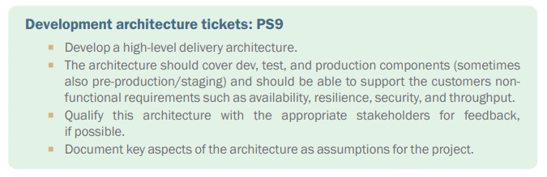

Operational Domains
- Set up three or four layers of environment.
- Layers include:
- Development (dev): Team creates the solution.
- Test: Check system effectiveness and quality.
- Production (prod): Where it runs for real users.
- Pre-production (pre-prod/QA): Screens systems for behavior with sensitive data due to regulatory or data protection concerns.

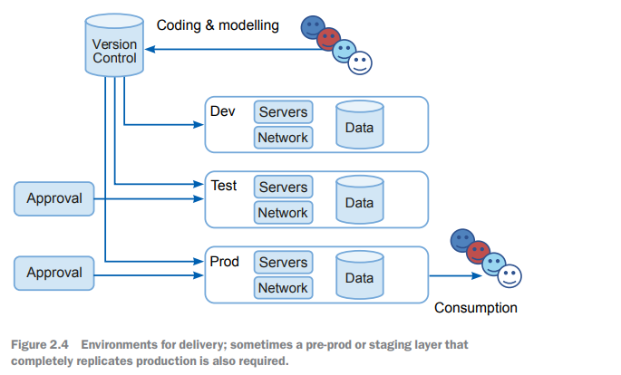

Development Environment
- May include specialized tools like compilers, GPUs, or TPUs for training models.
- Should clearly manage the need for live or sensitive data.

Test Environment
- Conduct model evaluation and test components for production.
- Replicates production with high fidelity but uses data snapshots or mockups for confidentiality.

Production Environment
- Delivers results to customers.
- Requires understanding of interaction during requirements analysis.

Understanding Flow
- Understand flow between development, test, and production environments.
- Recognize specific issues pertinent to machine learning (ML) systems.

###  Development environment 

Dev Layer Overview
- The dev layer is where the team works and provides necessary support for quick and effective delivery.
- Reference material on MLOps mechanisms is available for teams.

MLOps Environment
- Comprises components for rapid model iteration and releases.
- Tools facilitate model evolution control and systematic teamwork.

Assessing MLOps Setup
- Team may use existing customer MLOps or build a new one.
- If infrastructure exists, verify its suitability; if not, determine needed adjustments.

Key Questions for MLOps Setup
- Can source code control systems handle project artifacts? Are exceptions allowed?
- Is necessary data available in the development environment?
- Are there adequate servers for modeling (GPUs, multicore systems) and sufficient memory?
- What is the process for deploying from dev to test environments?
- What testing is required before moving to production?
- What are the timelines for accessing infrastructure across delivery layers?
- Who is in charge of approving infrastructure orders and expenses?
- Do data systems require special access arrangements?

Access to Working Environment for ML Team
- Is there a place for a model repository and feature store?
- Where can tools be hosted to transfer files and artifacts between environments (e. g. , Jenkins server)?
- Where can data pipeline tools be hosted (e. g. , Airflow server)?
- What effort is needed to establish these systems, and who is responsible?

Validation of MLOps System
- Obtain a technical description of the existing MLOps system.
- Validate the description with hands-on data scientists, preferably from the Modelling team.

###  Production architecture

Development Architecture and Building Models
- Development architecture informs how to build models and systems.
- Production architecture dictates the structure of the system to be built.

Creating System Architecture
- Requires defining properties and requirements for the models.
- A detailed system architecture must be developed.
- High-level solution is needed for potential delivery.

High-Level Definition of the Solution
- Identify components responsible for different system functions.
- Interaction details of components are not defined yet.
- Ensure components are available in client’s architecture and usable.

Purpose of High-Level Design
- Demonstrates a reasonable way to deliver the system.
- Exposes any gaps or missing components early to avoid future issues.

System Components Required for a Smart Building Solution
- Data from sensors must flow into a database.
- An execution environment runs models for control signals.
- Signals must trigger actions from building actuators.
- Information must be presented to users and owners.

High-Level Requirements for the Smart Building System
- A messaging system for information flow from sensors to actuators.
- A database that stores historical sensor information and actuator instructions.
- An execution environment.
- A dashboard system.
- An authentication system for user management.

Existing Architectures for System Components
- System architects know what is currently in use.
- Example components may include:
- MySQL for the database.
- Tableau for the dashboard.
- Active Directory for authentication.

Introduction of New Components
- A new messaging system like Apache Kafka may be proposed.
- Questions to address:
- Is the introduction of Kafka acceptable?
- What needs to happen for Kafka to be deployed to production?
- Who will handle the deployment and when?

## Summary

-	A structured process to develop a project is necessary if you are going to successfully manage risk.
-	It's important to understand how to manage the project and to comprehend the 
required project management infrastructure.
-	ML projects have particular features that need to be captured as requirements.
-	Particular attention needs to be paid to the data assets that will underpin the 
project, as well as getting a picture of what data is available. 
-	It’s important to understand how the data will be accessed and what capability is 
available to manipulate and prepare it for use by ML.
-	We need to understand specific requirements about the security and privacy of 
the data asset; this can introduce higher costs into the project.
-	A well-understood and fit-for-purpose development infrastructure is needed, and 
the IT architecture that the project is going to be delivered into needs to be clear.
-	Specific consideration to the corporate responsibility and ethical aspects of the 
project should be built in from the beginning.

# Chapter 3: Pre-Project: From Requirements to Proposal

This chapter covers
-	Creating a project hypothesis 
-	Generating an estimate for effort and time 
-	Doing the paperwork to get the project 
underway 
-	Completing your pre-sales checklist

Chapter 2 Summary

Pre-project work overview
- Covered the first half of the necessary preparations for the project

Setting up tools and infrastructure
- Established required tools and infrastructure for project tasks

Gathering project requirements
- Focused on ML-specific issues relevant to the project
- Examined the project dataset to assess accessibility

Data-specific issues
- Documented security and privacy concerns
- Identified key ethical and social concerns related to the project

Synthesizing requirements
- Requirements need to be summarized into a statement
- Statement should outline:
- Project intent
- Problems associated with the intent
- Estimated costs

Decision-making
- Organizations and clients can use this information for project decisions

## Build a project hypothesis

The project hypothesis states the purpose of the project and the major challenges to
overcome. Continuing from the pre-sales backlog in chapter 2, let's look at ticket PS10.
This is the work that needs to be done to understand the problem that is at the core of
the project.

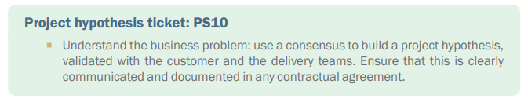

Challenges in Articulating ML Projects
- ML goals are often unclear or unrealistic from the business perspective
- Understanding specific ML algorithms is crucial to solving problems
- Importance of documenting:
- Challenges and benefits from shareholders
- Data, system architecture, and nonfunctional constraints
- Potential outcomes based on existing knowledge
- Feedback to build project consensus among stakeholders

Gaps in Understanding of ML Projects
- There is a misconception that ML is a "magic box" that automatically solves problems
- Stakeholder buy-in can be difficult for realistic projects
- Complexity and diversity of ML can hinder mainstream understanding
- Even widely used tools like Excel still require statistical expertise for meaningful analysis

Identifying and Articulating Concepts
- Teams need to create compelling concepts from available data to deliver business value
- Justify investments by highlighting sufficient value in the proposed project
- Use past work to brief collaborators and potential team members

Requirements to Capture
- Functional Requirements:
- Processes the system must execute
- Example: Inputs (user profile, budget, date) lead to outputs (book recommendations)
- Nonfunctional Requirements:
- Constraints on functional requirements
- Example: Recommendations must cost less than $0. 0001 and be produced in under 200ms

Requirements Analysis
- Analysis should produce a list of challenges and business opportunities
- Validate feasibility of improvements based on data and project findings

Developing Viable Concepts
- Expand on detailed descriptions for viable concepts
- Agile projects utilize:
- Systems stories: How the concept will be delivered
- User stories: Who will use and be impacted by the project
- Validation focuses on the viability of implementation paths and mechanisms for business impact

Writing User Stories
- Identify key functionalities and requirements
- Define acceptance criteria for the project
- Avoid potential problems and harms
- Identify corner cases that could render the system irrelevant

Stakeholder Involvement in User Stories
- Develop user stories for various stakeholders:
- Business sponsors
- Employees/users
- Customers/affected persons
- Cover three situations:
- First-time use
- Normal use
- When the system ceases to be used

Identifying the ML Model
- Determine the type of model to be built
- Identify data needed for model creation and runtime
- Describe what the model does for stakeholders to reveal their varying needs and requirements

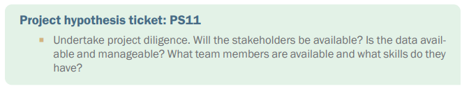

Framing the Project Concept

- Frame the concept as a hypothesis and investigation:
- Hypothesis example: Test if data from Table XYZ can model customer churn.
- Investigation example: Explore how this model can be integrated into business operations.

Actions to Take

- Focus on key actions:
- Test
- Create
- Model
- Investigate
- Use

Qualifying Concepts

- Check for technical feasibility:
- Assess risk, novelty, and difficulty for the team.
- Identify any new aspects that could pose risks.
- Evaluate if customer infrastructure can meet nonfunctional requirements.

- Consider a plausible business case:
- Understand potential savings, revenue gains, and quality improvements.
- Assist the customer in developing a detailed funding case.

- Evaluate commercial feasibility:
- Ensure funding is available to cover the entire project.
- A great project idea needs financial backing to proceed.

Additional Considerations

- Identify which customer strategic priorities are addressed.
- Determine if data resources meet project requirements.
- Ensure customers can effectively utilize the outcomes.

## Create an estimate

It’s great to have a clear project definition, but unless that definition can be turned
into an estimate, it’s about as useful as a teapot made of wax. Tickets PS12, PS13, and
PS14 define tasks that help us move from definition to estimate.

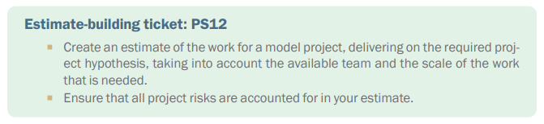

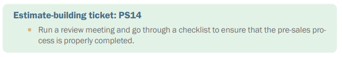

You now have an outline of the project concept, some data about how a top-level system
design would look, and you've systematically reviewed it to ensure that there are
no known legal or ethical constraints. You've documented these things, and so the
next task is to transform this outline into a project description that captures what will
need to be done, by whom, and when to deliver. The fact is that your team will adapt
to the realities of the project as it unfolds. What you are creating here is a credible
envelop of resources and money to work with to get a viable result.

###  Time and effort estimates

Estimating Time and Cost
- No estimate has been produced from the prep and investigation done so far.
- Two actions to take:
- Use backlog lists for each chapter as a starting point for creating a task list.
- Involve the team members who will do the work in building the estimate to ensure ownership.

Team Collaboration on Estimates
- Challenge team members to detail the work needed for all tasks.
- Highlight the importance of time for mechanical and administrative tasks, in addition to technical work.
- Understand nonfunctional challenges and communicate these while estimating efforts.
- User interfaces for many users are harder and more costly than those for fewer users.

Requirements Assessment
- Capture specific material requirements needed for the project.
- Assess compute consumption needs.
- Identify any special hardware requirements for developers.
- Ensure all costs for model training and data processing are accounted for.
- Be aware of high costs for GPU usage and cloud data transfers.

Creating a Task List
- Create a project backlog subject to ongoing updates as the project evolves.
- Estimate effort for backlog items using t-shirt sizing (small, medium, large, XL).
- Team consensus typically leads to a clear overall project scale.

Using T-Shirt Sizing
- Two applications of t-shirt sizing:
- Group tasks and ask the team for estimates in person-days for each size category.
- Record actual time taken for tasks to measure reliability of initial estimates.

Next Steps
- With an overview of tasks and their scale, consider who will complete the work.

### Team design for ML projects

ML Project Cost and Team Design
- Team represents the largest part of the project cost
- Understanding team design is critical for cost estimation
- Rare projects may have substantial costs, but typical costs are mainly team time

Resource Allocation
- Systematic approach needed for resource allocation from the project roadmap
- Every task should have an allocated resource covering the challenge scale
- Break project into tasks and estimate individually for more accuracy
- Involve team members and senior resources in the estimation process
- Identify the type of person needed for each task and the time required

Specialist Roles in ML Projects
- Four specialist roles identified from the complexity drivers in ML projects
- Complexity arises from challenges in data, modeling, and domain alignment

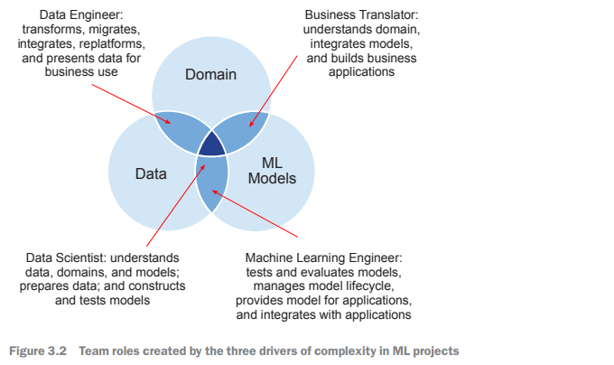

Roles in Machine Learning Projects

Business Translators
- Act as a bridge between business analysts, software engineers, and ML specialists.
- Help address the disconnect between ML teams and real-world applications.
- Important for gathering and developing insights, especially when product owner is unavailable.

Data Engineers
- Experts in managing and manipulating data resources.
- Provide knowledge about technology, efficiency, and security.
- Serve to help teams understand complex data, often relying on business translators for contextual understanding.

Machine Learning Engineers
- Responsible for developing and managing ML models and infrastructure.
- Set up testing systems and track model performance.
- Integrate models with business applications to maximize effectiveness.

Data Scientists
- Focus on creating, conditioning, and evaluating models for effectiveness.
- Central role in understanding data needs for machine learning projects.

Other Relevant Roles

Software Engineers
- Develop reliable software and work in teams; should not be mistaken for individual programmers.

DevOps Engineers
- Manage software development infrastructure, can sometimes fulfill ML engineer duties.

Cloud Engineers
- Set up and manage cloud environments and services; can assist data scientists when data engineers are unavailable.

Delivery Managers
- Organize project logistics, manage documentation, and facilitate communication between stakeholders.

UX Engineers
- Design user interfaces by understanding user needs and interactions.

Test and QA Engineers
- Develop and execute testing systems for project quality assurance and model performance evaluation.

General Team Dynamics
- Team roles can be shared among members; flexibility in skill distribution is common.
- Some organizations may define roles such as data engineers differently based on project needs.

Tips for Team Management
- Focus on identifying fundamental project needs first to allocate team roles effectively.
- Prioritize team members who can share insights and mentor others.
- Seek generalists who can adapt their skills across diverse project areas, rather than only specialists.
- Foster opportunities for team members to gain skills for future value and productivity.
- Beware of overloading the team with development opportunities which may affect productivity.

Figure 3.3 shows how a team might evolve over a project as skill requirements change,
new team members join, and folks who have made their contribution leave. For example,
a short assignment for a cloud engineer in sprint 1 (figure 3.3) might be problematic.
The engineer might resent being dropped into the project to clear up a few issues,
or they might enjoy the quick assignment between longer-term jobs.

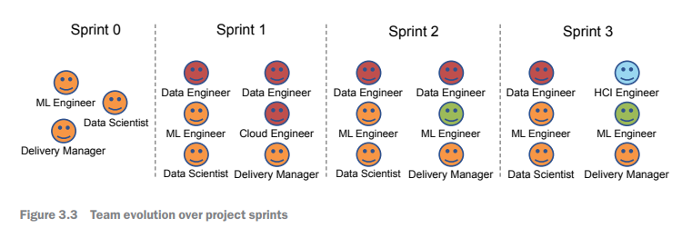

HCI Engineer's Role in Project Sprints
- HCI (Human-computer interaction) engineer is depicted in sprint 3.
- A two-week assignment allows the HCI engineer to add value to a showcase project.
- Issues may arise if the HCI engineer lacks project context.

Team Orientation and Preparation
- Hold pre-project team orientation meetings.
- Clarify individual expectations and team dynamics.
- Ensure resources will be available when needed.
- Form an agile team for each project sprint.

Team Stability and Dynamics
- A large core team should remain stable through the project.
- Some individuals may join or leave for expertise.

Task Management Process
1. Create a task list based on backlogs and team input.
2. Identify required roles and specializations for each task.
3. Estimate the effort needed for each task.
4. Aggregate effort to determine commitment per role.
5. Develop a role-resourcing plan matching required effort.
6. Identify a potential team design aligning with the plan.
7. Calculate overall project cost based on commitment costs.

Client Support and Involvement
- Client support is crucial for project success.
- Identify the product owner from the client who provides feedback.
- Have a technical/admin troubleshooter to help with administrative issues.

Addressing Potential Conflicts
- Be aware of team members' potential conflicts (e. g. , holidays, retirement).

Project Roadmap Review
- Review the complete task list and project roadmap.
- Look for optimizations or problems in task execution.
- Run tasks in parallel where possible for efficiency.

Identifying Risks in an Agile Project
- Expect unknown problems and glitches to arise during the project.
- Try to anticipate potential pitfalls early on.

##  Project risks

Reviewing the Risk Register

- Create an estimate for resources.
- Review the risk register after estimation.

Mitigating Risks

- Consider the cost of mitigating risks in the budget.
- Identify potential mitigations or workarounds.
- Use previously successful mitigations for higher value; new mitigations have lower value.
- Estimate the cost of mitigation:
- Low-confidence estimates should include a 100% risk premium.
- High-confidence estimates should include a 30% premium.
- Mitigation costs should be chargeable items, not internal costs.
- Include a risk premium and operational margin.

Budget Approval and Documentation

- Review to ensure no high-impact risks have low-value mitigations.
- An organizational officer must sign off on the budget and accepted risks.
- Ensure the officer understands potential risks.
- Document the process and share it with those who sign off.
- Send follow-up emails after sign-off meetings, including briefings.

Handling Unmanageable Risks

- Some risks may be unmanageable, particularly relating to data quality and availability.
- Data in poor condition can hinder model development.
- If data inspection is inadequate, further discovery must be done.
- Frame such projects as experiments or investigations.
- Contract terms should legally cover risk issues; maintain clear communication with the customer.

## Pre-sales/pre-project administration

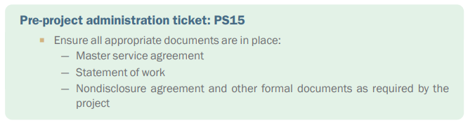

Contracts Required for Projects
- Formal contracts are sometimes necessary for projects.
- Types of contracts include:
- Master Service Agreement (MSA):
- Covers payment and liability mechanisms.
- Governs the entire relationship with the customer.
- Often applies to multiple projects.
- Statement of Work:
- Defines project efforts and activities.
- Legal agreement on deliverables.
- Specifies reimbursement details and timing.
- Nondisclosure Agreements (NDAs), confidentiality, and intellectual property agreements:
- Dependent on the MSA and jurisdiction.

Legal Involvement
- Development of contracts should be handled by legally qualified individuals.
- Avoid creating documents yourself or solely following customer suggestions.
- Involving the legal team early helps improve project outcomes and saves time.
- Legal teams may introduce necessary requirements that can delay work, but these are important.

Project Readiness
- Ensure that agreements are well-founded and properly signed (often requires signatures from regional CTO and COO).
- Agreement approval by the customer is essential before starting the project.
- Utilize a checklist to verify that all elements are included before obtaining signatures.

## Pre-project/pre-sales checklist

Having worked through the items previously listed and described, you should be in a
position to complete the pre-project/pre-sales checklist that follows. This list (table
3.1) lets you check each of the items to verify that there is adequate evidence that the
task is properly completed.

## Pre-project postscript

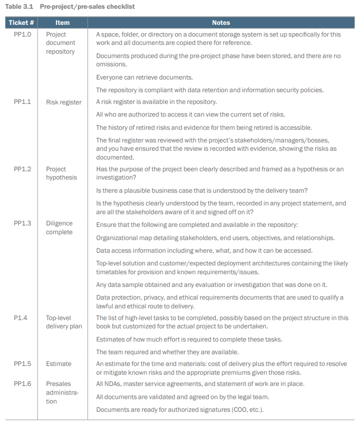

Go through this checklist with your team and make sure that they and you agree that
the items are complete. One trick is to not chair this meeting yourself, but instead, get a
relatively junior person from the team to host it. (Probably not the most junior as that's
a bit unfair, but someone who the team respects and will benefit from the experience
of running some meetings.) By getting them to set up the meeting and run it, you avoid
the trap of everyone thinking that they should just agree. From your perspective, you
want to know if something has been overlooked, now, before it's too late and while you
can still (hopefully) fix things.

## Summary
-	To get to a proposal for the project, the requirements need to be transformed 
into a hypothesis that spells out the expected outcome and key challenges.
-	A structured process of estimation can then be done based on the hypothesis and 
the information about the delivery environment that you gathered in chapter 2.
-	An useful estimate takes into account the team's structure and the commitment 
needed to meet the requirements.
-	Get your project documentation properly reviewed and signed off before anyone 
mentions costs to the customer.
-	If the pre-project phase fails, then it's certain that the project would have failed, 
and that is far worse.

