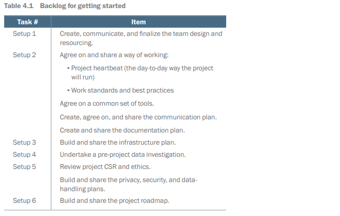
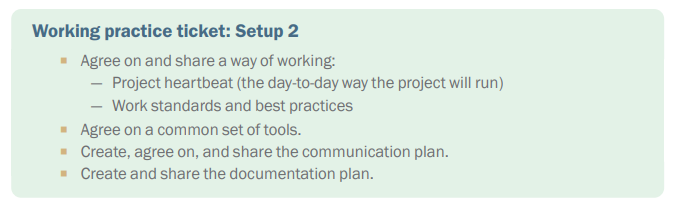
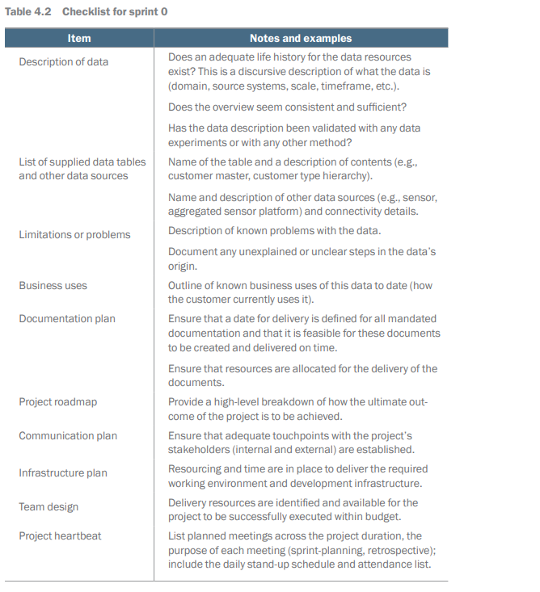

# Team Design, Infrastructure, and Data Collection

## Introduction

# Chapter 4: Getting Started

This chapter covers
- Focusing on preparation at the start of
engagement
- Getting all the required accesses and
permissions
- De-risking the project
- Verifying the development environment and
putting mitigations in place if needed

Sprint 0 Overview
- Introduced in chapter 3.
- Aims to set up everything for the project team.
- Acts as a buffer before the project officially starts.
- Helps identify problems before significant costs are incurred.
- Focuses on enabling team productivity.

Key Activities in Sprint 0
- Officially work on the project for the client.
- Gain access and information that were unavailable before.
- Request necessary access, information, and accounts.
- Resolve issues proactively, preventing delays.
- Agree on and communicate project processes.
- Understand risks and challenges better.
- Confirm project feasibility and validate estimates.

## Sprint 0 backlog

As with the pre-project phase, the backlog for sprint 0 lists the tasks or tickets that
need to be undertaken to complete this phase of the project (Table 4.1). Again, as with
pre-project tasks, these tasks need to be decomposed and developed further, based on
the reality of the project you are facing.

One of the important changes from pre-sales is that now you need to set up processes
and interactions using your client's infrastructure to deliver your ML project. You need
to include and integrate your working practice with their working practice. Sprint 0
achieves these three things:
- Your team is all set and ready to go with a clear agenda and with all the working
systems that they need to do their job.
- You and your team are now part of the customer organization.
- You have come to grips with the project's data resources and have verified that
the picture you were given about the data in pre-project is correct.

## Finalize team design and resourcing

The project team is the engine of delivery. Without the right people, the work required
simply can't be done. Because the design of the team and resourcing are one of the
most important activities, during sprint 0, ensure that the right people are assigned to
the project.

Pre-Project Phase
- Created a team design to estimate costs
- Checked availability of team members
- Used a resource reservation system to record team requirements
- Ready to start onboarding the team for the customer project

Possible Issues
- Team members might be taken by other projects
- Members may have left the business or become ill
- May need to find replacements or redesign the team

Risk Management
- Record team design issues on the risk register
- An inadequate team is a major concern that needs addressing
- Rapid internal escalation often resolves resource issues

Alternative Mitigation Strategies
- If original resources are unavailable, consider replanning
- Replanning can help find appropriate resources at different project stages
- Delivery organization may hire external contractors as a last resort
- Hiring contractors can be costly and may harm the project's commercial viability
- Protecting customer relationships may justify these costs

## A way of working

Assuming a project team is secured, the next step is to start to develop and agree on
the project’s working processes with the client. The working process is the set of activities
that everyone agrees are required for a task to be considered satisfactorily completed.

### Process and structure

Project Structure and Operations
- Clearly define how the project will operate and structure activities.
- Importance of clarity for team expectations and quality building.
- Teams should adopt practices that work best for them for better results.

Agile Project Management Literature
- Extensive literature exists on running agile projects.
- Different approaches (e. g. , Scrum, Kanban) emphasize unique practices.
- Deviating from prescribed methods may be seen negatively, yet no single way guarantees project success.
- Teams find various effective practices that can change over time.

Organizational Practices
- Organizations may require specific practices as management trends shift.
- If your organization mandates a framework like SAFe, conform to it.
- If flexibility exists, use a successful working method for your team and customers.

Key Elements to Define
- The process and structure to be used in the project.
- Tools that will be adopted.
- Standards and working practices for the team.
- Documentation methods.

Sprint-Based Projects
- Based on the Scrum approach, it is a popular agile structure.
- Real-life scenarios may lead to tasks spilling over between sprints.
- Teams may discover new work during the project (e. g. , testing hardware, code porting).
- Adaptation of work plans as projects evolve is central to the agile approach.

Milestones and Monitoring
- Sprint-based approach includes setting milestones and regular progress reviews.
- Decisions made at the end of each sprint inform next steps.
- Teams gain visibility and control to manage workloads over the following weeks.

Kanban Projects
- Operate as continually evolving plans with flexible task addition.
- Tasks are updated and prioritized to enhance efficiency.
- Effective for teams with deep domain understanding or when systematic expert input is necessary.
- More structured pace needed for projects requiring formal feedback.

### Heartbeat and communication plan

Role of the Project Lead
- Act as a message-switching device for communication.
- Gather and deliver messages to and from the team.
- Define communication process and gain agreement from managers, customers, and the team.

Importance of Information Sharing
- Sharing rhythms in a project provide reassurance despite complaints.
- Everyone should understand expectations for sharing and receiving information.
- Two ways to communicate:
- Hold meetings.
- Distribute documents and reports.

Managing Complaints
- Common complaint: lack of awareness about project status.
- Establishing a plan reduces complaints and dissatisfaction.
- Address complaint of too many meetings by explaining the need for them.
- Be open to feedback on information sharing, ensuring it is relevant.

Meeting Structure
- Be aware of additional “other” meetings that might disrupt workflow.
- Limit team meetings to one per day for productivity.
- Recognize that disengaged team members can lead to isolation.

Sprint-Based Structure Meetings
- Daily stand-up meeting with product owner, technical representative, and team.
- Weekly review meeting to update on project and review risks; take minutes and forward actions weekly.
- Planning meetings at the beginning of each sprint for work assignment agreement.
- Sprint closure and sign-off meetings to present completed work and demonstrate functionality.
- Post-sprint review meetings with stakeholders and product owner to address challenges.

Documentation and Reporting
- Keep notes during all meetings.
- Weekly review meeting minutes serve as status reports.
- Translate planning and closure meeting notes into actions and task boards.
- Maintain a risk register to track unresolved issues and their resolution status.

Meeting Scheduling
- Schedule regular meetings to ensure participant awareness and commitment.
- Getting time in calendars is essential for smooth project operation.
- Meeting patterns are crucial for ongoing project progress and evidence of goal alignment.

Conclusion
- Effective communication and tools are necessary for project success.

### Tooling

Establish a clear agreement with all team members and with the customer about preferred tools. Often, the project's customer will mandate these. The following lists some 
of these tools:
-	Document repository (SharePoint, Confluence, Microsoft Teams, etc.)
-	Work ticketing system (Jira, GitLab, Azure DevOps Services)
-	Source code control (GitHub, Bitbucket, Subversion)
-	Document production (Microsoft Office 365, Google Docs, Open Office)
-	Technical diagram production (Visio, Lucidchart)
-	Build management system (Gradle, Jenkins)
-	Dependency management system (Conda, Python's pip)
-	Testing (Python’s pytest, JUnit)

Sometimes using the wrong tool can mean that work must be redrafted to be accepted
by the customer, and sometimes using the wrong tool will be a breach of contract.
That may result in bigger problems down the line. It's worth getting this clear up front
because ML projects require their own tooling. At the time of writing, this is an emerging
area, but it's clear that there are significant gains to be had from standardizing on a
tool to support some of the pain points in an ML development project.

#### Data pipelining

Modern Databases and Data Science

- Modern databases support complex and dynamic organizations.
- Data science and AI projects require unified resources for problem area representation.
- Relational databases remain valuable but must also handle unstructured data.
- Large data resources for AI projects may frequently change.
- ETL tools struggle to support this flexibility, as they focus on relational data warehouses.

Data Pipelines

- Data pipelines use a sequence of transforms managed by a workflow engine and scheduler.
- The workflow engine chains tasks without loops, known as a directed acyclic graph (DAG).
- Each DAG step corresponds to a script executed on a target machine.
- Steps involve data processing, such as loading, joining, and cleaning data.
- Internal steps can execute other workflows independently.

Pipeline Engine and Scripting Languages
- Various programming languages are used for scripting activities.
- Pipeline engines simplify the management and chaining of these languages.
- Technology emerged with Hadoop implementations through the Oozie scheduler.
- Oozie enables easier management of big data resources in Hadoop clusters.

Airbnb and Apache Airflow
- In 2015, Airbnb sought a solution for complex data pipeline management across different technical stacks.
- This project evolved into what is now known as Apache Airflow.

Functionality of Pipeline Tools
- Tools like Oozie and Airflow provide an abstraction for data manipulation requirements.
- An engine is responsible for executing and managing the created code.

Impact on Data Management
- Large libraries of data flows using this technology are becoming available.
- AI teams frequently implement numerous processes for data import, preparation, and model work.
- Without these tools, such tasks are error-prone, hard to manage, and time-consuming.
- Airflow makes processes easier to inspect and manage, reducing bookkeeping and script management overhead.

#### Versioning

ML Projects and Assets
- ML projects produce various assets beyond code.
- Different models are created to improve specific performance aspects.
- Projects rely on training, validation, and test sets.
- Complex pipelines integrate different data and create features for learning algorithms.

Version Control Systems
- Specialized version control systems are available for managing ML assets.
- Tools include DVC, MLflow, and Weights & Biases.
- AWS SageMaker includes integrated versioning components.
- Apache Iceberg and Project Nessie are new filesystems for identifying and versioning datasets.

Challenges without Dedicated Infrastructure
- Tracking model versions and artifacts without dedicated tools can lead to administrative burdens.
- Complex errors may arise from lack of organization.
- Risks exist in reproducing the “good” model due to lost components; this can harm user trust.

Benefits of Versioning Artifacts
- Reproducibility: Artifacts can be tracked to recreate models accurately.
- Testing and Release: Allows for safe model deployment across different environments, ensuring dependencies are managed.

#### Data testing

Improving Data Infrastructure Management
- Use data pipelining technology for better project management.
- Easily monitor processes and identify failing pipelines.
- Remedial action can be taken for clearly identified issues.
- Data infrastructure allows for testing data to assess pipeline failures.
- Assurance can be created about data quality for model development.

Sources of Data Errors
- Data errors can arise from:
- Problems in data collection (faulty sensors, poor surveys, bad data entry).
- Issues in the mediating data infrastructure.
- These errors lead to "bad data" and data management errors.

Data Testing Suggestions
- Breck proposes tests for ML model development:
- Check if data distributions meet expectations.
- Ensure exclusions are properly applied.
- Verify features are correctly constructed from source data.
- Conduct system-level tests for invariants or causal links.
- Emphasize the need for clear responsibility ('one chef per broth').

Challenges in Developing Infrastructure
- High computational costs for testing large, fast data sources.
- Difficulties arise in selecting representative examples from large feeds.
- Performance and costs are impacted by data testing overhead.
- Using scalable processors (e. g. , Spark or Kubernetes) requires engineering effort.

Decision on Tool Policies
- Determine if tools will meet team needs.
- Assess if tools will enhance or hinder team performance.
- Consider complexity, maturity of organization, and project goals.
- Strategic projects may require significant infrastructure investment.
- Lightweight setups may be more suitable for proof-of-value or quick-start projects.

### Standards and practices

Team Dynamics and Leadership Practices

- Importance of understanding team behavior as a leader
- Different teams have different working styles
- Aim to create a positive team ethos for contribution and growth

Key Practices for a Positive Team Environment

- Respect and Politeness
- Essential for open communication
- Comments must be positive and respectful
- No interruptions; if interrupted, apologize and allow time back to the speaker
- Encourage listening and concise communication

- Work Tracking
- Record and track work in a ticketing system
- Everyone should have work to discuss in stand-up meetings

- Identifiable Outcomes
- Work should lead to documents, code, or artifacts
- Store these in a documentation repository for version control and access

- Peer Review
- Work not closed until reviewed by another team member
- Facilitates knowledge flow between senior and junior engineers

Customer Interaction and Agreement

- Agreement on project sign-off criteria
- Deliverables to be reviewed in project meetings
- Consider sign-off valid if no issues raised within five working days

- Customer Responsibilities
- Product owner and key contact should engage in discussions and meetings

Establishing Team Practices

- Teams must establish their own ways of working
- Address low standards or poor practices if observed
- Utilize role modeling and questioning to guide team behavior
- Document decisions and agreements to maintain consistency and enforce practices

### Documentation

Overview of Documentation in Software Development

- Documentation has been less prioritized by some software developers.
- The Agile Manifesto emphasizes the value of working software over comprehensive documentation.
- The authors of the Agile Manifesto recognize the importance of both documentation and working software.
- There is a belief that code should be self-documenting and that running code is the best proof of project progress.

Benefits of Focus on Code

- Focusing on code indicates progress and adds value.
- Emphasis on functionality requires deep thinking, revealing gaps in the designer's ideas.
- Designing software often uncovers missing details that the code needs to function.

Shifts in Perspective on Documentation

- A balanced view acknowledges the need for documentation in software projects to ensure usability and maintenance.
- Without documentation, users and developers may struggle to understand or fix the system.
- Poor documentation can jeopardize the success of a project.

Types of Documentation

- Two main categories of documentation exist:
- Exhaust Trail:
- Created by developers during task execution.
- Stored in the repository, serving the team's understanding and project evolution.
- Demonstrates the team's activity and can be used to show stakeholder progress.
- Important for future audits and reference by team members.
- Formal Documents:
- Summarize and present project information to customers and management.
- Create agreements on project progress and help the team focus on completed tasks.

Conclusion and Recommendations

- All tasks should be documented as standard practice.
- Technical notes must be kept accessible for all team members.
- Develop formal documentation deliverables to communicate effectively with clients.

## Infrastructure plan

This section covers the systems you need to set up to allow your team to work. Here, we
come to grips with the infrastructure that is necessary to run what the team is going to
build.

An ML project has quite different data architecture requirements from a standard corporate
data architecture. Running an ML system on a corporate data architecture and
infrastructure can sometimes have unacceptable impacts on other applications. However,
you may have limited or zero options, so what's needed is a pragmatic approach
to infrastructure design and development.

### System access

Steps to Access Data

- Confirm initial data understanding from pre-project work.
- Identify necessary technical interfaces like APIs, SQL queries, and filenames.
- Address any lack of clarity about system access quickly.

Discussions and Permissions

- Start discussions to clarify access and permissions needed for data.
- Initiate processes to grant access once information is confirmed.
- Understand that team members may require training to access data.

Training Requirements

- Expect 2 to 8 hours of training per team member for data handling.
- Prioritize identifying and scheduling necessary training.

Importance of Questions

- Ask any questions regarding the process and requirements.
- Obvious questions can reveal critical blockers to productivity.

Hardware Limitations

- Note that data access may require specific laptops or builds.
- Make arrangements for team access to necessary laptops or workspaces.

Time Expectation

- Realize that arranging permissions and training often takes longer than expected.
- Be aware that processes may be low-priority or underfunded.
- Addressing these steps quickly is crucial for the project’s success.

### Technical infrastructure evaluation

Specification of Environments
- Specification of dev/test/prod environments is shared
- Should be based on the best information about the customer’s environment
- Involves technical and security architects from the customer

Potential Issues
- Sometimes, hoped-for resources do not exist
- Lack of involvement from proper technical expertise during pre-sales
- Technical environment may be at risk as per the statement of work
- Assumed infrastructure may be inaccurate due to mistakes or misunderstandings

Example Scenario
- Assumed a GPU server would be available at project start
- Discovery that the server is on order and won’t be available for nine months

Action Steps
- If issues are found, brainstorm workarounds with the team
- Customer may need to adjust infrastructure provision
- If no solution is viable, the project may need to be stopped
- Consider renegotiating the project scope for alternatives

Infrastructure Documentation
- Document and specify the promised infrastructure
- Include actual available infrastructure in the risk register
- Work on required mitigations and changes to scope promptly
- Ensure customer acknowledges any discrepancies immediately

## The data story

Yet again, data, data, data. This is one of the vital differences between what you would
focus on in a sprint 0 for a normal software project and what you need to do for an ML
project. Setup 4 tasks you to do another data investigation. But, why now?

In the pre-project process, we mentioned how important it is to obtain a data sample
in the pre-sales phase of a project, and we also noted the importance of figuring out
whether the use of the data is ethical and legal. Sprint 0 is the first chance for paid
work (protected and licensed by commercial agreements), undertaken to understand
the customers data. Ronald Fisher, inventor of modern statistics, was a bit of a strange
man but, apparently, he said:

"To consult the statistician after an experiment is finished is often merely to ask him to 
conduct a post-mortem examination. He can perhaps say what the experiment died of." 

-- R.A. Fisher, Presidential Address to the 
First Indian Statistical Congress, 1938

Building a Data Understanding

- You need to create a picture of the customer's operating domain.
- The data available determines the quality of this picture.
- Data may not be neatly organized; prepare to gather from various sources.
- Understand the project's issues and iterations.

Initial Steps

- Before the team begins, develop a narrative about their data.
- In sprint 1, conduct a data survey from the system's perspective.
- A data survey clarifies the available data and its accessibility.
- Post data survey, the team can perform exploratory data analysis (EDA).

Role of Modelers

- Modelers engage in the exciting aspects of the project.
- Follow the iterative process of locating and analyzing data to avoid major issues.
- Develop a data story to minimize risks before technical access is available.

Data Story Importance

- The data story is the customer’s perspective on what the data entails and its origins.
- This view may differ from technical details but is essential for understanding corporate history.
- Frameworks exist to guide the questioning about data attributes.

5W1H+R Framework

- Use the 5W1H+R framework for structured questioning:
- Who, What, When, Where, Why, and How of the data.
- Investigate the relationship of the data to other data.

Questions for Data Understanding

- Why was the data created and intended for use?
- Who owns the data and grants access?
- What are the privacy and security concerns?
- What source systems provided the data set?
- How is the data stored and queryable?
- What types of data exist (unstructured, tabular, etc. )?
- When were systems created and significant events in their lifecycle?
- What is the origin of the data?
- What is the scale and historical profile of data assets?
- How does the customer perceive the quality of the data?

The 5W1H+R framework is useful for extracting information about the data, but it
focuses on supporting data governance tasks. Modeling and, by extension, using the
data for ML raises further questions. 
Even so, there are (at least) four ways that the 
story of the data you will use affects your ML models:
-	Motivation and context: Why the data was collected.
-	Collection: The mechanics of the data collection and the measurements made.
-	Lineage: The process that has brought the data into its current form and storage.
-	Events: What happened to the data

### Data collection motivation

Importance of Data Collection Motivation

- The reason for data collection influences its usability and interpretation.
- Different experiments yield different results, as demonstrated by examples of using a torch vs. turning on lights.

Types of Data Sets

- Data from controlled experimental studies differs from observational data sets.
- Different data collection methods require different analytical approaches.

Impact on Data Distribution

- Deliberately selected data will have distributions different from natural distributions.

Example of Data Collection Bias

- Butterfly collection serves as an analogy for data selection:
- Collecting rare cases leads to an uneven representation.
- Common cases may be ignored or discarded.
- Collection methods can introduce bias; for example, only collecting in summer.

Collector vs. Researcher Dynamics

- A data collector’s approach differs from that of scientists like ecologists or entomologists.
- Corporate data collection is also subject to biases.

Understanding Bias in Data Models

- Awareness of biases in data collection is essential for accurate modeling.
- Bias is neither good nor bad, but should be considered when analyzing available information.

###  Data collection mechanism

Data Collection Approaches Impact
- Total survey error arises from differences between sample data and the whole population.
- Bias can occur from how questions are asked or how interfaces are designed.
- Systematic errors often exist in data that is repeatedly updated, like personnel records or inventory.
- Users may disproportionately select the first item on a list when entering data.

Sensitive Information Collection
- Websites asking for sensitive information may face non-response issues.
- Some users might refuse to provide details, leading to bias in user data.
- The data collected may only represent those willing to respond, not the entire user base.

Sensor Data Challenges
- Sensor data collection has unique issues that require careful consideration.
- Engineers ensure reliability through calibration and installation standards, like NASA guidelines.
- Sensors can fail or be incorrectly installed, leading to erroneous data.
- Understanding sensor data requires knowledge of verification processes within the organization.

###  Lineage

Data Collection and Storage Challenges
- Analytics projects often rely on data that is far removed from original sources.
- Real-time databases are necessary for collecting large volumes of fast-generated data.
- Long-term scaling of databases for analytics is costly and complicated.
- Common practice involves mirroring data to cheaper storage solutions called data warehouses.

Complications in Data Architecture
- Large organizations may have complex data architectures due to:
- Politics, cost constraints, regulations, and general incompetence.
- Changes due to capitalism, like company sales or splits leading to inherited data structures.
- Regulatory requirements that complicate data storage and management.
- These factors can obfuscate the origins of data in specific tables.

Solutions for Data Lineage
- Implementing a data catalog or lineage system (e. g. , Alation or Collibra) helps track data origins.
- Organizations might use metadata management processes as a road map.
- Emerging research focuses on tools for automatically tracing data origins using discovery techniques.
- Advanced tools to support data tracing are in development and potentially useful in the future.

Mapping Data Architecture
- If a global view of data is unavailable, teams must map their specific area of focus.
- Pinpointing the ultimate source of data sets is crucial for understanding motivations and avoiding duplicate signals.

Understanding Data Processes
- Understanding the processes of how data is shifted and formatted is essential.
- Errors can arise from misinterpreted timestamps during data collection and aggregation.

Managing Assumptions about Data
- Many myths and assumptions influence data interpretation.
- New revelations about data origins can alter model interpretations and their value.
- It’s important to question the validity of lineage assertions to manage these risks.

###  Events

Data Store Calamities
- Underinvestment can lead to low storage capacity, causing data to be discarded.
- Data loss can occur from poorly written queries or hardware failures.
- Accidental damage can introduce errors like poor rounding or type conversion over time.

Data Quality and Changes
- Data stores undergo quality improvements, re-architecture, and replatforming.
- These changes may have no impact on data integrity but can also introduce bugs.
- Migration of data types can sometimes lead to noise if not done correctly.
- Understanding the data evolution is key to interpreting model results accurately.

Ethical Considerations
- The source and acquisition of data affect ethical considerations in a project.
- Documenting data origins helps address challenges regarding model usage and user safety.
- Recent AI/ML ethics debates highlight the importance of data sources in language models.

## Privacy, security, and an ethics plan

Understanding Data Collection and Ethics
- Understand motivation for data collection
- Know methods used to collect the data
- Be aware of data lineage
- Recognize events affecting the data set in storage
- Form a picture of ethical implications of data use

Technical vs. Ethical Considerations
- Technical questions are important for the modeling team
- They are not enough to fully understand ethical, privacy, and security issues

Sprint 0 Backlog Setup
- Undertake Setup 5 in the sprint 0 backlog
- Aim to create a fuller picture of data issues
- Make informed decisions about vital issues during the project

Pre-Project Work
- Qualified ideas and hypothesis to ensure legality and ethics.
- Conducted a Data Protection Impact Assessment (DPIA) for The Bike Shop.

Sprint 0 Opportunities
- Access to customer issues increases as more information is gathered.
- Allows for detailed addressing of issues.

Questions to Consider
- Were all data tables collected for the same purpose?
- Is the project's purpose suitable for all tables?
- Were all data tables gathered within the same legal jurisdiction?
- Are there exceptional data subjects needing special treatment for security and privacy?
- Can proper data-handling processes be implemented (anonymization, aggregation, encryption)?
- Should the team and application have access to all data sources?

Documentation and Validation
- Validate and document findings on CSR, privacy, security, and ethics.
- Use identified experts and authorities from pre-project activities to facilitate discussions.

## Project roadmap

Project Roadmap Overview
- High-level plan that guides the project
- Reflects project hypothesis and estimates from presales
- Indicates when tasks will be executed and their dependencies

Reasons for Developing the Roadmap Now
- New information on project delivery context is available
- Knowledge of team structure and availability for project tasks

General Structure of the Roadmap
- Data acquisition and project infrastructure building (Sprint 1)
- Model building, evaluation, and selection (Sprint 2)
- System integration and productionization (Sprint 3)
- Components can be adjusted based on circumstances
- Agreement with client stakeholders is essential for any changes

Sprint 1 Details
- Starting with UX features is beneficial for establishing nonfunctional requirements
- Engaging the customer with UX designs enhances project visibility

Data Integrity Considerations
- If data integrity is questionable, avoid unnecessary modeling work
- A "quick and dirty" approach to data infrastructure may be needed for rapid prototyping
- This may lead to rework and potential delays later

Experience and Decision Making
- Decision-making becomes clearer with experience
- Collaboration with the client is crucial for shared understanding

Opportunity for Cross-checking Estimates
- Opportunity to review estimates and assumptions based on new findings
- Realistic assessments of technical infrastructure and data availability are important
- Identifying potential complications early can mitigate risks

Final Thoughts
- A painful but necessary process to avoid project failure
- Options include reducing scope, increasing budget, or reconsidering the project entirely

## Sprint 0 checklist

You can complete the checklist in Table 4.2 with the delivery team to ensure that the 
elements of sprint 0 are put in to place before the project starts. The objective of sprint 
0 is to ensure that the conditions for the team to work effectively and efficiently are 
met. Everyone involved in the checklist meeting should be invested in making sure 
that every item is covered usefully.

## Summary
- Administrative processes need to be started early, before the people that need to
use the systems or get into buildings are billing the project. Actually, doing the
work to determine what needs to be asked for is a good first step, asking for it all
is a great second step.
- You need to make sure that the customer understands what is going to be delivered,
and how and when it is to be delivered.
- Ensure that lines of communication are open, and everyone knows how they are
expected to share and get information.
- Your team needs to have a shared understanding of how it will get work done.
- Check that the development environment you need can be set up and is operational
for all team members.
- Make sure that there is an understood path to production.
- Delve into the life story of the data that your team will be using.

# Chapter 12: Working with Stakeholders

This chapter covers
- Working with different types of stakeholders
- Engaging with people outside the data science 
team
- Listening so that your work gets best used

It seems like the job of a data scientist would be primarily about data, but much of
the work revolves around people. Data scientists spend hours listening to people in
their company talk about the problems they have and how data might solve those
problems. Data scientists have to present their work to people so they can use the
knowledge gained from an analysis or trust a machine learning model. And when
problems occur, such as projects being delayed or data not being available, it
requires conversations with people to figure out what the next step should be.

## Types of stakeholders

Each stakeholder you may encounter during a data science project has their own
background and motivation. Although a stakeholder can be pretty much anyone,
depending on how weird your project is, most stakeholders fall into one of four categories:
business, engineering, leadership, and your manager (figure 12.1).

### Business stakeholders

Business Stakeholders Overview
- Business stakeholders oversee business decisions.
- They request analyses and machine learning models for better decision-making and efficiency.
- Stakeholders come from diverse backgrounds, including marketing and customer care.
- Examples of backgrounds:
- Marketer with an MBA from an ad agency.
- Customer care manager starting as a care agent with a community-college degree.

Technical Background of Stakeholders
- Most stakeholders have little technical expertise.
- Skills may include basic proficiency in Microsoft Excel.
- Few stakeholders know R or Python or advanced machine learning concepts.
- They understand the importance of data science despite their lack of technical knowledge.

Involvement in Data Science Projects
- Stakeholders are crucial for data science projects from start to finish.
- They help define project objectives and provide feedback on results.
- Their involvement ensures that the business gains value from data science efforts.

Job of Data Scientists
- Data scientists must deliver analyses, dashboards, or machine learning models to stakeholders.
- Clear communication is essential; complex statistics need explanation for better understanding.
- Building trust as a business partner is vital for enabling stakeholder engagement with data.

Addressing Stakeholder Concerns
- Stakeholder skepticism can arise if they question data science results.
- Responses like "Oh, that can’t be right” can lead to exclusion of data scientists.
- To address concerns, involve stakeholders in understanding methods and assumptions used in analyses.
- Discussions can improve understanding and trust in data findings.

### Engineering stakeholders

Role of Engineering Teams
- Responsible for maintaining code and products.
- Become stakeholders when machine learning algorithms or data science analyses are needed.

Collaboration with Data Scientists
- Engineers share cultural and educational similarities with data scientists.
- They have technical backgrounds from school, bootcamps, or online courses.
- Engineers are not accustomed to the exploratory aspects of data science.
- Collaborate on projects where machine learning is integrated into engineering work, typically converting models to APIs.

Expectations from Data Scientists
- Engineers rely on data scientists for reliable products with clear inputs and outputs.
- Data scientists must understand engineers' needs to deliver effective solutions.
- Data scientists conduct analyses to prioritize features, diagnose bugs, and assess product performance.

Challenges with Engineer Stakeholders
- Uncertainty in data science work causes difficulties.
- Unlike software development, data science lacks clear initial expectations.
- Unknowns include necessary data, potential outputs, and model feasibility.
- Engineers may be surprised by the ambiguity and lack of early promises from data scientists.

Communication Strategies
- Data scientists should communicate the processes clearly and frequently.
- Involving engineers in the data science workflow can reduce surprises.
- Timely updates about ambiguities help engineers manage their expectations.

### Corporate leadership

Background of Executives and Data Scientists
- Executives come from business or engineering backgrounds.
- They have greater spheres of influence within the company.
- Executives rely on data for decision-making, often seeking insights from data scientists.
- Data scientists may be accountable for machine learning projects.

Challenges in Communication
- Corporate leaders are very busy with limited time.
- They prefer direct and concise information to understand implications quickly.
- Gaining time with executives can be difficult due to their schedules.

Collaboration with Executives
- Data scientists work with executives for major decisions or deeper understanding of company aspects.
- Sometimes, work is refined as it rises through organizational levels.
- Executives may request specific analyses or reports that need to be easily understood.

Organizational Variations
- Depending on organizational size and culture, data sharing practices may vary.
- In larger firms, multiple reviews ensure results align with objectives.
- In smaller or relaxed environments, data scientists can work directly for leaders.

Expectations for Quality and Clarity
- Work must be clean, clear, and error-free at all times.
- Presentations that are unclear or incomplete can create issues.
- If executives struggle to understand the data, they may question its reliability.

Impacts of Successful Collaboration
- Positive feedback from executives can enhance data scientists' credibility.
- Trust from an executive can provide data scientists with more opportunities to utilize data and machine learning throughout the organization.

### Your manager

Manager as a Stakeholder

- A manager can sometimes be a stakeholder in your project.
- They assign tasks, check on progress, and make suggestions.
- Managers want projects to succeed for these reasons:
- Their job is to help you succeed.
- Success reflects positively on them.
- Projects may align with their team goals.

Role of a Manager

- Managers should guide and mentor you throughout the project.
- It's important to discuss struggles with your manager.
- They help find the best solutions and promote your work.
- A manager integrates your work into existing processes and explores opportunities for improvement.

Dual Role of a Manager

- Managers depend on you to deliver quality work.
- They present your reports, models, and analyses to others.
- A manager is both a supporter and someone for whom you deliver work.

Communicating with Your Manager

- You can be more open and vulnerable with your manager.
- It's acceptable to share difficulties, like struggling to finish an analysis.
- Managers can offer personalized advice compared to other stakeholders.

General Communication Tips

- Treat managers like any other colleague.
- Provide clear updates and communicate regularly.
- Deliver work that can be presented well.
- When facing challenges, reach out to your manager first for support.

## Working with stakeholders

To communicate effectively with stakeholders during your data science projects, there
are four core tenets to think about:
- Understand the stakeholder's goals
- Communicate constantly
- Be consistent
- Create a relationship

The following sections go into detail on each of these tenets

### Understanding the stakeholder's goals

Understanding Stakeholder Goals

- Everyone has goals at work influenced by their job and personal traits.
- Goals can vary widely, e. g. , a lead engineer may aim for a promotion, while a senior executive may want to maintain stability before leaving.
- These goals affect how individuals behave at work and interpret situations.

Importance of Understanding Stakeholder Goals

- Understanding stakeholder goals is crucial for data scientists.
- The same analysis may be viewed differently depending on the stakeholder's perspective.
- Example: If a product manager learns their product is underperforming, their reaction could vary based on their goals.

Methods to Discover Stakeholder Goals

- Ask Directly: Inquire about what's important to the stakeholder to encourage openness.
- Ask Around: Gather insights from colleagues who have previous interactions with the stakeholder.
- Infer from Actions: Observe stakeholder reactions to understand their motivations, noting that this method can lead to mistakes.

Building a Mental Model of the Stakeholder

- Develop a mental understanding of how a stakeholder may react to different outcomes or delays.
- Anticipating reactions helps in communicating effectively.

Balancing Goals and Honesty

- Understanding a stakeholder’s motivations doesn't mean compromising personal goals.
- If there’s a conflict between your analysis and the stakeholder’s goals, prioritize truthful analysis over pleasing them.

Delivering Unwelcome News

- When delivering bad news, consider involving a manager or senior team member for support.
- They can help navigate company politics that might be challenging for a junior data scientist.

Framing Difficult Conversations

- Approach tough conversations as collaborative efforts.
- Position yourself as a partner, helping the stakeholder recognize potential opportunities despite the bad news.
- Focus on achieving a shared understanding rather than a technical discussion.

*Key Performance Indicators (KPIs)*

Key Performance Indicators (KPIs) and Objective Key Results (OKRs) are metrics that
a team or organization focuses on because they drive business value. An online retail
team, for example, may focus on orders per month as a number they want to raise.
KPIs are useful for data scientists because they provide explicit quantification of the
goals of the team. If you are able to find out a team's KPIs, you'll be able to frame
all of your analyses and other work in terms of how it affects their KPIs. If an analysis
or method does not relate to a KPI, the team probably won’t be interested.
Not every team has core KPIs, and sometimes, they are constantly changing or are
poorly defined, but if you do have a situation in which you are given KPIs, it's best
not to ignore them. They're often the easiest way to understand your stakeholder's
goals quickly.

### Communicating constantly

Communication Concerns for Data Scientists
- Data scientists often worry about communicating too much or too little.
- It's important to keep stakeholders informed to avoid misunderstandings.
- Lack of communication can lead to stakeholders feeling out of the loop.
- Regular updates help align stakeholder expectations with project realities.

Key Messages for Stakeholders
- Keep stakeholders informed about project timelines, including expected delays.
- Share project progress, discoveries, and any challenges faced.
- Update stakeholders on how work informs business decisions and future steps.
- If significant findings arise, provide recommendations for project changes.

Establishing Communication Routines
- Set up recurring meetings (weekly or biweekly) to ensure regular updates.
- Prepare for meetings with timeline updates, progress notes, and next steps.
- Directly email stakeholders as needed, especially to ask questions.
- If it's intimidating to email senior stakeholders, consult with your manager first.

Adapting Communication Strategies
- If project circumstances change, consider setting up quick meetings for immediate input.
- Proactively arrange meetings rather than waiting for others to do so.
- This approach aids in personal growth and prepares for future roles.

Tailoring Communication Based on Stakeholder Type
- Business stakeholders prefer collaborative meetings for direction.
- Engineers can provide technical answers but may also need guidance on project decisions.
- Executives typically engage only at the beginning (for goal setting) and end (for results review) of projects.

### Being consistent

Restaurant Experience
- Example of a restaurant with inconsistent food quality.
- First visit: Best fajitas ever.
- Second visit: Fajitas lacked seasoning.
- Third visit: Tasty but took over an hour to serve.
- Question: Is this a restaurant you'd want to eat at?

Importance of Consistency in Business
- Businesses thrive on delivering a consistent product.
- Data scientists act as mini-businesses within their organizations.
- Stakeholders are the customers; poor service can lead to them seeking help elsewhere.
- Standardization of work is key for delivering consistent relationships.

#### Standardizing Analyses and Reports

Structure of Analysis
- Use a consistent format: Objective, Data, Conclusions, Next Steps.
- Helps train stakeholders to read and understand materials.

Delivery of Analysis
- Use a standard file type for analyses (e. g. , PowerPoint, PDF).
- Store files in a consistent location (e. g. , Dropbox, network folder).

Style of Analysis
- Maintain visual consistency: same colors and templates.
- Bonus for using the company's colors.

Consistency in Dashboards
- Apply analysis consistency rules to dashboards.
- Keep styling and format uniform across multiple dashboards.
- Store dashboards in a shared location.

Consistency in APIs and Machine Learning Deliverables
- Consistency in design is crucial as portfolios grow.
- Input Consistency
- Standardize the data input format.

Output Consistency
- Structure output in line with the input format and team’s existing APIs.

Authentication Consistency
- Use consistent authentication methods across APIs for security.

Benefits of Standardization
- Helps stakeholders and improves personal workflow.
- Less thinking required on standardized aspects allows focus on interesting work.
- Easier to pass tasks within the data science team.
- Standardization benefits everyone involved.

## Prioritizing work

Task Management as a Data Scientist

- Data scientists must often decide on tasks to work on.
- Project managers may assign work, but data scientists should still recommend tasks.
- Tasks come from various stakeholders and can be classified into three categories:

Quick Tasks from Stakeholders
- Small, urgent requests (e. g. , creating a sales graph).
- Easy to say yes to but can distract from more important projects.
- Accumulation of these tasks complicates productive work.

Long-Term Projects
- Core responsibilities of a data scientist include:
- Building dashboards.
- Conducting long-term analyses.
- Developing models for production.
- These projects are crucial but not always urgent and can take weeks or months.

Ideas with Long-Term Benefits
- Typically more technical tasks (e. g. , creating predictive models).
- Involves work that can increase productivity (e. g. , automating lengthy manual processes).
- Not usually requested by stakeholders but seen as valuable for personal efficiency.

It’s challenging to prioritize tasks when requests come from multiple stakeholders.
- Important stakeholder requests may not align with business priorities.
- Data scientists often cannot decline stakeholder requests due to their influence on business direction.

Relationship Building as an Introvert

- Forming relationships is typically more challenging for introverts.
- The author conducted small experiments to connect with individuals:
- Formed hypotheses based on observations.
- Tested and adjusted interactions based on new information.
- Empathy towards others can improve connections.

Handling Stakeholder Requests

- Data scientists can struggle to balance fulfilling stakeholder requests and managing workload.
- Endless requests can lead to new questions, increasing work rather than reducing it.
- Key questions to consider when choosing tasks:
- Will this work have a significant impact on the company?
- Will this work involve trying something new or just repeating existing processes?

The answers to these two questions create four combinations of types of work:
- Innovative and impactful
- Not innovative but impactful
- Innovative but not impactful
- Neither innovative nor impactful

In the next few sections, we go into each of these combinations in detail.

### Both innovative and impactful work

Innovative Data Science Projects

- Many data scientists aspire to work on projects that significantly change businesses.
- Example project: Using advanced machine learning on untouched inventory data to optimize product ordering and save millions.
- Successful projects can lead to recognition in major publications like Harvard Business Review or Wired.

Requirements for Successful Projects

- Sufficient data must be available for data science methods to be effective.
- The data should contain interesting signals that models can detect.
- The business segment involved needs to be significant enough to impact the company's bottom line.
- The problem must be complex or unique, with minimal prior attempts to address it.

Project Importance

- Projects meeting these criteria generate excitement among stakeholders and data scientists.
- Stakeholders appreciate seeing clear project value.
- Data scientists enjoy experimenting with new methods and data.
- When such projects are identified, they should be supported and nurtured, as they can define a career.
- These projects are rare and often encounter obstacles to success.

### Not innovative but still impactful work

Projects in Data Science

- Not all projects are innovative; they often involve simple data analysis to persuade teams.
- Examples include proving common suspicions and launching products based on data.
- Engineering projects may redeploy existing models from one division to another.
- Streamlining time-consuming tasks is another non-innovative way to improve business.
- Although unglamorous, these projects significantly benefit the company.

Value of Data Science Work

- Helping stakeholders understand the value of data science can lead to greater buy-in.
- Increased buy-in can maintain trust during budget overruns or unsuccessful projects.

Role of Data Scientists

- The primary goal of a data scientist is to provide value to the company, not pursue personal interests.
- Tolerance for less fascinating work is a crucial skill for data scientists.
- If a job lacks interest and learning opportunities, seeking a different position is valid.
- Job satisfaction should be a consideration, but not the sole factor in prioritizing work.

###  Innovative but not impactful work

Innovative but Non-Useful Projects
- Some data science projects focus on new theoretical algorithms with low chances of practical use.
- These projects often become isolated "ivory towers," consuming significant time and resources.
- They can become costly for data science teams, yielding minimal results.
- Despite their inefficiency, these projects attract data scientists due to their interesting nature.

Project Initiation and Focus
- Projects generally start within the data science team based on methodological interest, not business needs.
- Data scientists often pursue new research papers, leading to lengthy trials on their data.
- Results may prove ineffective, and no business need for them is identified.
- Often, data scientists move on to new projects before addressing shortcomings.

Stakeholder Awareness
- Stakeholders often remain unaware of these projects and their goals.
- They might notice data scientists are busy but lack understanding of the specific work.
- Data scientists may assume completed projects will find a practical use, but if they don't appear useful, stakeholders may not perceive them as such.

Advice on Project Selection
- Avoid getting involved in projects that do not contribute to the business.
- Stay aware of how stakeholders perceive the value of your work.

###  Neither innovative nor impactful work

Ineffective Data Science Work
- Many tasks assigned to data scientists lack innovation and impact.
- Classic example: Non-automated, frequently updated reports that go unread.
- Time-consuming tasks can burden data science teams over time.

Small Requests from Executives
- Executives with a preference for data may repeatedly request charts and analyses.
- Example requests: Weekly sales charts for Europe or identifying products with order drops.
- These requests may be easy but consume significant team resources without adding value.

Challenges and Solutions
- Hard to find solutions as the situation is complex.
- Automating reports is time-consuming and may yield limited improvements.
- Refusing repeated requests from high-level stakeholders can risk the team's reputation.

Advocating for Productive Use of Time
- Data scientists should advocate for better use of their time.
- Communicate with managers and stakeholders about the value of tasks.
- Continuous discussions can help challenge the status quo.
- Consider implementing suggested improvements and showcasing them to stakeholders.

##  Concluding remarks

Working with stakeholders is a constant process throughout the course of a project.
You need to understand their needs and why they are asking for them. A project starts
due to a stakeholder request, but what they are requesting will likely change during
the project itself, and it's your responsibility to keep up with the changes. The more
you can align your project with what the stakeholder is asking for, the less likely the
project will be to fail.

Summary
- Stakeholders come in many forms, with many needs.
- Create relationships with stakeholders so that they can consistently rely on you.
- Have continuous communication, and keep stakeholders in the loop on timelines and difficulties with projects.

