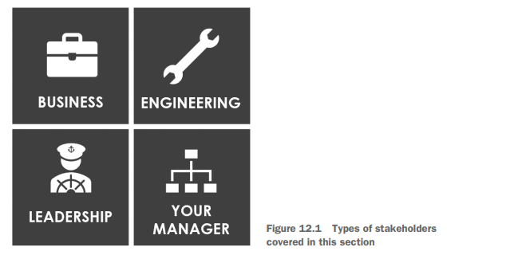

# eam Design, Infrastructure, and Data Collection

## Introduction

# Chapter 4: Getting Started

# Chapter 12: Working with Stakeholders

This chapter covers
- Working with different types of stakeholders
- Engaging with people outside the data science 
team
- Listening so that your work gets best used

## Types of stakeholders

### Business stakeholders

### Engineering stakeholders

### Corporate leadership

### Your manager

## Working with stakeholders

To communicate effectively with stakeholders during your data science projects, there
are four core tenets to think about:
- Understand the stakeholder's goals
- Communicate constantly
- Be consistent
- Create a relationship

The following sections go into detail on each of these tenets

### Understanding the stakeholder's goals

### Communicating constantly

### Being consistent

## Prioritizing work

### Both innovative and impactful work

### Not innovative but still impactful work

###  Innovative but not impactful work

###  Neither innovative nor impactful work

##  Concluding remarks

Summary
- Stakeholders come in many forms, with many needs.
- Create relationships with stakeholders so that they can consistently rely on you.
- Have continuous communication, and keep stakeholders in the loop on timelines and difficulties with projects.

