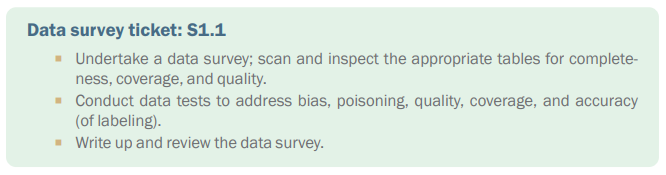
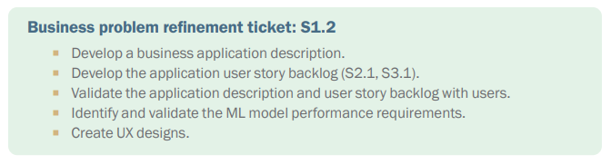
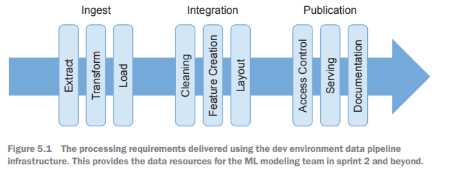

# Diving into the Problem

## Introduction

This chapter covers
-	Getting and verifying access to the data 
-	Revisiting, verifying, and refining business 
understanding
-	Developing UX and model utilization concepts
-	Getting the versioning and pipelining system in 
place and working
-	Building the initial pipelines to deliver a data 
set to the team
-	Starting to build data tests to make your 
pipelines robust

## Sprint 1 backlog

## Understanding the data

### The data survey

### Surveying numerical data

### Surveying categorical data

### Surveying unstructured data 

### Reporting and using the survey

## Business problem refinement, UX, and application design

## Building data pipelines

### Data fusion challenges

### Pipeline jungles

### Data testing 

## Model repository and model versioning

###  Features, foundational models, and training regimes

### Overview of versioning

## Summary

A data survey establishes that the expected data resources exist and have a level of 
integrity that will allow the team to meaningfully work on them.
-	By developing story cards and UX prototypes, you'll generate a deeper under-standing and agreement about the direction of the project and the requirements 
on the ML modeling activity that’s at the core of the project’s hypothesis.
-	Model repositories and versioning infrastructures for all the artefacts required 
in the project development need to be established, commissioned, and adopted 
(turn them on and use them).
-	Systematically build a data pipeline infrastructure to support agile development 
of modeling later in the project. The pipeline must provide support for ingest-ing the data, transforming it for use, and providing access to it for the modeling 
team.
-	Take careful note of the motivations and approach to data gathering for the data 
resources that the project uses.
-	Establish infrastructures for data testing and data pipeline testing to provide 
assurance during model development and into production that the team is work-ing with the correct data.

