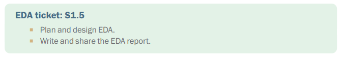
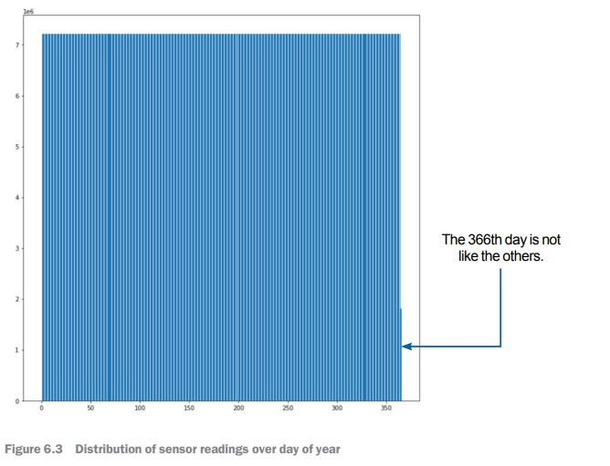
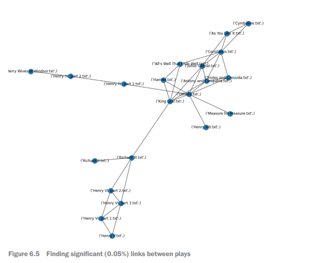
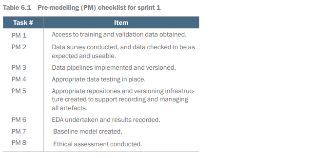

# EDA, Ethics, and Baseline Evaluations

## Introduction

This chapter covers
-	Undertaking an EDA to discover the statistical 
characteristics of data
-	Exploring unstructured data properties using 
foundational models
-	Checking the project's ethical, privacy, and 
security aspects
-	Building baseline models to get feedback about 
the potential for success
-	Providing support for estimating performance 
of more sophisticated models

## Exploratory data analysis (EDA)

### EDA objectives

### Summarizing and describing data

### Plots and visualizations

### Unstructured data

## Baseline models and performance

## What if there are problems?

## Pre-modeling checklist

## Summary

By undertaking EDA, it's possible to develop insight into the potential for developing models that meet the requirements of the project. 
-	We can systematically explore unstructured data as soon as the data set is available for analysis. 
-	Use graphics (plots and charts) to explore and illustrate the data features. Visual 
methods are revealing, and communicating what is discovered is important for 
people who work on the project in the future. 
-	Simple methods (counting, sizes, labels, etc.) provide some insights into unstructured data. Modern methods (embeddings, mappings, etc.) further characterizes these data sets. Explore what's possible with the current state of the art. 
-	Address ethical considerations explicitly as the data sources and types become 
clear. Remember, failing to think about this aspect of the project can waste a lot 
of money as well as compromising the team ethically. 
-	Building simple baseline models can provide validation of the potential for modelling and a way to measure progress.

