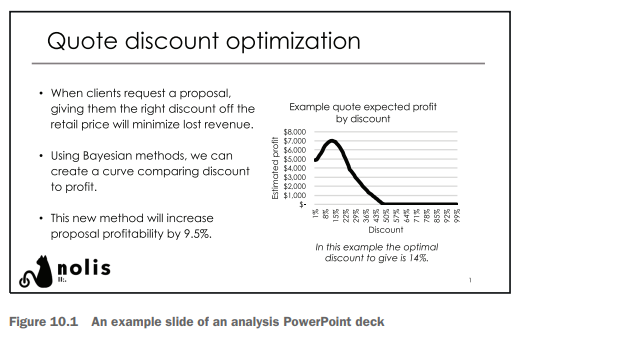
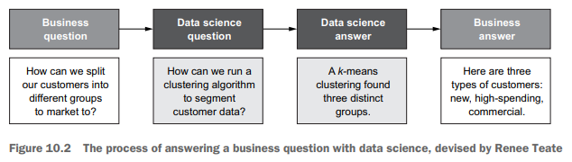
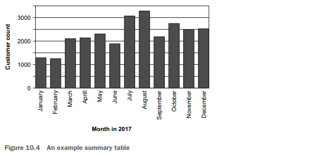
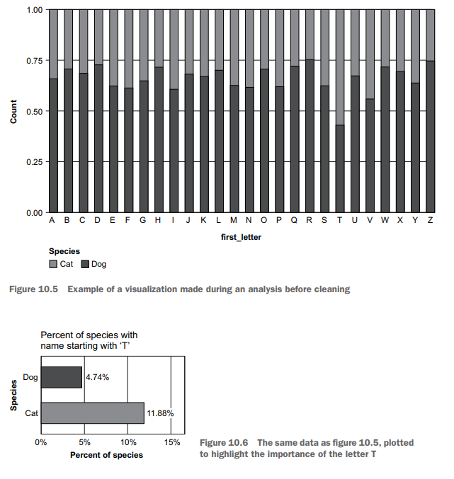

# Overview of the Analysis Workflow

## Introduction

# Chapter 10: Making an Effective Analysis

This chapter covers
- Planning an analysis
- Thinking through code, data, and project structure
- Delivering the analysis to the client

Context of the Chapter
- Written for data scientists focused on decision science and analytics.
- Machine learning engineers may find some content less relevant but will benefit from chapter 11 on model deployment.

Importance of Analyses in Data Science
- Analyses are essential documents that explain business situations or solve problems using data.
- Modern companies rely on reporting and analyses for decision-making.
- Decision-makers prefer data-backed choices, making data scientists important for deriving insights from data.
- Analyses help in building machine learning tools by understanding dataset context before model building.
- Crafting meaningful analyses from complex data is challenging and requires skill.

What is an Analysis?
- An analysis can be a PowerPoint, PDF, Word document, or Excel file shared with non-data scientists.
- It contains insights from data and visualizations.
- Typical time to complete an analysis ranges from one to four weeks.
- Analyses involve data collection, statistical coding, and producing final results.
- Once completed, the code may not be revisited until rerun is necessary.

Examples of Analyses
- Customer survey data analysis to identify products with high satisfaction.
- Examining order location data to decide on a new factory site.
- Using historical airline data to predict cities needing more routes.
- Analyses can vary in technical complexity, addressing specific one-time questions.

## Reporting versus Making an Analysis

Reports and analyses are similar but distinct.

A report is generated regularly with minimal changes.
- Example: Monthly financial report in Excel.
- Purpose: To monitor changes in metrics.

An analysis is a one-time project to answer specific questions.
- Example: Customer acquisition analysis using R.
- Results presented in PowerPoint.
- Reports are data-heavy with numbers and metrics.
- Analyses emphasize a main result.
- Traits of good analysis often apply to good reports.
- "Analysis" is used to refer to both unless stated otherwise.

### Traits of a Good Analysis

Answers the Question
- Provides a meaningful answer to the initial question.
- Example: It should indicate which website leads to more sales.

Made Quickly
- Should be completed in a timely manner, typically within a month.
- Timeliness is crucial for influencing decisions with deadlines.

Can Be Shared
- Needs to be presented in an accessible format for others.
- Formats like PowerPoint are preferred for clear communication.

Self-Contained
- Must be understandable on its own without external references.
- Includes clear descriptions, labeled axes, and well-documented explanations.

Can Be Revisited
- Should be able to be reused for similar questions in the future.
- Flexibility is necessary for changing input data or questions.

General Theme
- A good analysis aids non-data scientists in their work.

Steps of Analysis
- The chapter outlines steps from request to report delivery.
- Encouragement to follow steps to avoid mistakes commonly made by inexperienced data scientists.

### Analyses for Different Types of Data Scientists

Decision Scientist
- Core function is making analyses.
- Focus on answering questions with data.
- Need to communicate findings clearly to the business.
- Analysis serves as a key tool for communication.

Machine Learning Engineer
- Primarily creates and deploys models.
- Uses analyses to show model performance.
- Demonstrates value in building new models and tracking changes over time.

Analyst
- Concentrates on metrics and KPIs for the business.
- Creates frequent reports, often using Excel, SQL, R, or Python.
- Emphasizes maintainability due to the recurring nature of work.

##  The request

Business Questions
- Analysis begins with a business question from a colleague or manager.
- Examples of questions:
- "Can you look into why widget sales were low in Europe in December? "
- "Do our small-business customers behave differently from our larger ones? "
- Requests may vary from ill-defined (e. g. , “Why are sales down? ”) to precise (e. g. , “What attributes are correlated with a lower average order value? ”).

Data Science Questions
- Data science questions differ from business questions.
- Examples include:
- "How do you cluster these data points? "
- "How do we forecast sales? "
- Data scientists must convert business questions into data science questions and return answers understandable to the business.

Process Overview
- The process involves:
- Receiving a business question from stakeholders.
- Translating the question into mathematical terms (e. g. , clustering customer data).
- Producing a data science answer (e. g. , groups of clustered data points).
- Converting the data science answer back into business terms (e. g. , identifying “new customers” or “high spenders”).

Key Skills Required
- Combination of experience with specific problems.
- Understanding statistical methods and their potential business utility.

Foundational Work for Data Science Analysis
- Understand the business question before analyzing data.
- Determine who is requesting the analysis and their relationship to their team.
- Identify the motives behind the request.
- Clarify whether there is a specific question or a general idea for analysis.
- Assess if you have the necessary data to address the problem.
- Ask questions to grasp the purpose of the analysis; it can prevent unnecessary work.

Kickoff Meeting
- Conduct a 30- to 60-minute kickoff meeting with the requester and involved parties.
- If no meeting is scheduled, initiate one to clarify the request.
- Use the meeting to introduce yourself and understand their work better.

Hypothetical Example for Foundational Knowledge
- Requester: Julia from the widget product team.
- Motive: Widget sales declined by 10% this month.
- Request: Analyze if the sales dip is region-specific.
- Decision: Determine if the widget should be discontinued.
- Data availability: Customer orders by shipping zip code are present in the database.

Importance of Data Availability
- Confirm if necessary data exists to answer the question.
- Avoid lengthy analysis if the needed data is missing; communicate upfront with stakeholders.
- Explore possible alternatives or solutions to data issues and suggest long-term fixes if needed.

Questions for Analysis Planning
- Understand the identity and motivations of the requester for efficient analysis planning.

## The analysis plan

Importance of Data Analysis for Data Scientists
- Data scientists enjoy analyzing data to find answers.
- There are many ways to summarize and model data.
- It's common to fail to answer the business question asked.
- This realization can be discouraging, especially for junior data scientists.

Solution: Analysis Plan
- An analysis plan serves as a guardrail to keep work relevant.
- Before starting, write down what you plan to do with the data.
- Track progress on the plan as the analysis proceeds.
- Completing the tasks in the plan signals when you're done.
- The plan helps identify if you're veering off track.
- It aids in accountability and can be referenced in meetings with managers.

Making Actionable Analysis Plans
- Tasks in the plan should be actionable and specific.
- Example of actionable task: "Make a linear regression on sales by region. "
- Non-actionable tasks, like "Find out why sales are down," are unhelpful.
- An actionable plan facilitates progress and next steps in analysis.

Recommended Template for Analysis Plans
- Top Section: Include title, data scientist's identity, and analysis objective.
- Sections: General topics should be self-contained with independent tasks.
- First Level Section Lists: Correspond to each question posed in the analysis.
- Second Level Section Lists: Detail actionable tasks that can be checked off.

Example Analysis Plan Structure
- Title and objective at the top.
- Sections covering different analysis components.
- Subsections listing analysis questions.
- Detailed tasks listed for execution.

Analysis Plan Creation and Sharing
- Share your analysis plan with your manager and the stakeholder.
- They can offer suggestions or approve the plan.
- An approved plan serves as a foundation for your work.
- Reference the plan if stakeholders question your decisions later.

Updating the Analysis Plan
- It's normal to realize something important is missing or to have new ideas during analysis.
- Update the plan as needed and inform the stakeholder of changes.
- You may need to remove less important tasks due to time constraints.
- The analysis plan facilitates discussion about what to remove, avoiding overwhelming workloads.

### Doing the analysis

Getting Started with Analysis
- Sign off on the analysis plan.
- Import data for manipulation and cleaning.
- Transform data through summarizing, aggregating, modifying, visualizing, and modeling.
- Communicate the prepared work to others.

Considerations for Analysis in Work Environment
- Keep important considerations in mind during analysis.
- Many resources are available to learn coding for analysis in various languages.

### Importing and cleaning data

Data Preparation for Analysis

- Ensure data is in a usable format (R, Python, SQL).
- Expect data preparation to take longer than anticipated.
- Common issues may include:
- Problems connecting to databases in the IDE.
- Incorrect datatypes (e. g. , numbers as strings).
- Unusual time format (e. g. , “year-day-month” instead of “year-month-day”).
- Required formatting on data (e. g. , removing prefixes like “ID-”).
- Missing records in the dataset.

Managing Perceptions of Work

- Nontechnical stakeholders may not see data preparation as productive.
- Focus on moving to data exploration quickly.

Dual Mandate in Data Handling

- Limit time on non-essential data preparation.
- Invest time in formatting data believed to be useful.
- If spending too much time on an issue, assess its necessity.

Dealing with Difficulties in Data Importing

Options when stuck on an issue:
1. Ask for help from a senior colleague.
2. Avoid the problem entirely (e. g. , use a. csv file instead).
3. Avoid prolonged self-troubleshooting.
- Discuss with a manager if facing insurmountable issues.

Identifying and Handling Weird Data

- Weird data contradicts basic assumptions (e. g. , flights landing before taking off).
- Common types of weird data include:
- Negative prices for items.
- Discrepancies in production numbers among similar factories.
- Don’t ignore weird data; it can compromise analysis.

Steps to Address Weird Data

- Consult stakeholders or data owners about known weirdness.
- If the weirdness is unknown, investigate its impact on analysis.
- Conduct mini-analysis if key data points (e. g. , costs) are missing to assess feasibility.

### Data exploration and modeling

During the data exploration and modeling part of the analysis, you go through the
analysis plan point by point and try to complete the work. The following sections provide
a general framework tackling each point.

#### USE GENERAL SUMMARIZATION AND TRANSFORMATION

Data Analysis Techniques

- Majority of analysis work involves summarizing and transforming data.
- Simple questions, e. g. , “How many customers did we have each month? ” can be answered through data transformations.
- Requires grouping customer data by month and counting distinct customers.

Importance of Transformations

- Transformations may seem basic but are often highly valuable.
- Many individuals in a company lack access to data or the skill to perform effective transformations.
- Correct transformations provide insights that others may not achieve.

Use of Statistical Methods

- Depending on the data, additional statistical methods may be useful.
- Examples include finding values at different percentiles or computing standard deviation.

#### VISUALIZE THE DATA OR CREATE SUMMARY TABLES

Data Visualization Tasks
- Create visualizations or summary tables after data transformations
- Example: Use a bar plot to show monthly customer numbers

Benefits of Visualization
- Helps to identify patterns in data
- Easier to interpret than just reviewing data frames

Example Visualization
- A bar plot (Figure 10. 4) illustrates overall customer count each month
- Graph indicates a slight upward trend in customer count

Visualization Choices
- The type of visualization depends on the data available.
- Options include line graphs, box plots, summary data tables, and others.
- Refer to the resources section for guidance on selecting the right plot.

Process and Iteration
- Expect to iterate through visualizations and data transformations multiple times.
- Be prepared to adjust steps as you create your visualizations.

Code Management
- Balance the desire to delete mediocre results with the need to save them for future reference.
- Best practice: save as much as you can while ensuring old code remains functional.
- Clearly label "good" results to distinguish them from others.
- Avoid keeping non-working code or large commented areas to simplify maintenance.

Version Control
- Use version control tools like git and GitHub for better management.
- Make regular commits to track changes and allow for rolling back in case of issues.

#### CREATE A MODEL AS NEEDED

Modeling Data
- If patterns suggest modeling, proceed with it.
- Example: Apply time-series model for predicting customer counts for the next year.

Output and Visualization
- Output results to evaluate model accuracy and usefulness.
- Create plots to compare predicted results with actual values.
- Show metrics like accuracy scores and feature importance values.

Machine Learning Models
- If machine learning models will be used outside analysis, isolate the code for model building.
- Ensure model code is separate from general analysis code for easy access in the future.
- Chapter 11 will cover putting models into production.

#### REPEAT

Steps for Analysis Plan
- Complete the steps for each point in the analysis plan.
- Adjust the analysis plan if new ideas or realizations arise.

Related Points and Code Reuse
- Different points of the analysis plan are likely related.
- Code used in one point may be needed again in another.

Structuring the Analysis Plan
- Structure the analysis plan for code reuse.
- Aim for maintainable code that is easy to modify.
- Minimize time spent managing complex code.

###  Important points for exploring and modeling

The work of data exploration and modeling is extremely dependent on the problem
you are trying to solve. The mathematical and statistical techniques you'd use for trying
to cluster data are quite different from those for making a prediction or trying to
optimize a decision. That being said, following some broad guidelines can make the
difference between an OK analysis and a great one.

#### FOCUS ON ANSWERING THE QUESTION

Wasting Time in Analysis
- Work that doesn't align with the goal can waste time.
- Example: Analyzing customer orders for predictions can lead to unnecessary hyperparameter tuning instead of focusing on a simple feasibility question.

Staying Focused on Goals
- It’s crucial to stick to the analysis plan.
- Constantly ask, "Is this relevant? " when creating plots or tables.
- If the analysis feels irrelevant, adjustments may be needed.

Adjusting Your Approach
- If you doubt the usefulness of a plot or table, consider changing your approach.
- Explore dramatically different methods (e. g. , switching to clustering for customer analysis).
- Discuss concerns with your manager or project stakeholder about data effectiveness.

Building Relevant Results
- Throughout the analysis, consistently gather relevant results.
- Aim to adhere to the analysis plan throughout the process.

#### USE SIMPLE METHODS INSTEAD OF COMPLEX ONES

Importance of Complex Methods
- Complex methods like random forests and neural networks outperform simple methods like linear regression.
- They are more interesting and can provide better results for business questions.

Drawbacks of Complex Methods
- Accuracy is not the only goal; clarity and understandability are crucial.
- Complex methods can make it hard to explain results to businesspeople.
- They require more time for setup, tuning, and running.

Recommendations for Analysis
- Choose simple methods whenever possible.
- Use straightforward models and transformations.
- Consider logarithmic transformations or medians over means for data handling.
- If linear regression is sufficient, avoid unnecessary complexity with neural networks.
- Simplicity aids in understanding, defending, and debugging results.

#### CONSIDER PLOTS FOR EXPLORATION VS PLOTS FOR SHARING

Reasons for Data Visualization
- Two main reasons a data scientist visualizes data:
- For exploration
- For sharing

Exploration Visualizations
- Aim: Help data scientists understand data.
- Complexity: Complicated and poorly labeled graphs are acceptable if understood by the data scientist.
- Usage: Should utilize many exploratory plots for analysis.
- Not for sharing purposes.

Sharing Visualizations
- Aim: Communicate specific points to those unfamiliar with the data.
- Simplicity: Must be simple and clear to be effective.

Example of Visualization
- Scenario: Exploring the relationship between the first letter of pet names and species (cats vs. dogs).
- Initial visualization shows the split between cats and dogs based on starting letters.
- Observations:
- Significant finding: "T" has more cats (higher number) than dogs.
- Not suitable for stakeholders due to complexity and unclear message.

Improved Visualization
- Second version of the data plot presents the same information clearly.
- Findings: Cats have a 12% chance of names starting with T, while dogs have a 5% chance.
- This version is suitable for sharing with stakeholders.

#### CONTINUOUSLY READY TO SHARE

Analysis Output Forms
- Choose the output form based on the target audience.
- Slide decks or editable documents (PowerPoint/Word, Google Slides/Docs) are ideal for businesspeople.
- Technical audiences may prefer Jupyter Notebook or R Markdown output HTML files.
- Excel is best for delivering tables of data to financial people who need further calculations.
- Decide on the output type early in the analysis process to avoid rework.

Stakeholder Check-ins
- Check in periodically with stakeholders during the analysis to show progress.
- Prevents isolated work leading to invalid results, e. g. , missing critical factors.
- Stakeholders can suggest focus areas or methods during check-ins.
- This approach resembles agile software development, promoting continuous improvement.

Polishing Work for Presentation
- Frequent check-ins are essential but often neglected by data scientists.
- Ensure work is presentable for non-data scientists: clear plots, minimal errors, and a basic narrative.
- Avoid postponing sharing work for polishing; it usually increases overall workload.
- Maintaining a consistent level of polish leads to a better end product.

#### ONE-BUTTON RUN

Data Loading and Preparation
- Use one script to load and prepare data
- Ensure analysis runs with one-button press

Python
- Use Jupyter Notebook to automatically load data and conduct analysis without errors

R
- Use R Markdown file for loading data, performing analysis, and generating output files (HTML, Word, or PowerPoint)

Best Practices in Analysis
- Avoid running too much code outside the main script
- Do not run scripts out of order to prevent errors during reruns
- Allow for some ad-hoc coding but ensure the script can be rerun without issues
- Keep results ready for sharing and minimize script fixing time at the end

## Wrapping it up

Final Output Preparation
- The output may satisfy stakeholders, or further polishing may be needed.
- A polished version, such as a PowerPoint, should follow company style guidelines.
- Create a narrative that helps others understand the work’s conclusions and processes.

Crafting the Narrative
- Identify the story you want to tell.
- Introduce the problem and explain how your work offers a solution.
- Discuss the next steps in your narrative.
- Imagine how you would explain the work to someone unfamiliar with it.
- Continuously ask if your content is understandable and how it can be improved.

Adding Text and Context
- Include explanatory text in your document.
- Ensure the text is useful for the business and understandable to outsiders.
- Different companies have varying standards for the depth of text.
- Aim for clarity and detail; it’s easier to cut down than to add more content later.

Peer Review Process
- Conduct a peer review to catch small mistakes before submission.
- Get feedback from a team member who understands the work’s context.
- Your manager may also need to review and approve the content.

### Final presentation

Meeting Preparation and Delivery
- Set up a meeting with the stakeholder after receiving manager's sign-off on your analysis.
- Present your analysis in person, walking through each component.
- Explain what you did, what you learned, and what was excluded from the analysis.
- Be comfortable explaining the data, as you have invested significant time in it.

Handling Questions
- Expect varying question styles from stakeholders: some may ask throughout, others at the end.
- Question types can be calm and curious or critical and concerned.
- Respond to questions by being honest about what you know and don't know.
- It's acceptable to admit when you need further investigation.
- Always clarify your reasoning for choices made in the analysis.

Addressing Alternative Requests
- Be prepared for suggestions or questions about areas not covered in your analysis.
- Stakeholders may inquire about different approaches or data slices, especially if results are inconclusive.
- Gently push back against unnecessary or time-consuming requests.
- Use your expertise to determine the potential value of exploring new ideas.
- Recognize when to stop exploring options, especially in abstract business questions.

### Mothballing your work

Final Analysis Completion Steps

- Move quickly to the next set of work after analysis approval.
- Upcoming reanalysis may require using recent data; take the following steps to simplify this:

- Double-check the ability to rerun the entire analysis.
- Comment your code for better understanding in the future.
- Add a README file explaining the analysis purpose, reasons, and usage instructions.
- Store your code safely; consider using git and GitHub.
- Ensure safe storage of data files in places like cloud services or secure databases.
- Store output in a shared location instead of email attachments for better accessibility.

- Once all tasks are completed, the analysis is considered truly complete.
- Improve methods and techniques with experience for better and faster analyses.

## Summary

Analyses are documents that highlight conclusions and encapsulate important
features of an application of data science to solve a business problem. They are
critical for data scientists.
- A great analysis requires understanding the business problem and how data can
solve it.
- When making the analysis, always think of the end goal, use simple methods
with clear visualizations, and be ready to share your work.
- Managing the process of creating the analysis is important to keep the work
focused on the goal and to ensure that it has a clear end.
