# Leading Projects

## Introduction

The text *How to Lead in Data Science*
by Jike Chong and Yue Cathy Chang
divides the features relevant to leaders in Data Science and Business Analytics 
into 6 components that comprise what they call the TEE-ERA Fan. 

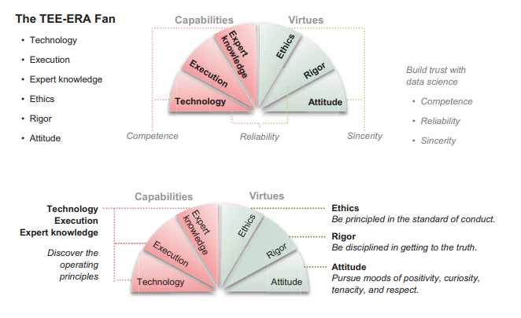

This section compiled from two chapters in this book
will guide effective leadership of an analytics project, 
which is the first step up the chain of command in the analytics profession. 

# Chapter 2: Capabilities for Leading Projects

This chapter covers
- Using best practices for pattern discovery and 
setting expectations for success
- Specifying, prioritizing, and planning projects from 
vague requirements
- Striking balances between complex technical 
trade-offs
- Clarifying business contexts and accounting for 
data nuances
- Navigating structural challenges in organizations

As a data science tech lead, you are expected to influence without authority by mentoring a team of data scientists and collaborating with business and engineering partners to drive projects forward.

What are these strategic capabilities for a data scientist tech lead?

- *Technology:* The tools and frameworks for you to lead projects more effectively,
which are used in framing the problem, understanding data characteristics,
innovating in feature engineering, driving clarity in modeling strategies, and
setting expectations for success.
- *Execution:* The practices for you to specify projects with vague requirements
and prioritize and plan projects, while balancing difficult trade-offs. 
- *Expert knowledge:* The domain knowledge for you to clarify project alignment to
organizational vision and mission, account for data source nuances, and navigate structural challenges in the organization.

## Technology: Tools and skills

Practicing DS involves translating business needs into quantitative frameworks and
optimization techniques, such that we can learn patterns from data and anticipate the
future. Setting up a project to learn from data has many challenges involving the following three areas: 

1. Framing the problem to maximize business impact
2. Discovering patterns in data:
  - Understanding data characteristics
  - Innovating in feature engineering
  - Clarifying the modeling strategy
3. Setting expectations for success

### Framing the problem to maximize business impact

Framing the problem can be more important than identifying the data sources. A powerful framing can inform what data sources are required to achieve the goals you set out to accomplish.

*Text p.25*

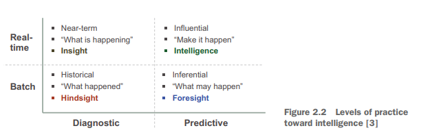

*Text p.26*

### Discovering patterns in data

#### UNDERSTANDING DATA CHARACTERISTICS

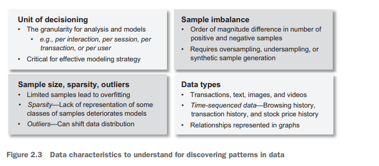

#### UNIT OF DECISIONING

#### SAMPLE SIZE, DATA SPARSITY, AND OUTLIERS

#### SAMPLE IMBALANCE

#### DATA TYPES

#### INNOVATIONS IN FEATURE ENGINEERING

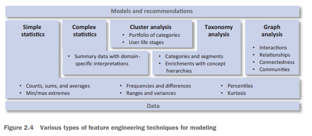

#### CLARIFYING MODELING STRATEGY

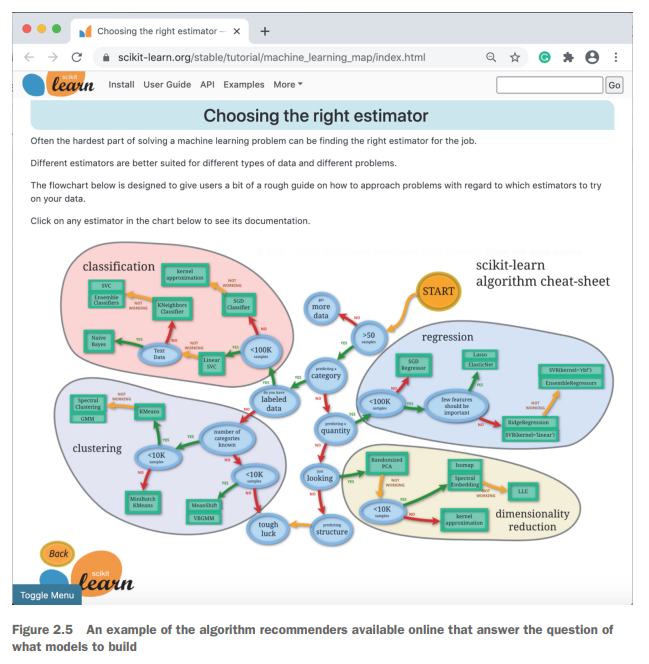

### Setting expectations for success

Partners may form unrealistic expectations for data science projects after hearing
machine learning use cases from social media or a marketing white paper. When
unrealistic expectations are set, even when good insights and models are delivered,
partners may not be satisfied.

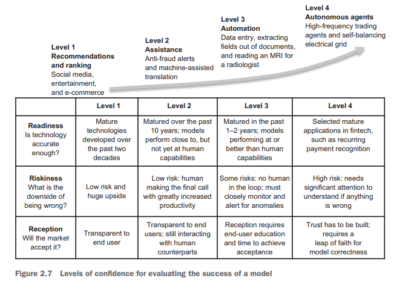

Success in recommendations is evaluated by lift, which maps to the incremental
business impact of using a model. To illustrate lift, an engagement improvement from
4% to 5% would be a 25% lift (as calculated by: 5% / 4% – 1 = 25%).

At the assistant level, 
success is assessed by the increase in human productivity in some function.
Confidence is guaranteed by the final human decision in the loop.

For models with automation, 
success is the adoption of models that can perform at human accuracy, such that we
can significantly increase the reach to serve the previously unreachable populations.

For autonomous agents, success is when human operators can overcome the leap
of faith to trust autonomous agents to correctly operate with the strategies defined
to produce the anticipated results.

## Execution: Best practices

### Specifying and prioritizing projects from vague requirements

Effective data science tech leads learn to ask the question behind the question to
take personal accountability for setting up data science projects for success.

*Text p. 41*

#### HOW TO PRIORITIZE

As a tech lead, here are three levels of diligence for DS project prioritization you can reference:
- Innovation and impact
- Priority refinements with RICE
- Prioritize with alignment to data strategy

#### Level 1: Innovation and impact

#### Level 2: Priority refinements with RICE

You can assess the operational risks for project success by asking: What data is
available? Of what’s available, what is reliable? Of what’s reliable, what is statistically significant? Of what’s statistically significant, what is predictable? Of what’s predictable, what is implementable? Of what’s implementable, what is ROI positive? Of
what is ROI positive, is there a business partner ready to operationalize it to create
business value?

#### Level 3: Prioritize with alignment to data strategy

### Planning and managing a DS project for success

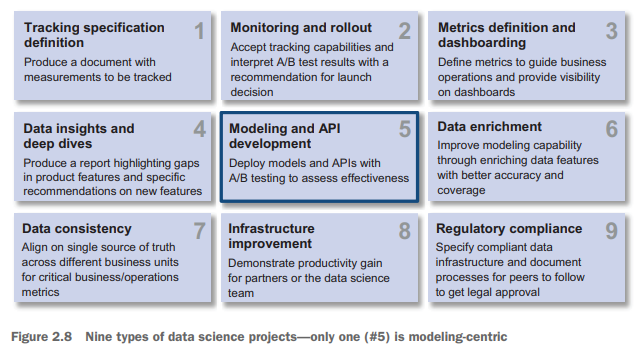

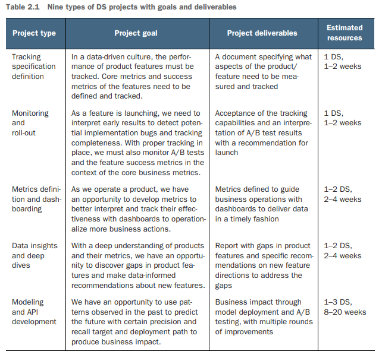

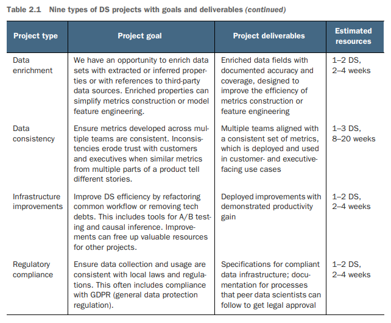

As a DS tech lead, there are many common failure modes for you to anticipate. Here
are nine:
- Customer of the project is not clearly defined
- Stakeholders are not included in the decision process
- Project goals and impact are not clarified and aligned to company strategy
- Affected partners are not informed
- Value of the project is not clearly defined
- Delivery mechanism is not defined
- Metrics of success are not aligned
- Company strategy changes after project definition
- Data quality is not sufficient for the success of the project

Zeroing in on planning, the purpose of a project plan is to address these failure
modes to the best of the team’s abilities to avoid wasted efforts. Especially for large
and complex projects, a project plan also serves to align understanding with partner
teams to coordinate and commit resources toward executing the company strategy.

 Here is a sample template of a project plan:
1 Project motivation
  - Background—Customers, challenges, and stakeholders
  - Strategic goal alignment—Company initiative it serves, its impact, and its value
2 Problem definition
  - Outputs and inputs specification
  - Metrics of project success
3 Solution architecture
  - Technology choices
  - Feature engineering and modeling strategy
  - Configurations, tracking, and testing
4 Execution timeline
  - Phases of execution
  - Synchronization cadence
  - A/B test scheduling
5 Risks to anticipate
  - Data and technology risks
  - Organizational alignment risks

*Text p. 47-51*

### Striking a balance among trade-offs

As a DS tech lead, effective execution of DS projects with the team requires many
trade-offs to be balanced between speed and quality, safety and accountability, and
documentation and progress.

#### BALANCING SPEED AND QUALITY

When balancing speed and quality, a tech lead must understand when to quickly
empower a business partner to make a timely business decision and when to 
practice the art of craftsmanship.

#### BALANCING SAFETY AND ACCOUNTABILITY

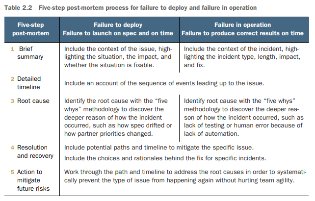

#### BALANCING DOCUMENTATION AND PROGRESS

Documentation is a hard topic for DS, as it is often seen as competing with making
progress on additional projects. Many question how useful it really is for one or more
of the following reasons:
- Small teams—Most DS projects are performed by teams of one to three data scientists with good communication between team members.
- New teams—Many DS teams are new and have not experienced project hand-offs
where documentation becomes essential.
- Technical decisions—Many DS decisions are highly technical and are made within
the team without extensive reviews from business partners.
- Who's got the time—There is a significant demand on the team to tackle new projects rather than documenting existing work.
- No obvious location—Many tools (ad hoc queries, spreadsheets, slides, scripts)
are used, and there is no single obvious place to document both the code and
data.

Good documentation doesn’t have to be long and nuanced, but it does have to have
three properties: reproducibility, transferability, and discoverability.

## Expert knowledge: Deep domain understanding

How can you guide the technical direction of critical projects to align with business
goals? How do you crystalize your project plan narratives for fast project approval by
your manager? What are some fundamental data source limitations your team should
look out for? How do you tread a path through organizational constraints to drive
project success? As a DS tech lead, being observant of these distinctions and learning
to work with these opportunities, limitations, and challenges can help you lead projects to success. 

This section focuses on improving project success through the rigorous application of expert knowledge. You can infuse expert knowledge into the projects with a
CAN process: 
- Clarify the business context of opportunities or risks
- Account for domain data source nuances
- Navigate organizational structures in an industry

### Clarifying business context of opportunities

Clarifying the business context for your project team involves first interpreting the
organizational vision and mission. Vision is the desired future position of an organization. Mission defines a company’s business, its objectives, and its approach to reach those objectives.

As a DS tech lead, you should be sensitive to the way the vision and mission are
defined and check current projects for consistency, so your work and the team's work
can stay aligned with the direction intended by the executive team. Specifically, projects should be:
- Important, such that if not done, they would have a negative consequence for
the company
- Useful, such that they progress the company along with its mission 
- Worthwhile, such that they produce good ROI at low risk

### Accounting for domain data source nuances

Domain data source nuances often show up unexpectedly and can throw off project
milestones or cause complete project failures. As a tech lead, you have the responsibility to anticipate, recognize, and mitigate data biases, inaccuracies, and areas of incompleteness to achieve project success.

A bias is a systematic difference between the data collected and the populations represented. An inaccurate piece of data is one that misrepresents the fact in some ways. An incomplete piece of data is one that is not completely collected.

### Navigating organizational structure

Organizational structure is another source of uncertainty in the path toward project
success. Navigating this domain involves two skills: internally assessing the DS organization's capabilities and maturity, and externally navigating the business partners' organization structure outside the DS organization.

Internally, the DS organization’s maturity is highly dependent on data technology
platform capabilities. These capabilities can determine how fast a project team can
move to execute projects successfully. DS is also a team sport. External to the DS organization, the business partners’ organization structure determines how well the goals of the DS projects align with the mandates of business partners.

#### ASSESSING THE MATURITY OF DS ORGANIZATION

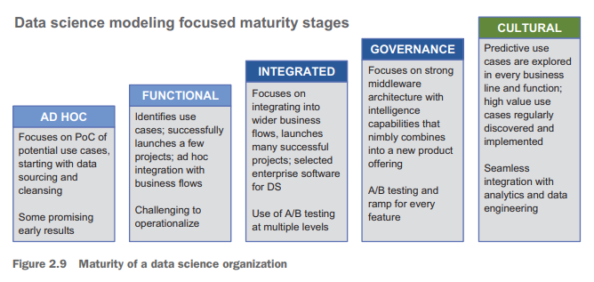

*Text p. 64*

#### NAVIGATING BUSINESS PARTNER ORGANIZATION STRUCTURE

*Text p. 64-66*

## Self-assessment and development focus

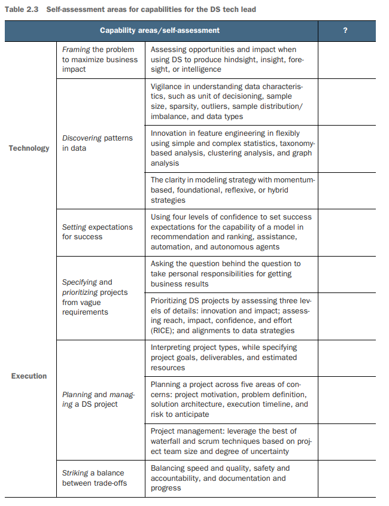

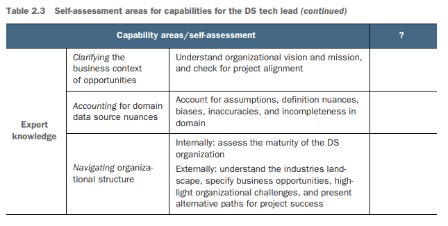

### Practicing with the CPR process

### Developing a prioritize, practice, and perform plan

## Summary

# Chapter 3: Virtues for Leading Projects

This chapter covers
- Operating in the customers' best interest as 
the standard of professional conduct in DS
- Adapting to business priorities and confidently 
imparting knowledge
- Practicing the fundamentals of scientific rigor
- Monitoring for anomalies and taking responsibility 
for creating enterprise value
- Maintaining a positive attitude with tenacity, 
curiosity, and collaboration

*Text on ERA, p. 73*

## Ethical standards of conduct

### Operating in the customers' best interest

#### INSENSITIVE USE OF DS

The tech lead is the first line of defense guarding a company against unethical data
science practices. An internal ethical compass can help you call off an analysis direction that could be seen as insensitive to the customer's well-being.

#### IMPACT ON CUSTOMERS’ EMOTIONAL WELL-BEING

### Adapting to business priorities in dynamic business environments

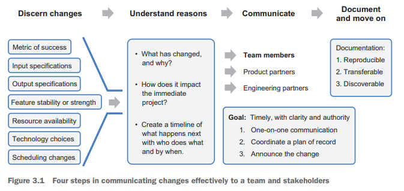

#### DISCERNING THE CHANGES THAT REQUIRE ATTENTION

#### Understanding the reasons behind a change

#### Communicating to team members and stakeholders

#### Documenting and moving on

### Imparting knowledge confidently

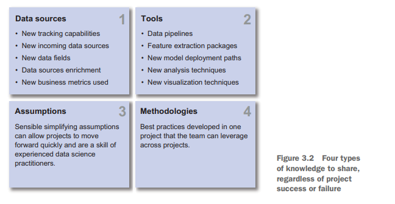

As a tech lead, you are responsible for ensuring the learnings from the team are captured and disseminated as much as possible, so the team’s experience and 
expertise can accumulate and grow over time.

## Rigor cultivation, higher standards

### Getting clarity on the fundamentals of scientific rigor

The rigor of the scientific methods is less frequently taught. Some may argue that
rigor needs to be practiced rather than taught.

You should be sensitive to these background differences and gently guide data scientists in the five scientific rigor principles when the background is missing. This way,
you can uphold the following five standards of rigor in data scientist projects to maintain customer and partner trust in your projects:
- Redundancy in experimental design
- Sound statistical analysis
- Recognizing error
- Avoiding logical traps
- Intellectual honesty

#### REDUNDANCY IN EXPERIMENTAL DESIGN

#### SOUND STATISTICAL ANALYSIS

#### RECOGNIZING ERROR

#### AVOIDING LOGICAL TRAPS

“Even the most careful experimental approach is not rigorous if the interpretation
relies on a logical fallacy or is intellectually dishonest.” - Casadevall and Fang

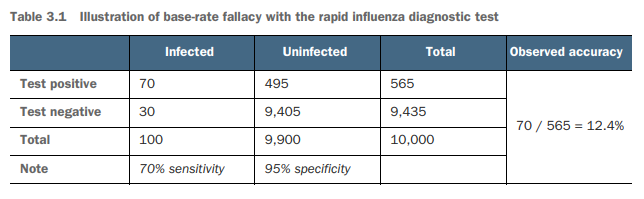

#### INTELLECTUAL HONESTY

##  Attitude of positivity

DS is a field with high failure rates. It is common to expect 70% of the experiments
not to show positive results. In well-optimized domains like Bing, Google, and
Netflix, success happens about 10–20% of the time. It takes an immense
amount of curiosity and tenacity to stay upbeat and focused on staying the course to
deliver project wins. 

How do we maintain positivity in the midst of adversity, celebrate the successes,
and learn from the failures, while building trust with partners to execute toward the
major business wins? There are three aspects to emphasize:
- Positivity and tenacity to work through failures
- Curiosity and collaboration in responding to incidents
- Respecting diverse perspectives in lateral collaborations

### Exhibiting positivity and tenacity to work through failures

You may have come across idealized stories like this: a data wizard hacks together a
solution using off-the-shelf ML algorithms and, in a few days or weeks, saves an organiation millions of dollars a year! Well, the reality is very different from the hype in the media. 

What does reality look like? Winston Churchill once said, “Success consists of
going from failure to failure without loss of enthusiasm.” 

The idealized DS wins are but one of nine different types of projects you can take on. 
As shown in the following list, only two of the nine types of projects introduced in section 2.2 have direct DS-driven business impact. 
The purpose of most DS projects is building tracking and data foundations, servicing technical debts, and/or supporting daily business operations:
- Tracking specification definition
- Monitoring and rollout
- Metrics definition and dashboarding
- Data insights and deep dives (direct DS-driven business impact)
- Modeling and API development (direct DS-driven business impact)
- Data enrichment
- Data consistency
- Infrastructure improvements
- Regulatory items

### Being curious and collaborative in responding to incidents

An incident is defined as an outage or significant degradation of a business service. 
In a fast-moving business and technology environment, incidents are quite inevitable. 
The potential negative impact of incidents tends to increase as the number of customers
grows. The team can come under significant pressure when something breaks unexpectedly. 
It is crucial for you, the tech lead, to maintain a safe and respectful atmosphere in these stressful situations.

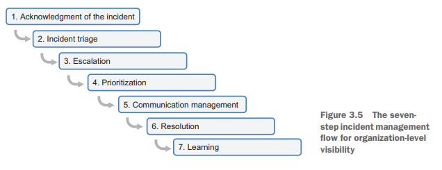

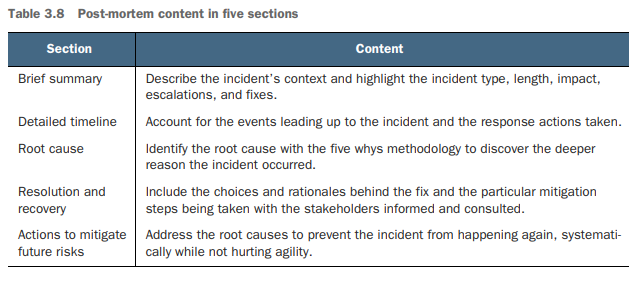

### Respecting diverse perspectives in lateral collaborations

To produce business impact, data scientists need to work with business functions to
implement data science recommendations that affect revenue, cost, or profitability/
efficiency. 
Strong respect for and strong coordination with business functions are critical for the success of data science initiatives.

## Summary
