# Making Useful Models with Machine Learning


## Introduction


# Chapter 7: Making Useful Models with Machine Learning

This chapter covers
-	Transforming data for processing 
-	Injecting information with feature engineering
-	Designing the model's structure
-	Running the model development process
-	Deciding which models to retain and which to 
reject


Sprint 2 Overview
- Sprint 2 marks the beginning of machine learning (ML) work.
- The outcome of this phase is critical to the overall project success.
- Previous phases (presales, sprint 0, sprint 1) set the stage for this work.

Creating Useful Models
- Creating a model is straightforward once data is prepared.
- A simple model can be made with minimal effort (e. g. , a single line of code).
- The challenge lies in making the model truly useful.

Qualities of Useful vs. Useless Models
- Useful models generalize well to new, unseen data.
- Other traits can also determine a model's utility.
- A referenced table contrasts useful and useless model characteristics.

Model Development Process
- The team must:
- Generate multiple features from data.
- Create numerous candidate models.
- Evaluate and select the most effective model.
- Communicate findings to stakeholders, regulators, and auditors.

Importance of a Rigorous Evaluation Process
- Flawed evaluation may lead to a brittle model in production.
- Convincing stakeholders of responsible model choices is essential.

Drivers of Model Quality
- Model alignment with stakeholder needs is key.
- Develop on strong foundations for reliability.
- Ensure outcomes are verifiable, building trust in model quality.

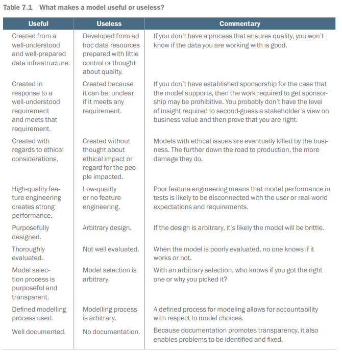


## Sprint 2 backlog

In sprint 2, the team implements systematic and professional modelling and evaluation
processes. By using an organized and documented approach, the team avoids some of
the pitfalls and common problems that produce poor quality models. At least, that's
the plan! Let's look at those tasks for sprint 2 before we dive into the details.


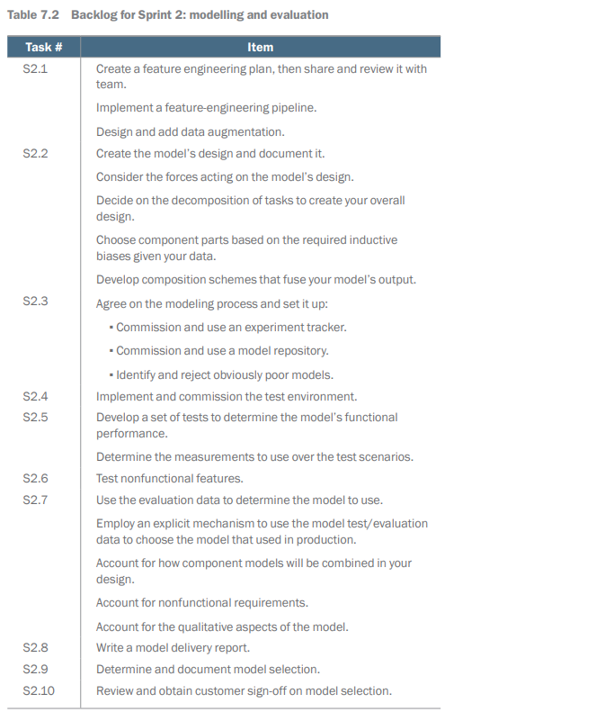


### Feature engineering and data augmentation


Feature Engineering and Selection

- Core part of the machine learning (ML) pipeline.
- Raw data requires preprocessing to create useful features.
- Data needs enrichment and transformation before modeling.

Systems and Approaches

- Feature selection and engineering frameworks exist.
- Kuhn and Johnson's book provides analytical insights on features.
- A systematic approach helps identify and solve technical data issues:
- Removing biases from repeated information across fields.
- Adjusting for distribution biases and scale differences.
- Managing hierarchical data effectively.

Incorporating Human Insight

- Feature engineering can encode common sense into data for ML.
- Example: December (12) followed by January (1).
- Machines need logical rules to understand order over days.
- Addressing circularity in directional data (0 to 360 degrees).
- Items at 359° and 1° should be represented as close in value.

Transforming Data for Understanding

- Feature engineering transforms data for ML comprehension.
- Instead of reasoning rules, data is restructured to include necessary knowledge.
- Example: Representing dates as distances from Midsummer’s Day.

Application Example

- Smart building sensors record temperature over a leap year.
- Mean temperature data illustrated to demonstrate transformation benefits.


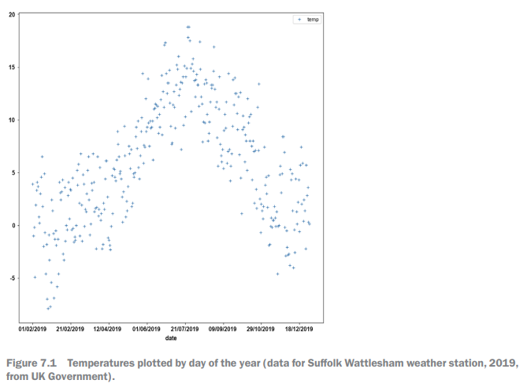

Figure 7.2 shows two new features: one giving the distance in days of a candidate day
from Midsummer's Day and another with the mean temperature for that day divided
by the distance from Midsummer’s Day and normalized from 0.0 (Midsummer's Day)
to 1.0 (Midwinter's Day) if there is a leap year. That’s 183 days, so the day after midsummer
has a value of 0.0054.


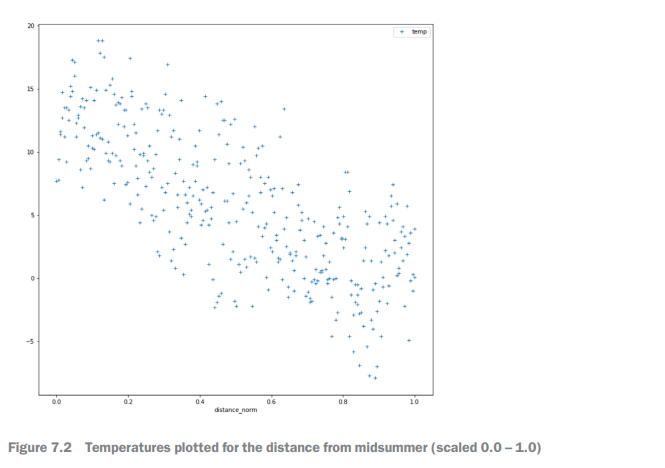


Creating Features from Unstructured Data

- Use pretrained foundation models to create features from unstructured data.
- Chapter 4 discussed using a foundation model to analyze Shakespeare’s plays.
- This method helps convert unstructured data into a form suitable for machine learning (ML).
- Instead of applying ML to raw unstructured signals, we leverage patterns formed during the foundation model’s training.
- Results are used to better represent data for modeling.
- Shakespeare example utilized the all-MiniLM-L12-v2 sentence transformer to identify novelty and similarity in themes.
- Similar methods can fuse information from both structured and unstructured data sources.

New Problem Scenario with Textual Data

- An email for customer acceptance is incorrectly sent, leading to inefficiencies.
- The text classifier struggles with new or uniquely phrased emails.
- Such corner cases can significantly increase costs and decrease user trust in the triage system.
- After exploratory data analysis (EDA), the team identifies the need for an outlier-detection feature.
- Aiming to build a classifier for appropriate topics, they create a signal indicating new/strange versus normal emails.
- Data is indexed using embeddings from a foundational model.
- An email's novelty is assessed by comparing it to the second closest email in the index and calculating similarity distance.

```
results_array = array [length(emails)]
for email in emails :
match = index.search (email)
results_array[email.id]=match.D
```

Note in the above block of pseudo-code:
- email.id is the index of this email.
- match.D is the distance that the index has returned.

Distance and Filtering Emails
- Results array shows distance to closest match for each email.
- Calculate standard deviation of the array.
- Set threshold at two times the standard deviation plus the mean.
- Filter out the strangest 5% of emails for training.
- Use this feature for topic classifier to create an "Other" label.
- Stronger classifications for remaining topics will result.

Importance of High-Quality Features
- Developing quality features is time-consuming and challenging.
- Requires experience and domain insight for good results.
- Feature stores are valuable assets for managing features.

Benefits of Consistent Data Use
- Consistent data use helps ensure ML algorithm behavior is understood.
- A well-developed feature store can be a lasting asset for clients.
- Previous projects may provide useful insights and information on features.


### Data augmentation

Introduction to Early ML System Story
- There is a story about an early ML system for identifying tanks in photos.
- The system reportedly learned to recognize snowy ground instead of tanks.
- This story highlights issues with ML algorithms learning from narrow data sets.

Limitations of Narrow Data Sets
- ML algorithms can become restricted by the limited examples they learn from.
- Such narrow data can lead to learning coincidences instead of accurate classifications.
- More diverse examples can reduce misleading coincidences in training.

Data Augmentation Technique
- Developed by Shorten and Khoshgoftaar, data augmentation creates more training examples.
- Transformations and alterations are applied to existing data to enhance robustness.
- Useful when the original training set has a narrow range of examples.

Image Augmentation Examples
- Various image transformations include:
- Rotation (b, c, and d).
- Adding extra objects (e and f).
- Adding noise (g).
- Inversion (h).
- Scaling (i).
- Repositioning (j).
- Mirroring (k) to create new examples for the algorithm.


Augmentation Processes for Robust Models
- Purpose: To create models that are more robust and general.
- Focus: Minimize reliance on coincidental features by using diverse training data.
- Application: Can be applied to unstructured data.

For text:
- Add spelling errors to samples.
- Replace non-stop words with synonyms.
- Use auto-translate to change phrasing.

For images:
- Alter contrast and brightness.
- Introduce noise and distortions.

Iterative Modelling Process
- New features and augmentation can be applied iteratively.
- Adaptations are made based on team investigations and algorithm behavior.
- Subsequent step: Create the model's design after initial feature implementation.
- Further details on managing iterative modelling discussed in section 7. 4.

## Model design

Designing ML Models
- ML models must be designed before being built by ML algorithms.
- Data scientists and ML engineers are responsible for the design.

Analogy of Rocket Engineering
- Rocket engines are designed based on technology and fuel available.
- Teams without access to quality materials must adopt a pragmatic approach.
- Access to advanced materials allows for more ambitious designs.

Comparison with ML Models
- ML models are designed to work with available data.
- Models must consider the production environment they will operate in.
- Both rocket engines and ML models require careful design to meet functional needs.


### Design forces

Sprint 0 and Sprint 1 Overview
- Requirements and constraints for ML modeling were clarified.
- User stories communicated various forces affecting model design.

Forces Affecting Model Design
- Quantitative Performance:
- Important metrics include F1 score, precision, recall, sensitivity, and specificity.
- Explanation/Transparency:
- Best numerical performance doesn’t guarantee sufficient explanations or transparency for decisions.
- Latency:
- Classifier response time must suit the application (e. g. , real-time interactions vs. batch processing).
- Cost:
- High execution frequency of classifiers can lead to significant infrastructure costs.
- Data Privacy/Security:
- Classifier behavior may reveal confidential information.
- Reuse and Data Sparsity:
- Limited data might require using prebuilt classifiers instead of training new ones.
- Project Risk/Time to Develop:
- Building classifiers from scratch is risky; using pre-trained components may reduce risk but lower performance.
- Robustness in Production:
- Highly tuned solutions may fail under real-world conditions.

Conclusion
- Selecting a solution isn’t as straightforward due to the complexity of project demands.

### Overall design

Choosing the Right Algorithm

- Selecting the right algorithm is crucial for data and problem-solving.
- A vast amount of literature exists to aid in making this choice.
- Kevin Murphy's book, "Probabilistic Machine Learning: An Introduction," offers comprehensive algorithm explanations.

Challenges in Algorithm Selection

- No single best option exists; you face trade-offs.
- Often, you must select a less suitable option.
- The best option may not fit your model's context due to:
- Team's understanding
- Time constraints
- Hardware limitations
- Need for excessive user intervention in production

Overcoming Challenges

- One solution is to implement a composite model combining several techniques.
- This approach can handle different data parts that a single model cannot address effectively.
- Example: An automatic translation bot may be more efficiently built using multiple specialized networks rather than one complex deep network.

Disjoint Models in Business Processes

- Some challenges may require independent models for different parts of a business process.
- Example: A customer service system that identifies customer language and provides relevant support.
- Architectural choices can help decompose the problem into manageable parts solved by different algorithms.

Decision-Making for Architectural Choices

- There are strategies for making architectural choices to address challenges.

### Choosing component models

Role of Data Scientists
- Data scientists choose ML algorithms to create suitable models for problems.
- Experience and insights are crucial, but heuristics can help.
- Heuristics are useful for managing project risk during modeling.

Key Determinants of Models
- The type of data an algorithm uses and the output it produces are critical.
- A model must produce the correct type of output (e. g. , graduated vs. binary signals).
- Algorithms must effectively model the output distribution to be useful.
- If an algorithm cannot produce the required output, alternative approaches are needed.

Choosing Algorithms
- Prefer well-known algorithms over novel ones when possible.
- New algorithms may perform slightly better but can be less understood and tested.
- Benchmark well-known algorithms against new ones for performance comparison.
- Simpler algorithms should be used when they can effectively solve the problem.

Deep Networks vs. Simpler Models
- Deep networks handle complex unstructured data but lack transparency.
- Simpler, transparent models (e. g. , association rules, decision trees) should be preferred if possible.
- Balance functional performance against the need for transparency.

Training and Costs
- Deep networks can be expensive to train and have high latency and costs in production.
- Running extensive data centers for model training has environmental impacts.

General Principles
- Use models that ensure required output from input based on inductive bias.
- These principles are common-sense heuristics for model selection.

### Inductive bias

Machine Learning Models and Bias
- ML models can be created using different algorithms and approaches
- Each approach introduces some bias

Smart Building Sensors
- Sensors have attributes: age, manufacturer, installation
- Installation has two values: internal or external
- Age ranges from 0 (new) to the number of days installed
- There are five manufacturers
- Half of the sensors in the data have failed

Decision Tree for Sensor Failure Prediction
- Objective: predict which sensors are likely to fail
- Important decisions in tree construction:
- Which attribute to test first
- Tests to apply to each attribute
- A sensible first test may be the installation attribute:
- Assess if the sensor is internal or external
- Possible observation: 80% failure rate in external sensors vs less than 20% in internal sensors
- Figure 7. 4 illustrates the effect of a split using the installation attribute

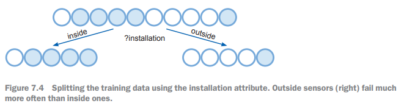

Even though our choice is commonsensical, in some ways it's arbitrary. Figure 7.5
shows an alternative split using the age attribute, which creates a clean division of data.
Now we see that all sensors that have been installed for longer than 100 days always fail.
A split using test age > 100 creates a left-hand node that only contains failed sensors.


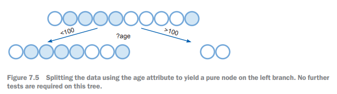

Sophisticated Choices in Algorithms
- More advanced choices have been developed for decision making.
- Decisions are guided by reasoning related to Occam’s razor, preferring simple decision trees.
- Algorithms may utilize different criteria for data splitting, impacting their ability to find patterns.

Model Creation Techniques
- XGBoost, boosting algorithms, and random forests create strong models for tabular data.
- These models can be complex and difficult to interpret, posing challenges for transparent decision-making.

Using XGBoost Effectively
- An overly complex XGBoost model can serve as a denoiser to improve simpler models.
- Train XGBoost and then use its output to help create simpler decision trees or association rules.
- XGBoost can be a baseline to evaluate the trade-off between simplicity and effectiveness of model choice.

Unstructured Data Handling
- XGBoost is less effective for images and text data.
- Hierarchical architectures for deep networks support various biases through selective architecture choice.
- Correct architecture choice can reduce training demands while achieving lower loss with less data.

Types of Deep Networks
- Different deep network architectures include:
- Multi-layer perceptrons
- Grid networks for computer vision
- Recurrent networks for speech and text
- Graph networks
- Attention-based networks like transformers

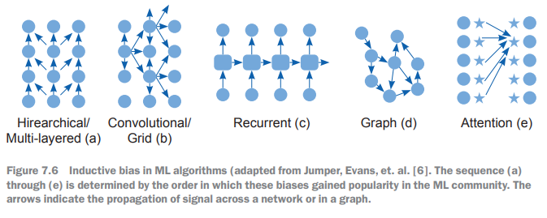

The network structures in figure 7.6 were developed in response to the need to process
different types of data. For example, figure 7.7 shows a perceptron-type network using
a hierarchical structure. This consumes the data from an image one pixel at a time, but
because the context of the pixels is as important as its content, the perceptron doesn't
do well. The information in the image is largely stored in the relationship of the pixels
to each other, and the perceptron can't capture that.

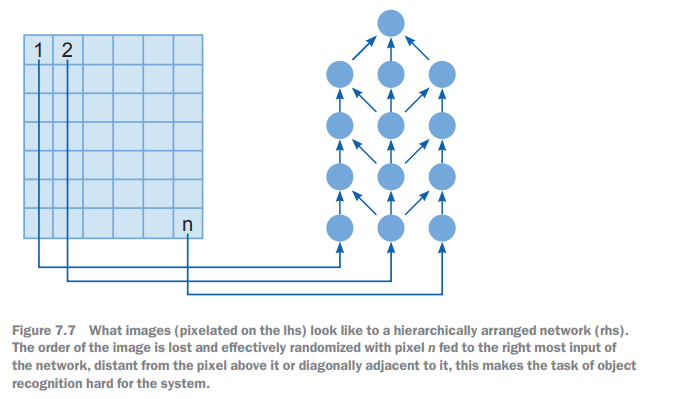

As an Alternative, we can use Convolutional Networks

- Convolutional networks can be constructed to consider localities.
- Convolution involves local information propagation in the network.
- It normalizes and filters activations at a local level.
- A learned filter moves in a sliding window over the network.
- This determines signal propagation from pixel to pixel.
- Information is pooled between layers.
- Convolutional networks are preferred for image recognition tasks.
- Large scale training sets and powerful compute engines enable effective training for these networks.

### Multiple disjoint models

Project Requirements

- Multiple models are needed for different parts of an AI application.
- Model results are independent and either consumed by humans or used as inputs in decision systems.

Example of Models

- A credit risk model can consist of several models focusing on different risks.
- Possible models include:
- Fraud model
- Risk dependency model
- Economic trends model
- Outputs can be combined for a single score or presented separately to a credit controller.

Impact of Divergent Requirements

- Different model requirements can increase system complexity.
- Complexity affects inference and data layers in production.
- System performance is influenced by both quantitative and nonfunctional factors.
- Resource allocation among models must be balanced to maximize overall system value.

Resource Management

- Resources include time and processor power for production models.
- Development effort and team time are also considered resources.
- A common mistake is to overly refine one model at the expense of others that might provide greater benefits with less effort.

### Model composition

Model Composition Overview
- Models can be used in sequence for overall reasoning.
- Chaining models is necessary when further intervention or outcomes are required.
- Example: Decision making in processes like controlling reagent flow and observing mixing before heating.
- Model composition is more complex than using independent models.

Breaking Tasks into Dependent Models
- Tasks can sometimes be divided into dependent models.
- In some cases, a single model may be more effective.
- A pragmatic approach is to break problems into steps that can be learned individually to create a chain of inference.
- Example: Translating a sentence involves three steps: recognizing the source language, determining meaning, and rendering it into English.
- A single network exists for all steps, but three separate networks can be easier to manage.

Advantages of Using Chains of Models
- Better management of technical risks for each subproject.
- Reusable pretrained networks or datasets may be available for subcomponents.
- Testing individual components in isolation simplifies troubleshooting.
- Parallel development of components can shorten project timelines.
- Partial solutions can be integrated for overall business value.

Downsides of Composite Models
- Composite models may not perform as well as bespoke models.
- Managing multiple models can be complex and costly in terms of documentation.
- Chains of models can create latency and throughput bottlenecks.
- Understanding and maintaining complex designs can be challenging.

Next Steps
- Once the model design and integration strategy are agreed upon, the team proceeds to implement it.

## Making models with ML


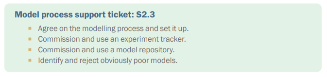

Creation of ML Models
- Creating ML models can be complicated or simple.
- Complex models require expert knowledge and a dedicated team.
- Non-experts may struggle to create effective models without help.

Low-Code Approaches
- Low-code tools make model creation seem easy.
- However, expertise is still needed for valuable results.
- One-click model creation can lead to poor outcomes without proper insight.

Importance of Process Management
- The process leading up to and following model creation is crucial.
- Proper definition and management of the modeling process are essential to create value and avoid damage.

### Modeling process

Model Development Process

- The model development process is driven by curiosity and is both an art and a science.
- Understanding data and creating model designs are necessary for success.
- Success requires experimentation, introspection, and investigation.
- The process can seem unstructured, but it is performed within a managed framework.
- Detailed experimental notes should be kept in a lab book to ensure rigor and reproducibility.

Importance of Documentation

- Data scientists should maintain thorough documentation to prevent losing details on model design.
- Well-organized investigations avoid duplicated efforts and wasted resources.
- Inefficient efforts can waste time and money, along with valuable resources.
- Proper processes prevent teams from misjudging the quality of models.

Data Leakage Issues

- Data leakage corrupts the model evaluation process, allowing test data to affect training.
- A common scenario involves models performing well on validation data but failing in real-world applications due to over-optimizations.
- Problems with training and validation data choices, especially in time series predictions, can lead to misleading results.

Plan for Model Development

1. Plan the time spent on implementing and exploring model design performance.
2. For each design component, identify experiments to verify behaviors and document expectations.
3. Execute the planned modeling and testing, documenting results.
4. Analyze results using appropriate tools.
5. After each modeling episode, review and decide on necessary changes to the plan.
6. Select the next experiment from the backlog and repeat the process.

Benefits of a Disciplined Approach

- A disciplined process with documentation helps prevent over-optimization and data leaks.
- Identifying when more validation data is needed improves model development.
- Rigorous examination of results leads to better comprehension and review after each iteration.
- Following these steps creates direction and momentum in the development process.

Record-Keeping and Future Implications

- Proper record-keeping in ML creates audit trails and reproducible models, similar to traditional science.
- As ML systems become more widespread, maintaining records will enhance model accountability.
- Professional documentation increases the usefulness and value of models.

### Experiment tracking and model repositories


Model Repository
- Stores instances of models built by the team
- Includes metadata about models
- Version of the algorithm
- Hyperparameters used
- Links to training set or training pipeline versions

Performance Statistics
- Table 7. 3 shows statistics recorded over several runs
- Simple linear model used for predictions
- Performance variation due to different test set sizes
- Performance estimated using AUC (area under the curve metric)
- TestSize parameter added at 10:38am to record performance differences
- Change in penalty function by ML package (Elastic_net) noticed with large test sets

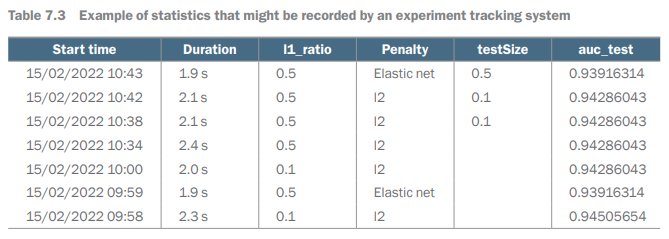

Recording and Storing Experiment Data
- Recording data can be tedious and prone to errors
- Used a tool called MLflow to record experiment data
- MLflow runs in the same Python environment as machine learning algorithms
- An API was utilized to record experiment details including statistics and parameters
- Data about parameters and performance is pushed each time the experiment is run
- Data can be retrieved through a graphical user interface (GUI) or command-line calls

Model Repository
- Unique identifiers link models to binaries, data assets, and results
- Models created by ML algorithms are stored as binary files
- Binary files encode parameter settings and weights for each model
- Stored in the filesystem or a database using MLflow's API

Artifacts and Metadata
- Artifacts include Conda code for Python packages and the model pickle (. pkl) file
- Artifacts enable reconstitution and running of the model on demand
- Other directories contain metadata defining the model and its performance during the experiment


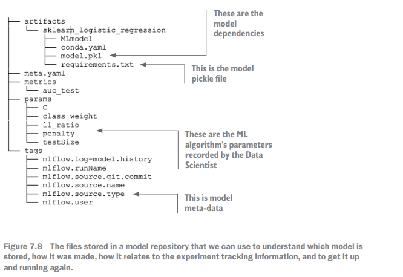

Data Pipelines and Features
- Developed in sprint 1
- Supportive of data scientists’ work
- Framework built on understanding data, business problem, and ethical challenges

Recommendations
- Consider outsourcing model design and creation process to a machine
- This could simplify the ML part of the project and reduce stress for the team

### AutoML and model search

Automated Search Systems for Model Creation
- Systems use automated searches to create models by varying algorithm parameters
- This practice emerged to explore the vast potential of deep-learning models
- Known as neural architecture search (NAS) or meta-learning

Benefits of AutoML
- Replicates the work of a data scientist with a single line of code or a button press
- Can rapidly improve model performance
- Automates tedious and error-prone tasks
- Some robust state-of-the-art results have been achieved

Challenges and Considerations
- Model search systems can produce brittle models that perform well on hold-out data but fail on test data
- Risk of luck-based success in identifying high-performing models
- Difficult to justify or explain chosen architectures or parameter settings
- The gap in reasoning when an alternative model is chosen over the optimal one found
- AutoML can be costly in terms of compute resources
- Important to balance learning process costs with gains in model performance

Situations for Using AutoML
- Useful at the start of modeling to set performance benchmarks
- If a manually derived model approaches AutoML performance, it indicates a good stopping point
- Failure of AutoML suggests the data may not be suitable for machine learning, prompting further data collection or feature engineering discussions
- Can optimize existing models to find further improvement opportunities
- Analyze where the optimized model outperforms the previously developed model

## Stinky, dirty, no good, smelly models

Aside: I think it is humorous that the AI summarizer did not understand the joke,
but it still gets the idea of the section. 

Model Smell

- Refers to issues in software models similar to "bad smells" in code
- Models can perform oddly, indicating problems
- Suspiciously good or bad performance is a warning sign
- It's important to investigate and address these issues
- A "smelly" model may show nice performance stats but can be misleading

Indicators of Model Smell

- Erratic performance on validation data
- Large performance changes from small parameter tweaks
- Outperforms expectations despite known issues
- Stands out from similar models due to hyperparameter sensitivity

Addressing Model Smell

- A suspect model may lead to new investigation opportunities
- Document experiments thoroughly and record results
- The AI summarizer rephrased the following: "Then, having figured it out, you'll need to drag the model
outside and beat it with a stick until it stops twitching," but a bit more formally.
- Discard aberrant models once verified
- The AI summarizer translated the following into the above point: "Then get rid of it (often throwing
it in a local pond is a good move, but you didn't hear that here)," but it captured the idea.
- Bugs in the pipeline or configuration mistakes are common causes
- Evaluation can be misleading; potential data leaks or overfitting may occur

Importance of Recognizing Model Smell

- Smelly models can falsely appear to rescue failing projects
- Easy to mistakenly move deceptive models into production
- Identifying model smell early helps in fixing pipeline bugs
- Fixes allow for straightforward and quick rerunning of experiments
- Iterations can lead to more robust models, eliminating the issues

Chapter Overview

- Setup for modelling activity and design processes explained
- Introduction to the modelling activity and necessary infrastructure
- Upcoming chapter (Chapter 8) will cover model evaluation and selection


## Summary

Create informative features for consumption by the ML algorithms in the modelling phase.
-	Create additional training data with data augmentation to support more robust 
models. 
-	Develop an understanding of the design forces on a model. 
-	Make purposeful and effective choices about the components of models that you 
want to develop. 
-	Understand and use inductive bias to inform your approach to modelling. Consider using hierarchical, grid-based, recurrent, graph-based, or attention-based 
structures. 
-	Determine when to use composite models and how to structure them effectively 
to solve the problem at hand. 
-	Structure and manage a controlled and purposeful modelling process.
-	Track and manage the evolution of models using automated tools. 
-	Detect and determine models that should be immediately rejected based on 
their behavior or structure.
