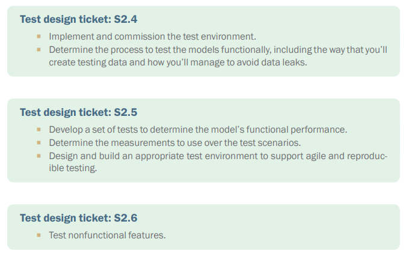
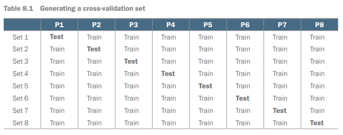
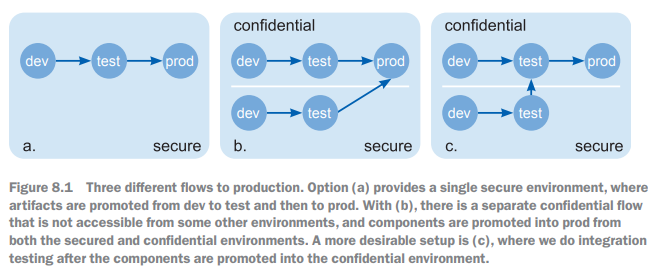
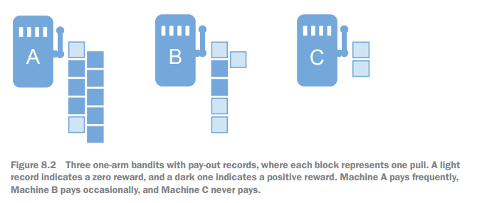
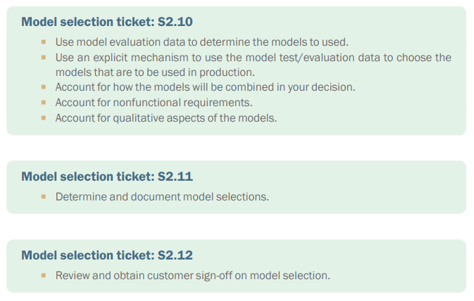
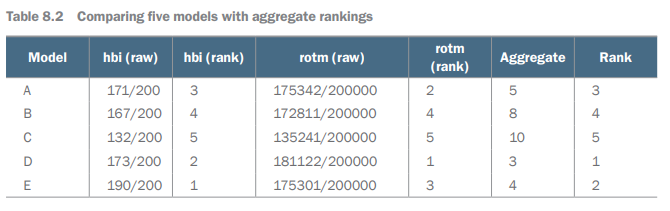
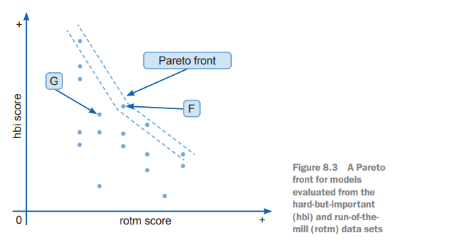
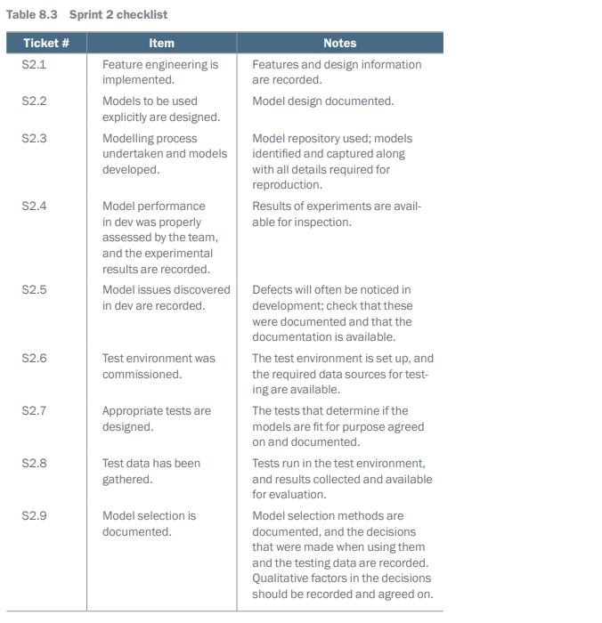

# Testing and Selection

## Introduction

This chapter covers
-	Structuring testing environments, then 
migrating code and artifacts to them
-	Measuring the properties of models 
-	Understanding how to test ML-discovered 
models offline and online
-	Understanding how the test results can be used 
to select models
-	Using qualitative evaluation and selection and 
quantitative measures
-	Avoiding deceptive traps when evaluating your 
models 

## Why test and select? 

## Testing processes

### Offline testing

### Offline test environments

### Online testing

### Field trials

### A/B testing

### Multi-armed bandits (MABs)

### Nonfunctional testing

## Model selection

### Quantitative selection

#### Choosing With Comparable Tests

### Choosing with many tests

###  Qualitative selection measures

## Post modelling checklist

## Summary

Your test environment needs to accommodate the security and privacy requirements of the data that you are handling, allowing access to testing mechanisms 
for the right people in the team. 
-	You must deliberately decide what is important to measure about the performance of your models. Just as sometimes the fuel economy of a car is more 
important than its acceleration, it can be the case that different performance 
tests need to be evaluated for models in different contexts. 
-	Model accuracy is a poor way to understand model performance. Consider models in terms of their precision and recall performance or their F1 score. Even 
better, consider a range of performance measures to get an overall view of what 
matters about the model's performance on a particular test. 
-	Nonfunctionals need to be tested and considered as well, so you can rate the 
results of those against functional performance. 
-	You can use cross-validation to measure model performance when data is hard to 
get. Models can be tested on live cases using A/B testing or multi-armed bandits. 
You must be aware of the costs and trade-offs of testing in terms of the constraints 
that you face on gathering data or exposing people to the behavior of experimental models. 
-	Model selection is both quantitative (using the results of your tests) and qualitative (based on wider considerations and model aesthetics). 
-	Quantitative selection may require you to compare and weigh tests that are done 
on different bases. Different approaches to doing this are rankings, MCDM 
(multi-criteria decision making), and Pareto fronts. Which approach you use 
depends on your project. 
-	You can test the component parts of your models to reveal how they are failing. You can use causal theories of what the model is doing as part of your 
decision-making. 
-	When selecting models and model components, you are often left with a judgement. What’s important is that the basis of your decision is transparent, and the 
decision process is recorded and documented. If the decision comes down to 
selecting A or B, and there is no clear way for you to establish which, document 
this and pick the one that seems best to you. 

