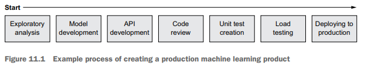

# Overview of Model Deployment

## Introduction

# Chapter 11: Deploying a Model into Production

This chapter covers
- Building a machine learning model to use in 
production
- Understanding what APIs are and how they're 
helpful
- Deploying a machine learning model

Introduction to Machine Learning Engineering
- Covers essential concepts for machine learning engineers.
- Focuses on creating and deploying machine learning models for business use.
- Aims to ease the fear of analysis and reporting professionals about machine learning.

Difference Between Roles
- There is a smaller gap between decision scientists and machine learning engineers than perceived.
- Data science projects may aim to create useful tools rather than just answer questions.

Examples of Machine Learning Applications
- Analyzing customer buying patterns vs. creating a recommendation program.
- Deploying models for different business areas like websites and call centers is complex.
- Involves teamwork between data scientists, software engineers, and product managers.

Focus of the Chapter
- Discusses how to think about models as products.
- Aims to help get models from local environments into functional applications.

Notes on Content
- Technical aspects covered are more complex than in previous chapters.
- Emphasis on concepts over technical details for readability.
- General statements may not be 100% true, simplifying explanations for understanding.

## What is deploying to production, anyway?

Deploying into Production

- Definition of deploying: Taking code and putting it on a system for continuous operation.
- Definition of production: The environment where customer-facing code runs.
- Importance: Code in production must operate with minimal errors to avoid customer impact.

Involvement of Data Scientists

- Increasing role of data scientists and machine learning engineers in production.
- Training machine learning models for production requires more steps than just analysis.
- Initial steps involve understanding data and gaining business approval before deployment.

Example of Deployment Process

- Scenario: A business stakeholder is concerned about customer churn.
- Data scientist performs analysis and builds a model to identify churn indicators.
- Stakeholder wants to use the model to help call center agents retain customers.
- Data scientist must deploy the model so it runs whenever a customer calls.

Requirements for Production Models

- Must run in near real-time for predictions or classifications.
- Common use cases:
- Netflix recommendations
- Facebook facial recognition
- Google Gmail autocomplete

Steps to Prepare Production Models

- Code must handle all possible scenarios to minimize errors.
- Unlike analysis, production models can't ignore strange input data.
- Need features to manage unusual cases without crashing the product.

Maintainability of Production Models

- Must be retrainable to adapt to new data.
- Require monitoring to ensure consistent performance.
- Needs to adhere to coding standards for long-term usability and updates.
- Avoid using outdated languages for production models to prevent future issues.

Visual Reference
- Reference to figure 11. 1 for an example process of creating and deploying a production machine learning model.

Production for Different Types of Data Scientists

Machine Learning Engineer
- Focuses heavily on production systems.
- Must be comfortable with all relevant topics discussed in this chapter.

Analyst
- May handle production systems based on reporting complexity.
- Should productionize reporting systems for consistent and recurring reports.
- Automated reporting allows the analytics team to focus on other tasks.
- Dashboard systems need to be in production and self-updating.

Decision Scientist
- Primarily engaged in ad hoc work, limiting production system opportunities.
- Understanding production systems is helpful, especially when models are passed to machine learning engineers.
- Can create interactive business tools using libraries like Shiny or Dash that need deployment and maintenance in production systems.

The rest of this chapter covers three concepts: how to create a machine learning
model that is suitable for production, how to deploy it into production, and how to
keep it running over time.

## Making the production system

Production System Steps for Machine Learning Model

Start with basic steps of creating a machine learning model:
- Find appropriate data
- Perform feature selection
- Train the model
- Obtain business buy-in

Additional work required after initial steps:
1. Convert model to an accessible format:
- Create code for API access from other systems
2. Add code for input handling:
- Ensure model stability with unexpected inputs
- Add tests to check data processing capabilities
3. Deploy to a test environment:
- Verify model functionality
- Test API for performance under expected traffic

Final step: Deploy the model to a production environment after all testing is complete.

### Collecting data

Data Collection for Model Training
- Find a suitable set of historical data with good signal.
- Historical data is necessary for analysis and production models but not sufficient alone.

Real-Time Considerations
- Production models need to predict in real time (e. g. , whether a customer will leave).
- Example: A historical collection of customer attributes is good for training, but the model needs real-time data for predictions.
- Code must access current customer attributes when the model is invoked (e. g. , number of orders when a customer calls support).

Differences Between Historical and Real-Time Data
- There can be significant differences between using historical data for training and real-time data for running the model.
- Data collection may have lags of hours or days before it's available for data scientists.
- Real-time data might be available, but historical values may not be stored.

Considerations for Production Data
- Identify necessary real-time data for model execution.
- Ensure data is fresh and can be accessed (e. g. , via database connection).
- Dataset issues can lead to machine learning project failures.

### Building the model

When you have a suitable dataset, you can start building a machine learning model.
This topic is a broad one; if you want to learn how to build a machine learning model,
from feature engineering to model training and validation, lots of books and internet
resources are available. That being said, when making a model specifically for production,
you want to keep a few things in mind.

#### PAYING EXTRA ATTENTION TO MODEL PERFORMANCE

Understanding Model Functionality
- Models must work effectively with any data systems use.
- Need to grasp how the model will perform in different scenarios.

Example Scenario
- Creating a model to predict products customers will buy next.
- A model predicting 99% correctly could still fail with 1% incorrect predictions.
- E. g. , wrongly predicting a customer will buy Nicolas Cage temporary tattoos.

Impact on Business Decisions
- Correct predictions can aid in making informed marketing decisions.
- Error margins are critical in production systems, risking customer loss.
- Misleading recommendations can lead to negative customer experiences.

#### BUILDING A SIMPLE MODEL

Model Deployment and Issues
- Models may behave unexpectedly once in production
- Example: A customer churn model predicts all Alaskan customers will churn without clear reasons
- Example: A recommendation engine suggests only kayaks

Understanding Model Behavior
- Simpler models (e. g. , linear regression) make it easy to trace predictions
- Complex models (e. g. , ensembles, boosted models) are harder to understand
- Prioritize using the simplest model that sufficiently solves the problem, even if less accurate

Real-World Example: Netflix Prize
- Netflix hosted a contest to improve movie recommendations by 10%
- In 2009, the competition awarded a $1 million prize to the winning team
- Netflix never used the winning algorithm due to high complexity in engineering and debugging
- Reveals that accuracy may not be worth the complexity, even for large companies like Netflix

### Serving models with APIs

Machine Learning Models as APIs

- Most machine learning models are served through application programming interfaces (APIs).
- Machine learning model code can run on one computer and other systems connect to it for data processing.
- Companies can separate the machine learning model from their main applications by setting up a secondary system for the model.
- An example use case is applying a discount when a customer is predicted to unsubscribe.

Microservices Concept

- Breaking systems into microservices is a popular trend in software engineering.
- For data scientists, important to have a dedicated system running the machine learning model.

Modern APIs and REST API

- Modern APIs typically use web services, known as REST APIs.
- A REST API operates like a small website, returning formatted data instead of HTML.
- Uses HTTP protocol, similar to web browsers (URLs begin with http:// or https://).
- Example: A weather API could return data about the temperature in Seattle.

Prediction Requests

- Machine learning model APIs provide predictions via specific URLs.
- Example URL: http://internalcompany. com/predict? customer=1234 could return a probability (0 to 1) of a customer leaving.

API Design Considerations

- Designing an API involves deciding which URLs return what data and the types of requests available.
- Clear and understandable interface design is crucial for user adoption.

Benefits of Machine Learning APIs

- A web API enables the machine learning model to be used across the company by various systems and analysts.
- Flexibility allows integration with different technologies regardless of the programming language used (e. g. , R, Node. js, Python).
- Hosting the model as a separate website minimizes risks; if it fails, it won't disrupt other applications like the shopping site.

### Building an API

APIs and Machine Learning Models
- APIs are useful for machine learning models but require extra coding.
- R uses the Plumber package; Python uses the Flask package for this coding.
- Running a script with these packages exposes the function to a computer endpoint.
- Example: Accessing http://yourwebsite. com/predict runs the model and returns results.
- Allowing outside traffic by adjusting the firewall lets others access your API.
- When the API hosting program is stopped, the model becomes unavailable.

API Design Considerations
- Important design decisions include what data to input for API requests.
- Example: A model to predict customer churn based on tenure, spending, and calls.
- Possible API request formats:
- Using unique customer ID: http://yourwebsite. com/predict? customer_id=1234
- Including customer details in the body: {“tenure”:1. 7,“spend”:1257,“calls”:3}
- Both options are valid but differ in effort required from the API user.

Collaboration and Feedback
- Avoid making design decisions in isolation; involve potential API users.
- Gather feedback from users after showing them your API design.
- Share documentation to help users understand how to use the API.

### Documentation

Importance of API Documentation
- Write documentation when you have a working API.
- Early documentation makes it easier to maintain the API.
- Ideal to document before writing any code, serving as a blueprint.

Core Elements of API Documentation
- Specification for API requests, including:
- Endpoint URLs (e. g. , http://www. companywebsite. com/example)
- Required elements in the request
- Format and content of the response

Documentation Formats
- Can be stored in any text document.
- Standard templates include OpenAPI documents for clear understanding.

Operational Documentation
- Include system requirements for the API to run.
- Instructions on how to install on different systems.

Purpose & Methodology Documentation
- Document the reasons for the model's existence.
- Outline basic methods behind the model.
- Useful for future developers after you leave the project.

### Testing

Importance of Testing Machine Learning Models

- Ensure model accuracy before production deployment.
- Testing checks if the model handles all potential inputs.
- Unexpected inputs (blank, negative, or invalid IDs) can lead to errors or crashes.

Types of Testing

- Various testing methods exist, but unit testing is crucial for machine learning models.
- Unit testing involves checking each small component of the code.
- For APIs, test behavior under different input conditions (large numbers, negative values, odd strings).

Example Tests

- For a sentiment analysis API:
- Test: Input "I love you" should result in a positive response.
- Test: Input 27. 5 should return "could-not-compute" instead of crashing.

Code Coverage

- Aim for 100% code coverage with every line tested.
- Run tests each time before model deployment.
- Resolve any failures before presenting the model to customers.

Conclusion on Testing

- Testing is crucial to catch major issues before production.
- Despite feeling like busywork, testing is vital and should not be overlooked.

### Deploying an API

Machine Learning Model Deployment

- Machine learning models can be run on laptops.
- Turning a model into an API on a laptop is straightforward.

Limitations of Laptop Deployment

- Laptops are not ideal for continuous API operations.
- Need for an alternative when the laptop is off or in use for other activities (e. g. , watching Netflix).

Solution: Server Deployment

- APIs should be deployed on a server for stable, continuous operation.
- Deployment means moving code to a server to ensure constant accessibility.
- Setting up a server for running code requires more effort than just creating the API.

#### The term server

When you hear the word server, it can be intimidating, like some special computer
that normal people don’t understand. In practice, a server is just an ordinary computer,
such as a laptop, but it runs somewhere without a screen. Instead of walking
up to a server and logging in, people connect remotely with other computers, which
simulate being in front of it. Servers run almost the same operating systems as computer
laptops—Windows or Linux with minor tweaks. If you connect remotely to a
server, it should look very familiar, with the same Start menu for Windows or a terminal
for Linux.
The advantages of servers are that people usually leave them running and that they
tend to live in places safer than a home office. But there is no reason you couldn't
take an old home PC, put it in your closet, and treat it like a server; many software
engineering hobbyists do just that.
When people talk about using cloud services such as Amazon Web Services (AWS),
Microsoft Azure, and Google Cloud Platform (GCP), what they mean is that they're
using servers that are rented from Amazon, Microsoft, and Google. But just because
you're paying a big company for these services doesn’t mean that the computers are
different. You can think of them as being expensive sky laptops.

You have two basic ways to deploy an API to a server: run it on a virtual machine or put
it in a container.

#### DEPLOYING TO A VIRTUAL MACHINE

Overview of Enterprise Servers and Virtual Machines
- Enterprise servers are powerful and expensive machines.
- It is inefficient to dedicate one server to a single task.
- Servers can run multiple tasks concurrently.
- A crash in one task can affect unrelated tasks.

Virtual Machines
- Virtual machines (VMs) are simulations of computers.
- Multiple VMs can run on a single powerful server.
- If one VM crashes, others remain functional.
- VMs function like regular computers; only noticeable to trained users.
- Services like AWS, Azure, GCP involve virtual machines.
- On-premises virtual machines are often set up by IT departments.

Advantages of Virtual Machines
- VMs can be easily turned on or off.
- Snapshots can be taken to revert to earlier versions or run multiple copies.
- Snapshots can be shared with others for easy access.

Deploying Code to Virtual Machines
- To deploy code, basic steps are:
- Start a virtual machine.
- Install necessary programs and libraries (e. g. R or Python).
- Copy and run your code.
- Production systems can be set up easily with these steps.

Challenges with Manual Code Deployment
- Manual code transfers for updates can be laborious and error-prone.
- Risk of forgetting to update or tracking versions.

Continuous Integration and Continuous Deployment (CI/CD)
- CI: Automatically recompiles code when changes are committed.
- CD: Automatically deploys updated code to production.
- CI/CD tools monitor repositories for changes and handle deployments.
- CI/CD simplifies updates for data scientists.

Running Multiple Virtual Machines
- Multiple VMs can be created to handle high traffic.
- Traffic can be distributed across different copies of a VM.
- Monitoring and managing VM activity is essential.
- Autoscaling allows dynamic adjustments to VM resources.
- Setting up autoscaling can be complex and typically requires developer assistance.

#### DEPLOYING TO A DOCKER CONTAINER

Setting Up Virtual Machines
- Setting up a virtual machine is challenging, similar to setting up a regular computer.
- Requires installation of programs, changing drivers, and configuring settings.
- Documenting steps can be difficult, leading to potential mistakes.
- Virtual machines take up significant space as they simulate a full computer.

Introduction to Docker
- Docker provides a solution to the issues faced with virtual machines.
- Metaphor: Virtual machines are like houses in a neighborhood; Docker containers are like apartments in a building, sharing services.
- Docker containers are easier to set up and more efficient than virtual machines.

Benefits of Docker
- Simplifies specifying machine setup, allowing shared resources across different machines.
- Makes creating and maintaining production systems easier than with virtual machines.

Key Concepts of Docker
- Dockerfile: Text file with steps to set up the simulated machine (e. g. , install software, copy files).
- Docker Image: Snapshot of a computer's state created from the steps in a dockerfile.
- Container: Runs an image, functioning like a regular computer with specified programs and data.

Challenges in Using Docker for Machine Learning
- Successful deployment of machine learning models requires Docker use within the organization.
- Need for someone knowledgeable in creating, deploying, and monitoring Docker containers.
- Nonstandard deployment methods may face resistance.

Recommendation for Beginners
- If inexperienced with code deployment, starting with virtual machines may be easier.
- Using Docker for reproducible analyses offers significant benefits.
- Gaining experience with Docker is valuable, even if immediate career needs are unclear.

### Load testing

Importance of API Stability
- Ensure the API does not fail under stress.
- Possible failures: running out of memory, slow processing, growing request queues.

Load Testing
- Conduct a load test by making many simultaneous requests to the API.
- Aim for a number at least double the expected maximum requests.

Assessment of API Performance
- If the API handles the requests well, it is stable.
- If it crashes, consider improving code efficiency, scaling the system, or making other changes.

## Keeping the system running

Even after your API is successfully deployed and being used, that's not enough. (It's
never enough.) Either you or someone else in the organization will have the job of
continuing to ensure that the API works. Some companies have a development operations
(DevOps) team whose charter is to make sure that the APIs are always working.
Even if the API is working fine, you still may want to make adjustments for other reasons.
The following sections discuss three important considerations for API maintenance
over time.

###  Monitoring the system

Monitoring Model Performance
- Continuously monitor model performance
- Track the number of requests received each hour
- Assess accuracy of model predictions
- Identify and record errors

Logging and Telemetry
- Logging records internal issues in the tool
- Telemetry records events like requests and predictions
- Set up alerting for issue occurrences

Logging
- Can be simple: write information to a file on events
- Check logs by accessing Docker container or virtual machine

Telemetry
- Involves sending event data to a remote server
- Centralizes telemetry data for multiple systems
- Enable real-time viewing and monitoring through a dashboard

Alerting
- Tools notify employees when errors occur
- Alerts can be automatic emails or Slack messages
- Example: alert if no requests are received over an entire day

Standardization in Monitoring
- Different monitoring systems are often used together
- Aim to standardize monitoring for all company APIs
- Align with organizational standards for better tool usability

### Retraining the model

Performance Decline of Machine Learning Models
- Machine learning models may perform poorly over time due to outdated data.
- Example: A churn prediction model might struggle with new customer demographics.
- Retraining is required when the model's performance drops significantly.

Retraining Process
- Simplest method: Repeat original training steps with updated data.
- Involves loading data into R or Python, rerunning scripts, and deploying the model again.
- Many successful companies use this straightforward approach for model maintenance.

Establishing a Regular Retraining Schedule
- Create a standard schedule for retraining instead of relying on intuition.
- Perform retraining every set number of weeks or months to reduce uncertainty.

Automation of Retraining
- Automate the retraining process using scripts to load data, build models, and save results.
- Set the retrainer system to run automatically on the predefined schedule.
- The system can also monitor the performance of the newly retrained model.
- If the new model doesn't perform as well, it should alert data scientists.
- Cloud tools like AWS SageMaker facilitate advanced retraining processes.

Importance of Monitoring Models
- Continuous monitoring of model performance is crucial.
- Data scientists risk causing harm by neglecting models after deployment.
- Regular performance checks help ensure models remain effective over time.

### Making changes

Making Changes to Successful Models

Successful models in production may require changes for improvement.

Potential changes include:
- Adding more datasets.
- Changing the machine learning method.
- Feedback from team members about desired features or issues with the model is common.

Challenges of Model Improvements

- Updates can cause real issues related to time and resources.
- It's important to assess if the improvements are worth the effort.
- Example: Spending three months to increase accuracy from 84% to 86% may not be productive.
- Consider the impact of requested features on the overall customer base.

Time Management in Model Improvement

- Successful models attract interest from many stakeholders.
- As a data scientist, focus on ensuring improvement efforts are justified and valuable.

## Wrapping up

Chapter covers various concepts about deploying models.
- Some topics may be familiar while others may not.

Importance
- Understanding these topics is beneficial for future work.
- Not all topics may be relevant to individual work.

Resources
- Many good resources are available in books and online.
- Topics have overlap with software engineering.

Continuous Learning
- Data science field is evolving.
- Topics will remain important and are worth ongoing learning.

## Summary

- Deploying to production is the practice of making models run continuously.
- Putting a model in a REST API allows other systems to use it.
- APIs can be deployed to virtual machines or as Docker containers.
- Look closely into how your company manages code, testing, and deployment of
production systems.
