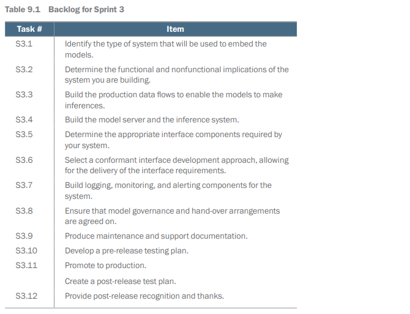
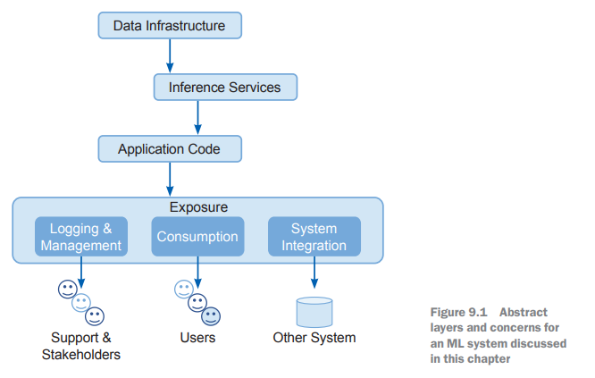
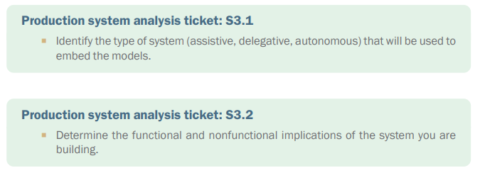
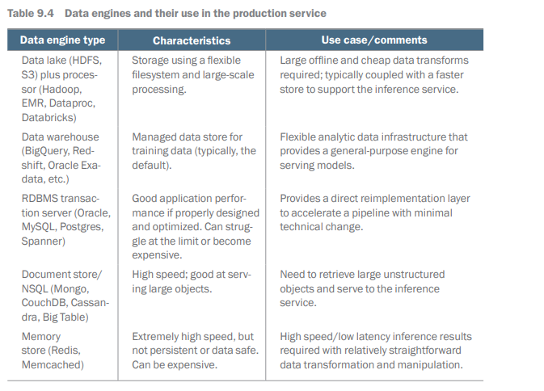
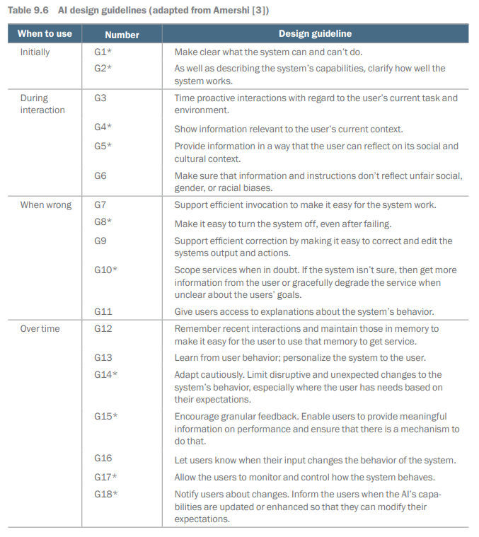

# System Building and Production

## Introduction

This chapter covers
-	Embedding your models into the system you are 
going to build
-	Dealing with nonfunctional implications
-	Building the data and model-serving 
infrastructures for production
-	Ensuring that the user interface is appropriate
-	Ensuring that the logging, monitoring, and 
alerting elements are properly governed and 
managed in production

## Sprint 3 backlog

## Types of ML implementations

### Assistive systems: recommenders and dashboards

###  Delegative systems

### Autonomous systems

## Nonfunctional review

## Implementing the production system

### Production data infrastructure

### The model server and the inference service

### User interface design 

## Logging, monitoring, management, feedback, and documentation

### Model governance

### Documentation

During the project, you should have produced and filed a great deal of documentation. All of this is incredibly useful and valuable, but to deliver a maintainable system, 
the team needs to prepare some additional documents that support the system in life. 
These documents are:
-	A production team organization chart
-	A run book
-	A technical overview
-	A troubleshooting guide

## Pre-release testing

## Ethics review

## Promotion to production

## You aren't done yet

## Summary

-	Make a deliberate choice about the type of ML system that you and the team are 
building. Is it assistive, delegative, or autonomous? 
-	Own the implications of that choice! The nonfunctional and functional requirements of the various types of ML-driven systems are different. 
-	You need to build production data flows and a suitable model-serving infrastructure to support the requirements that you've identified. 
-	User interface requirements for ML systems are different from normal systems. 
You will need to ensure that the system is appropriately instrumented and that 
the relevant controls are available to the users. 
-	Make sure to provide the right logging, monitoring, and alerting infrastructure, 
or the production support groups won't be able to accept it into service. 
-	Get your system tested and signed off as fit for production.
-	Budget time and effort for pre-release user and integration testing. 
-	Ethical review is essential when developing a release candidate for the system. 
This is often the point at which stakeholders realize what it is that has been implemented and its implications. It can be painful, but catching problems at this last 
hurdle is far preferable to releasing problems into the wild. 
-	Be ready for the ongoing work that comes with delivering a system into production. Your job isn't over when the users get their hands on your work. In fact, it's 
probably just beginning. 
