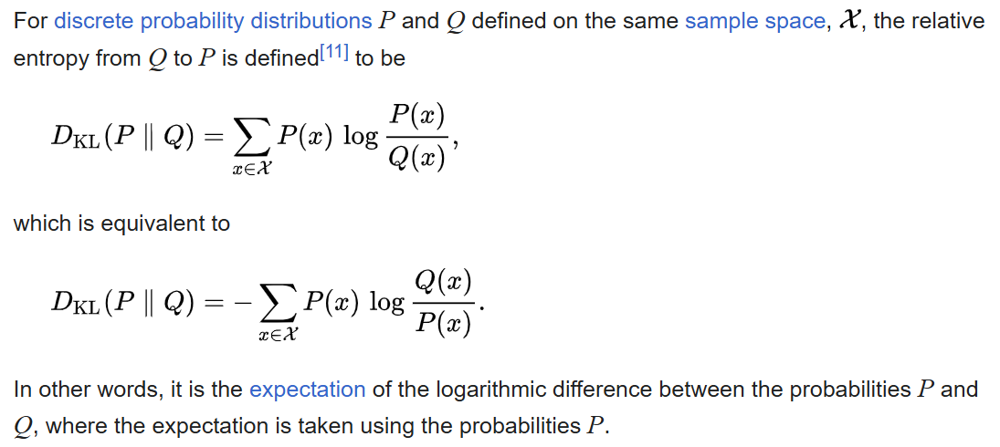

# Model Monitoring: Stability

Monitoring for model stability is a set of procedures to track the 
factors that might influence or explain changes in 
the performance of a model over time. 

If one observes that the performance drops upon launch, 
due to some difference between the modeling framework and the real-world operation, 
one should know where the performance drop is coming from, so that a fix can be designed.
Over the medium term, some components might show a problem that should be addressed, 
which can be pinpointed to either the variables in the model, 
or the parameters in the model. 
Over the long term, the situation may change and a model can become outdated,
so these procedures are also useful to determine whether a model should be replaced, 
and, if so, what features and design components should be changed or excluded.

Model monitoring comprises two sorts of analysis:
one is an analysis of the changes in the estimates of parameters 
in repeated estimations of a model, a phenomenon known as *parameter drift*
or  *parameter stability*. 
This will be discussed at length in a later module.

In this module, we will consider changes in the distribution of the inputs
to a model. 
This analysis of the distribution of explanatory variables is known as 
*input stability*.

## Input Stability

The analysis of changes in the distribution of variables has long been studied by statisticians.
Thus, the methods are commonly known in the statistical field. 
Yet, these relatively simple procedures can alert analysts and engineers
to changes in the population running through a model in production, 
and explain any changes in performance. 
If the population being scored by a model changes, 
it may suggest an evolving relationship between the explanatory variables
in a model and the outcome that is predicted, 
potentially suggesting that the model be replaced.

### Statistical Methods

This can be achieved by tracking a performance statistic, 
such as a goodness-of-fit statistic on the distributions of input variables. 
The goodness-of-fit statistic could be a Chi-squared statistic or
a Kullback-Leibler Divergence Criterion. 
Either could be used to construct a population stability index that can be plotted over time. 

#### Goodness-of-Fit Statistic

Although there are many choices, the most common  
[goodness-of-fit](https://en.wikipedia.org/wiki/Goodness_of_fit) statistic is 
[Pearson's Chi-Squared Test](https://en.wikipedia.org/wiki/Pearson%27s_chi-squared_test). 
It is designed for calculating differences between distributions for categorical variables. 
However, it could be used to calculate differences in distributions for continuous
variables by separating values into bins, like one does when drawing a histogram. 

The calculation of the statistic is as follows.

The values of the inputs are the proportions of observations in each bin, 
from the null distribution and the comparison distribution. 
When checking whether a distribution has changed from that in the original model, 
the null distribution is that distribution of the variable that was in the original
sample from which the model was built. 
The comparison distribution is the distribution of the variable on future data, 
when the model is in use to make a decision. 
The statistic follows a Chi-squared distribution with degrees of freedom equal 
to the number of bins minus one. 

#### Kullback-Leibler Divergence Criterion

The theory for the Kullback-Leibler Divergence Criterion is more involved, 
and the behavior of this statistic is less intuitive, but it is more powerful 
in that it is more likely to detect certain types of changes in the distribution. 
It is based on the concept of relative entropy of two phenomena, 
which could be thought of as the degree of variation. 
The formal definition is as follows.

In this expression, x is the outcome variable, Q represents the probabilities
under the null distribution and P represents the probabilities
under the distribution to be tested for equality. 

Aside from the more technical calculation from taking log transformations, 
this statistic has one major drawback combined with a super power.
This value becomes infinite when the new distribution has zero observations
where the null distribution has some probability mass. 
Thus, this would indicate with certainty that the distributions are different. 
In some sense this is perfect information that the distributions are different, 
beccause if two distributions do not agree on which outcomes are impossible
(i.e. have zero probability) then they are surely different

### Graphical Methods

As with parameter stability, 
one could plot the statistical measure over time, 
whether it is the Chi-squared statistic or
the Kullback-Leibler Information Criterion, 
to show how the distribution of input variables in the latest period
compares to the distribution of the variables in the sample for the original estimation. 
When the value of the difference becomes large, it indicates a significant change
in the distribution of the input variable. 
If the input variable has a different distribution, it might indicate that the meaning
of the variable has changed.
In any case, such a change might indicate that the relationship between the variable 
and the predicted outcome has changed, 
and that a new estimation of the model might be in order. 

