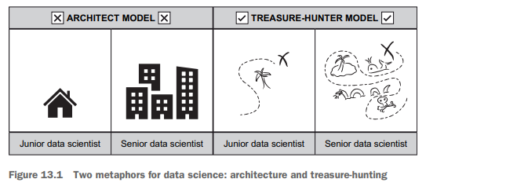
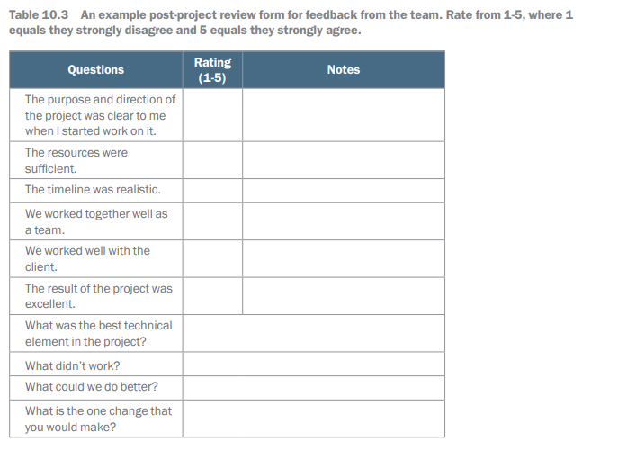

# Post-Project Review, Technical Debt, and Model Drift

## Introduction

# Chapter 13: When Your Data Science Project Fails

This chapter covers
- Why data science projects tend to fail
- What you can do when your project fails
- How to handle the negative emotions from failure

Data Science Project Challenges
- Data science projects are often high-risk ventures.
- Work is exploratory and involves predicting or optimizing unknowns.
- Data scientists will encounter failures in their projects.

Case Study Example
- Example of a machine learning model for product recommendations.
- Initial excitement from executives after a convincing pitch.
- Challenges arise during implementation, such as limited transaction data.
- Projects may fail if outcomes do not meet expectations, leading to abandonment.

Defining Project Failure
- A project is considered a failure if it does not meet its objective.
- In analyses, failure occurs when business questions remain unanswered.
- For machine learning, failure happens if models are not deployed successfully.

Sharing Failure Experiences
- Data scientists often avoid discussing project failures.
- Failure can lead to feelings of vulnerability and self-doubt.
- There is little comfort in sharing experiences of failure in the field.

Nature of Data Science
- Data science involves research and development of new trends from unexplored data.
- Unlike software engineering, achievements in data science are not guaranteed.

Importance of Understanding Failure
- Learning from failures helps avoid future mistakes.
- Analyzing what worked can provide insights for future successes.
- Failed projects may still have potential with adjustments.

Key Topics Covered
- Reasons data science projects fail.
- Strategies for assessing project risk.
- Managing emotions during project failure.

## Why data science projects fail

It seems that data science projects fail for an endless list of reasons. From budget to
technology and tasks that take far longer to complete than expected, there are many
reasons for failure. Ultimately, these many types of failures break down into a few
core themes.

### The data isn't what you wanted

Data Source Limitations
- Cannot review all possible data sources before starting a project.
- Must make informed assumptions about available data based on company knowledge.
- Assumptions may be proven wrong once the project begins (e. g. , missing data, inaccessible formats).

Issues with Data Access
- Initial problems often arise from a lack of data, halting projects early.
- Internal bargaining occurs to work around data gaps (e. g. , using less data than desired).
- Pitches may be made without full access to data, especially in consulting scenarios.
- Existing data could be flawed, rendering it unusable.

Example Failure: Loyalty-Program Analysis
- A director wishes to understand spending patterns in a loyalty program with various status levels (silver, gold, platinum).
- Data science team discovers that the database does not track historical levels, making the analysis impossible.
- Recommendation to update the database is not acted upon due to cost and low demand, leading to abandoned analysis ideas.

Strategies for Data Access and Risk Mitigation
- Quick access to data is crucial to address potential inadequacy.
- Best scenario includes getting data samples before project start.
- If samples are not possible, design project timelines considering poor data quality.
- Include early “go/no go” assessments with stakeholders to avoid surprise data issues.

Limited Options for Insufficient Data
- Explore alternative data sources for analysis substitutes (e. g. , product volume manufactured).
- Often, substitutes can cause complications in analysis.
- If viable substitutes aren’t available, consider starting a new project to collect better data.
- Implement processes to capture data efficiently (e. g. , adding telemetry, creating storage databases).

### The data doesn't have a signal

Gambler and Data Scientist Case Study
- A gambler hires a data scientist for a dice game.
- The gambler rolls a six-sided die 10,000 times and records the rolls.
- The data scientist attempts to create a prediction model for the next roll.
- No prediction is possible beyond a 1/6 probability for each side (assuming a fair die).
- There is no signal in the data indicating the next roll outcome.

Common Problem in Data Science
- Absence of a signal in data is a widespread issue in data science.
- Example: e-commerce website trying to predict customer orders based on browser, device, and operating system.
- Uncertainty whether data points can predict customer behavior.
- Creating a machine learning model tests for signals, but often none are found.
- Lack of a signal can lead to project failure if predictions are based on non-existent relationships.

Possible Solutions When Signal is Lacking
- Reframe the Problem
- Try to identify a different signal.
- Example: Classifying the most relevant article for users instead of merely predicting relevance.

- Change the Data Source
- Consider utilizing a different dataset to find potential signals.
- This is risky since starting datasets are typically chosen for usefulness.

Use of Complex Models
- Data scientists often attempt more complex models to find signals.
- Starting with simple models is advised to validate project feasibility.
- Moving to complex models later is better than beginning with them.
- Complexity does not guarantee better results if no signal exists.

Example of Failure: E-commerce Website Bugs
- A hypothetical e-commerce site faces frequent, unnoticed errors.
- Marketing team detects bugs due to low daily revenue, rather than the technical teams.
- The data science team implements statistical techniques on sales data to alert on low revenue.
- Detecting bugs proves difficult due to multiple factors affecting revenue.
- Lack of a reliable signal makes generalizing identified bugs problematic.

### The customer didn't end up wanting it

Value of Data Science Models

- Accuracy is important, but value to stakeholders is essential.
- Interesting findings for data scientists may not interest businesspeople.
- A precise machine learning model needs deployment to provide value.
- Many data science projects fail even with complete analysis.

Product Development in Data Science

- Data science analysis, models, and dashboards are considered products.
- The product design process is informed by years of collective thought.
- Billions are spent annually on products that customers do not want.
- High-profile and low-profile product failures occur (e. g. , New Coke, Google Glass).

Understanding Customer Needs

- Engaging with customers is crucial for creating desirable products.
- Market research and user experience research help understand customer needs.
- Common methods include surveys, focus groups, user stories, personas, and testing.
- Data science struggles with understanding customer needs; data scientists prefer data analysis to direct communication.

Communication and Iteration

- Many projects fail due to insufficient customer engagement by data scientists.
- Early communication with customers helps identify true problems.
- Adjusting analyses or model features can address customer issues.

Minimally Viable Product (MVP) Concept

- The MVP approach aims to get products to market quickly for feedback.
- Rapid feedback helps improve models and analyses based on customer needs.
- Longer development times limit the opportunity for gathering feedback.

Example of Failure: Sales and Marketing Campaign Value Prediction

- A retail company aimed to create a machine learning model for ROI prediction.
- The data science team built a Python model based on marketing team struggles with Excel.
- The marketing team's actual need was for Excel reports to get finance approval.
- The model went unused because it did not meet the finance team's requirements.

## Managing risk

Project Risk in Data Science

- Projects vary in risk levels.
- Standard dashboards using known data are likely to succeed.
- Complex projects, like real-time machine learning models, have higher risks.

Managing Project Risk

- Working on multiple projects helps mitigate risk.
- If a risky project fails, other projects can provide support.
- Simultaneous work on simpler projects keeps stakeholders satisfied even if a complex project fails.

Utilization and Work Flow

- Data science projects often have delays.
- Multiple projects allow progress despite stops on one due to waiting for data or responses.
- Switching projects can help overcome mental blocks.

Incorporating Early Stopping Points

- Projects should have predefined points to assess success.
- If a project lacks viable data after a set period, it can be ended early.
- Presenting the possibility of failure early reduces surprises and costs.

Embracing Uncertainty

- Data science involves many unknowns and should include chances for projects to fail.
- Avoiding risks limits potential for big successes.
- Research and development in data science require planning for possible project failures.

Consequences of Avoiding Risk

- Teams can stagnate by focusing only on updating previous work.
- Successful teams should explore new ideas to avoid missing growth opportunities.

## What you can do when your projects fail

If your data science project has failed, that doesn't mean all the time you spent working
on it was wasted. In section 13.2, we outlined some potential actions you can take
to turn the project around. But even if there's no way the project can succeed, there
are still steps you can take to get the most out what’s left of it. In the following sections,
we give you some strategies for handling your emotions when a project fails.

### What to do with the project

Although the project may have failed, there likely is still a lot that can be gained from
the project, both in knowledge and technology. The following steps can help you
retain many of those gains.

#### DOCUMENT LESSONS LEARNED

Assessing What Can Be Learned from a Failed Project

- Important first step: Assess what can be learned from the failure.

Key Questions to Ask:

- Why did it fail?
- Understand the reasons by stepping back and looking at the bigger picture.
- Have discussions with all involved team members.
- Use the concept of a blameless postmortem to diagnose problems without assigning blame.
- Focus on flaws in processes rather than individual mistakes to encourage open discussion.

- What could have been done to prevent the failure?
- Identify factors that contributed to the failure to avoid future issues.
- For instance, if the data was inadequate, a longer exploratory phase could have been beneficial.
- Learning from failure helps the team grow.

- What did you learn about the data and the problem?
- Valuable lessons can be gained even from failures.
- Previous attempts might reveal useful insights for future projects, such as effective data joins.

Team Meeting and Documentation:

- Have a meeting to work through these questions.
- Save the results in a shared location for future reference.
- Aim to derive value from the failed project by brainstorming alternatives and salvaging insights.

#### CONSIDER PIVOTING THE PROJECT

Project Failure and Repurposing

- A failed project can still lead to valuable outcomes.
- Example: A model designed to detect revenue anomalies might still work well for forecasting.
- Companies have successfully turned failed ideas into profitable ventures.

Communication and Engagement

- Pivoting a product necessitates strong communication with stakeholders and customers.
- The process requires revisiting the initial stages of product design.
- Engaging with stakeholders and customers helps identify their problems.
- Understanding these problems can reveal new uses for the original work.

#### END THE PROJECT (CUT AND RUN)

Ending a Project
- If a project cannot be pivoted, it is better to end it.
- Canceling allows the team to focus on new, promising work.

Challenges of Continuing a Project
- Data scientists often want to keep working on a project in hopes it will eventually succeed.
- There are many algorithms available, but getting stuck on one project can lead to wasted effort.
- Working on a stagnant project can become unenjoyable.

Importance of Cutting a Project
- Ending a project can be difficult as it involves recognizing it’s not worth the effort.
- Ultimately, cutting a project can be beneficial in the long run.

#### COMMUNICATE WITH YOUR STAKEHOLDERS

Communication with Stakeholders
- Data scientists should communicate regularly with stakeholders throughout a project.
- Increase communication if the project is failing to maintain transparency.
- Hiding project issues can lead to surprises and damage to one’s career.
- Transparency inspires trust and enables collaborative decision-making on next steps.

Seeking Support
- If unsure how to communicate problems, consult your manager for guidance.
- Managers can help brainstorm approaches or deliver the message themselves.
- Stakeholders may prefer different communication methods, such as spreadsheets or informal chats.

Dealing with Anxiety
- It’s normal to feel anxious when reporting project failures; it can feel vulnerable.
- While some may react poorly, many stakeholders are willing to assist in resolving issues.
- Communicating project problems can lead to relief rather than ongoing stress.

### Handling negative emotions

Personal Well-Being After Project Failure
- It’s important to focus on your own well-being after a project fails.
- Experiencing a project failure is emotionally tough.
- Project failures can linger and drain you if not handled well.
- Thoughtful reactions and narratives about the failure can promote long-term success.

Common Misconceptions About Failure
- Internal dialogue often blames personal inadequacies for project failures.
- This belief is a fallacy; most failures stem from inherent uncertainties in data science.
- Successful data scientists have also faced failed projects.
- Blaming yourself places all the responsibility on one individual.
- Project failures arise from various factors, rarely linked to the data scientist’s skill.

Embracing Failure for Growth
- Accepting failure as a normal part of growth is essential.
- Confidence aids in processing failure and learning from it.
- Gaining confidence takes time, patience, and practice; struggling is normal.

Understanding Project Failure
- Failure is not a reflection of your skills; external factors often contribute to project failures.
- Acceptance of these truths helps in moving on from failure more easily.

Metaphor for Data Science
- Comparing data scientists to architects is misleading; failure for architects can end careers.
- A better analogy is treasure hunters; they seek valuable findings and often face failures.
- All data scientists, regardless of experience level, experience failures as part of their work.

## Summary

- Data science projects usually fail because of inadequate data, a lack of signal, or
not being right for the customer.
- After a project fails, catalog why and consider pivoting or ending it.
- A project failure isn't a reflection on the quality of the data scientist.
- A data scientist isn't solely responsible for a project failure.

# Chapter 10: Post Project

This chapter covers
-	Looking after an ML system after it's gone into 
production
-	Dealing with production failures
-	Learning from the project and improving 
practice

## Sprint Omega backlog

## Off your hands and into production?

### Getting a grip

### ML technical debt and model drift

### Retraining

### In an emergency

### Problems in review

## Team post-project review

## Improving practice

## New technology adoption

## Case study

## Goodbye and good luck

## Summary

-	Its likely that the team will get called on to support the system they developed. 
Over time, this demand will likely taper off, and other folks will take on the 
remaining tasks. Sometimes these people will be junior members in your team. 
-	Work to get clarity about what systems you are responsible for supporting. 
Remember, the resources required to look after them are allocated somewhere 
in the organization, and by all rights, they should go where the responsibility lies. 
-	Get a grip on the systems that you have responsibility for. Ensure that proper governance and support arrangements are in place and that there is a plan to deal 
with them if they go wrong. Review all systems regularly.
-	Identify and deal with technical debt. Especially ensure that all systems are properly instrumented so that you know how they are behaving and that there is information available to troubleshoot if there is a failure. 
-	If a system fails, then get organized. Convene a group to support you and act as 
quickly as you can to get it fixed. 
-	Run project reviews to learn from what happened and to support development 
in your team. 
-	Ensure that your team has access to learning and development opportunities in 
the light of what's happening in the project. 
-	Develop your own point of view on the issues that this book has covered, then 
share them with me and other people who will need your insight if they are to 
succeed in the future. 
