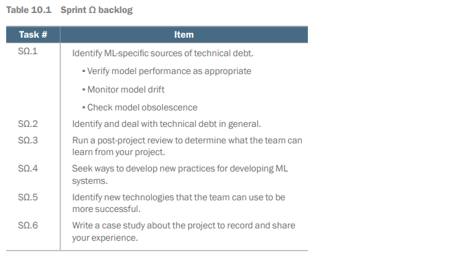
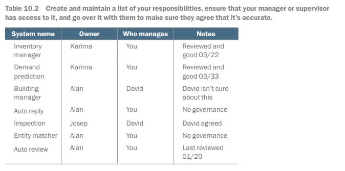

# Post-Project Review, Technical Debt, and Model Drift

## Introduction

# Chapter 13: When Your Data Science Project Fails

This chapter covers
- Why data science projects tend to fail
- What you can do when your project fails
- How to handle the negative emotions from failure

Data Science Project Challenges
- Data science projects are often high-risk ventures.
- Work is exploratory and involves predicting or optimizing unknowns.
- Data scientists will encounter failures in their projects.

Case Study Example
- Example of a machine learning model for product recommendations.
- Initial excitement from executives after a convincing pitch.
- Challenges arise during implementation, such as limited transaction data.
- Projects may fail if outcomes do not meet expectations, leading to abandonment.

Defining Project Failure
- A project is considered a failure if it does not meet its objective.
- In analyses, failure occurs when business questions remain unanswered.
- For machine learning, failure happens if models are not deployed successfully.

Sharing Failure Experiences
- Data scientists often avoid discussing project failures.
- Failure can lead to feelings of vulnerability and self-doubt.
- There is little comfort in sharing experiences of failure in the field.

Nature of Data Science
- Data science involves research and development of new trends from unexplored data.
- Unlike software engineering, achievements in data science are not guaranteed.

Importance of Understanding Failure
- Learning from failures helps avoid future mistakes.
- Analyzing what worked can provide insights for future successes.
- Failed projects may still have potential with adjustments.

Key Topics Covered
- Reasons data science projects fail.
- Strategies for assessing project risk.
- Managing emotions during project failure.

## Why data science projects fail

It seems that data science projects fail for an endless list of reasons. From budget to
technology and tasks that take far longer to complete than expected, there are many
reasons for failure. Ultimately, these many types of failures break down into a few
core themes.

### The data isn't what you wanted

Data Source Limitations
- Cannot review all possible data sources before starting a project.
- Must make informed assumptions about available data based on company knowledge.
- Assumptions may be proven wrong once the project begins (e. g. , missing data, inaccessible formats).

Issues with Data Access
- Initial problems often arise from a lack of data, halting projects early.
- Internal bargaining occurs to work around data gaps (e. g. , using less data than desired).
- Pitches may be made without full access to data, especially in consulting scenarios.
- Existing data could be flawed, rendering it unusable.

Example Failure: Loyalty-Program Analysis
- A director wishes to understand spending patterns in a loyalty program with various status levels (silver, gold, platinum).
- Data science team discovers that the database does not track historical levels, making the analysis impossible.
- Recommendation to update the database is not acted upon due to cost and low demand, leading to abandoned analysis ideas.

Strategies for Data Access and Risk Mitigation
- Quick access to data is crucial to address potential inadequacy.
- Best scenario includes getting data samples before project start.
- If samples are not possible, design project timelines considering poor data quality.
- Include early “go/no go” assessments with stakeholders to avoid surprise data issues.

Limited Options for Insufficient Data
- Explore alternative data sources for analysis substitutes (e. g. , product volume manufactured).
- Often, substitutes can cause complications in analysis.
- If viable substitutes aren’t available, consider starting a new project to collect better data.
- Implement processes to capture data efficiently (e. g. , adding telemetry, creating storage databases).

### The data doesn't have a signal

Gambler and Data Scientist Case Study
- A gambler hires a data scientist for a dice game.
- The gambler rolls a six-sided die 10,000 times and records the rolls.
- The data scientist attempts to create a prediction model for the next roll.
- No prediction is possible beyond a 1/6 probability for each side (assuming a fair die).
- There is no signal in the data indicating the next roll outcome.

Common Problem in Data Science
- Absence of a signal in data is a widespread issue in data science.
- Example: e-commerce website trying to predict customer orders based on browser, device, and operating system.
- Uncertainty whether data points can predict customer behavior.
- Creating a machine learning model tests for signals, but often none are found.
- Lack of a signal can lead to project failure if predictions are based on non-existent relationships.

Possible Solutions When Signal is Lacking
- Reframe the Problem
- Try to identify a different signal.
- Example: Classifying the most relevant article for users instead of merely predicting relevance.

- Change the Data Source
- Consider utilizing a different dataset to find potential signals.
- This is risky since starting datasets are typically chosen for usefulness.

Use of Complex Models
- Data scientists often attempt more complex models to find signals.
- Starting with simple models is advised to validate project feasibility.
- Moving to complex models later is better than beginning with them.
- Complexity does not guarantee better results if no signal exists.

Example of Failure: E-commerce Website Bugs
- A hypothetical e-commerce site faces frequent, unnoticed errors.
- Marketing team detects bugs due to low daily revenue, rather than the technical teams.
- The data science team implements statistical techniques on sales data to alert on low revenue.
- Detecting bugs proves difficult due to multiple factors affecting revenue.
- Lack of a reliable signal makes generalizing identified bugs problematic.

### The customer didn't end up wanting it

Value of Data Science Models

- Accuracy is important, but value to stakeholders is essential.
- Interesting findings for data scientists may not interest businesspeople.
- A precise machine learning model needs deployment to provide value.
- Many data science projects fail even with complete analysis.

Product Development in Data Science

- Data science analysis, models, and dashboards are considered products.
- The product design process is informed by years of collective thought.
- Billions are spent annually on products that customers do not want.
- High-profile and low-profile product failures occur (e. g. , New Coke, Google Glass).

Understanding Customer Needs

- Engaging with customers is crucial for creating desirable products.
- Market research and user experience research help understand customer needs.
- Common methods include surveys, focus groups, user stories, personas, and testing.
- Data science struggles with understanding customer needs; data scientists prefer data analysis to direct communication.

Communication and Iteration

- Many projects fail due to insufficient customer engagement by data scientists.
- Early communication with customers helps identify true problems.
- Adjusting analyses or model features can address customer issues.

Minimally Viable Product (MVP) Concept

- The MVP approach aims to get products to market quickly for feedback.
- Rapid feedback helps improve models and analyses based on customer needs.
- Longer development times limit the opportunity for gathering feedback.

Example of Failure: Sales and Marketing Campaign Value Prediction

- A retail company aimed to create a machine learning model for ROI prediction.
- The data science team built a Python model based on marketing team struggles with Excel.
- The marketing team's actual need was for Excel reports to get finance approval.
- The model went unused because it did not meet the finance team's requirements.

## Managing risk

Project Risk in Data Science

- Projects vary in risk levels.
- Standard dashboards using known data are likely to succeed.
- Complex projects, like real-time machine learning models, have higher risks.

Managing Project Risk

- Working on multiple projects helps mitigate risk.
- If a risky project fails, other projects can provide support.
- Simultaneous work on simpler projects keeps stakeholders satisfied even if a complex project fails.

Utilization and Work Flow

- Data science projects often have delays.
- Multiple projects allow progress despite stops on one due to waiting for data or responses.
- Switching projects can help overcome mental blocks.

Incorporating Early Stopping Points

- Projects should have predefined points to assess success.
- If a project lacks viable data after a set period, it can be ended early.
- Presenting the possibility of failure early reduces surprises and costs.

Embracing Uncertainty

- Data science involves many unknowns and should include chances for projects to fail.
- Avoiding risks limits potential for big successes.
- Research and development in data science require planning for possible project failures.

Consequences of Avoiding Risk

- Teams can stagnate by focusing only on updating previous work.
- Successful teams should explore new ideas to avoid missing growth opportunities.

## What you can do when your projects fail

If your data science project has failed, that doesn't mean all the time you spent working
on it was wasted. In section 13.2, we outlined some potential actions you can take
to turn the project around. But even if there's no way the project can succeed, there
are still steps you can take to get the most out what’s left of it. In the following sections,
we give you some strategies for handling your emotions when a project fails.

### What to do with the project

Although the project may have failed, there likely is still a lot that can be gained from
the project, both in knowledge and technology. The following steps can help you
retain many of those gains.

#### DOCUMENT LESSONS LEARNED

Assessing What Can Be Learned from a Failed Project

- Important first step: Assess what can be learned from the failure.

Key Questions to Ask:

- Why did it fail?
- Understand the reasons by stepping back and looking at the bigger picture.
- Have discussions with all involved team members.
- Use the concept of a blameless postmortem to diagnose problems without assigning blame.
- Focus on flaws in processes rather than individual mistakes to encourage open discussion.

- What could have been done to prevent the failure?
- Identify factors that contributed to the failure to avoid future issues.
- For instance, if the data was inadequate, a longer exploratory phase could have been beneficial.
- Learning from failure helps the team grow.

- What did you learn about the data and the problem?
- Valuable lessons can be gained even from failures.
- Previous attempts might reveal useful insights for future projects, such as effective data joins.

Team Meeting and Documentation:

- Have a meeting to work through these questions.
- Save the results in a shared location for future reference.
- Aim to derive value from the failed project by brainstorming alternatives and salvaging insights.

#### CONSIDER PIVOTING THE PROJECT

Project Failure and Repurposing

- A failed project can still lead to valuable outcomes.
- Example: A model designed to detect revenue anomalies might still work well for forecasting.
- Companies have successfully turned failed ideas into profitable ventures.

Communication and Engagement

- Pivoting a product necessitates strong communication with stakeholders and customers.
- The process requires revisiting the initial stages of product design.
- Engaging with stakeholders and customers helps identify their problems.
- Understanding these problems can reveal new uses for the original work.

#### END THE PROJECT (CUT AND RUN)

Ending a Project
- If a project cannot be pivoted, it is better to end it.
- Canceling allows the team to focus on new, promising work.

Challenges of Continuing a Project
- Data scientists often want to keep working on a project in hopes it will eventually succeed.
- There are many algorithms available, but getting stuck on one project can lead to wasted effort.
- Working on a stagnant project can become unenjoyable.

Importance of Cutting a Project
- Ending a project can be difficult as it involves recognizing it’s not worth the effort.
- Ultimately, cutting a project can be beneficial in the long run.

#### COMMUNICATE WITH YOUR STAKEHOLDERS

Communication with Stakeholders
- Data scientists should communicate regularly with stakeholders throughout a project.
- Increase communication if the project is failing to maintain transparency.
- Hiding project issues can lead to surprises and damage to one’s career.
- Transparency inspires trust and enables collaborative decision-making on next steps.

Seeking Support
- If unsure how to communicate problems, consult your manager for guidance.
- Managers can help brainstorm approaches or deliver the message themselves.
- Stakeholders may prefer different communication methods, such as spreadsheets or informal chats.

Dealing with Anxiety
- It’s normal to feel anxious when reporting project failures; it can feel vulnerable.
- While some may react poorly, many stakeholders are willing to assist in resolving issues.
- Communicating project problems can lead to relief rather than ongoing stress.

### Handling negative emotions

Personal Well-Being After Project Failure
- It’s important to focus on your own well-being after a project fails.
- Experiencing a project failure is emotionally tough.
- Project failures can linger and drain you if not handled well.
- Thoughtful reactions and narratives about the failure can promote long-term success.

Common Misconceptions About Failure
- Internal dialogue often blames personal inadequacies for project failures.
- This belief is a fallacy; most failures stem from inherent uncertainties in data science.
- Successful data scientists have also faced failed projects.
- Blaming yourself places all the responsibility on one individual.
- Project failures arise from various factors, rarely linked to the data scientist’s skill.

Embracing Failure for Growth
- Accepting failure as a normal part of growth is essential.
- Confidence aids in processing failure and learning from it.
- Gaining confidence takes time, patience, and practice; struggling is normal.

Understanding Project Failure
- Failure is not a reflection of your skills; external factors often contribute to project failures.
- Acceptance of these truths helps in moving on from failure more easily.

Metaphor for Data Science
- Comparing data scientists to architects is misleading; failure for architects can end careers.
- A better analogy is treasure hunters; they seek valuable findings and often face failures.
- All data scientists, regardless of experience level, experience failures as part of their work.

## Summary

- Data science projects usually fail because of inadequate data, a lack of signal, or
not being right for the customer.
- After a project fails, catalog why and consider pivoting or ending it.
- A project failure isn't a reflection on the quality of the data scientist.
- A data scientist isn't solely responsible for a project failure.

# Chapter 10: Post Project

This chapter covers
-	Looking after an ML system after it's gone into 
production
-	Dealing with production failures
-	Learning from the project and improving 
practice

The models are integrated in an application, and the application is delivered to
production. Now someone must look after it! In addition to dealing with old ML systems
and looking after new ones, this chapter addresses what happens to the team
after you complete the project. How can you and your team learn from it, and what
should be done to make the next project better?

## Sprint Omega backlog

The backlog in table 10.1 lays out the work that the team needs to cover once you've
delivered a system into production.

## Off your hands and into production?

Chapter 9 Summary: ML Model in Production

Main Process:
- Getting the ML model into a system and production.
- Important activities include:
- Building a monitoring, logging, and alerting system.
- Establishing governance processes.

Current Trends:
- ML teams are increasingly managing projects in production (shift left).
- In this model, development teams take on more responsibilities traditionally held by support groups.
- Reasons for this trend:
- Smaller companies have limited funds for dedicated production teams.
- Cloud computing reduces the need for in-house support teams.

Counterarguments:
- Concerns about ML teams managing production systems instead of developing new ones.
- Specialist skills may be needed to maintain production ML systems.
- Experience gained from maintaining systems can inform future developments.

Support Responsibilities:
- Supporting projects in production is often necessary for ML projects.
- CIOs consider the potential for orphaned projects in the future.
- Organizations may view project support as a routine part of the job.
- Challenges of supporting ML systems in production will be discussed.

### Getting a grip

Responsibilities in ML Systems

- Teams often accumulate responsibilities for models over time.
- Uncertainty exists over who is responsible for what.
- Teams may feel they are not accountable for certain failures.
- This can lead to a lack of preparation for system failures.
- A failure can shift the perception, making everyone believe others are responsible.

Managing ML Systems

- Managing ML systems reduces the frequency of failures.
- Properly handling issues helps maintain professional image.
- Step one is to take control of the systems your team oversees.
- Assess and clarify the systems your team is responsible for.

Creating a Responsibility List

- Make a list with four columns to clarify responsibilities.
- Include all systems your team has touched or may be responsible for.
- Owner: Business owner who ensures system’s value.
- Who Manages: Responsible person for the project management.
- Aim for agreement from the Owner on the designated manager’s responsibility.

Management Responsibilities
- Your initial assumption may be that you are responsible for the systems.
- Aim to find others to share these responsibilities.
- Discuss finding alternatives with your manager.
- The outcome will clarify responsibilities for you and the team.

System Reviews
- Organize reviews for each system.
- Check if governance is in place; fix if needed.
- Verify if the support organization is current and relevant.
- Ensure documentation is available, meaningful, and useful.
- Confirm the availability of relevant tools and licensed hardware.
- Review systems for end-of-life issues.
- Plan for any upcoming infrastructure changes.
- Determine the failure response plan for the system.

Periodic Reviews
- Establish a standard time for reviews, ideally yearly.
- Recognize that technical debt affects all software systems, especially ML systems.

### ML technical debt and model drift

Technical Debt
- Technical debt refers to the gap between the best performance a system can achieve and its actual performance.
- It represents the accumulated debt of extra work caused by compromises to launch early agile projects, as introduced by Cunningham.
- Over time, technical debt in computer systems grows due to changes in their environment, leading to issues often caused by interface changes.

Technical Debt in ML Systems
- ML systems are particularly susceptible to technical debt, with specific forms needing attention.
- A common issue is the lack of effective logging and monitoring in legacy ML systems.
- Establishing logs, performance mechanisms, and alert systems is crucial for troubleshooting and reducing stress during failures.

Innovation and Maintenance
- The rapid advancements in ML algorithm design contribute to technical debt as older methods become outdated.
- When maintaining an ML system, benchmark against newer techniques to identify opportunities for improvement.
- New models may be trendy, but older models may still serve valuable purposes; robust evaluation methods can clarify this need.

Model Drift and Testing
- Model drift can reveal that a previously effective model is underperforming due to poor testing practices.
- Responsible ML system maintenance involves reviewing testing documentation and possibly redoing tests to identify model weaknesses.
- Concept drift occurs when previously applicable models fail as contexts change dramatically.

Changing Needs and Performance
- Models may need to adapt to sudden changes in customer behavior (e. g. , pandemic shifts to remote work).
- Changes in data noise types can lead to increased errors in model predictions.
- Updates to technical interfaces (like APIs) can subtly alter model behavior, resulting in feature drift.

Monitoring and Retesting
- Regular monitoring and establishing behavior assertions for models can detect drifts effectively.
- Undetected drift can lead to crises, eroding trust in the model and disrupting workflows.
- Retesting models and monitoring features to catch changes early is advisable.

### Retraining

Retraining of Models

- Retraining is needed when a model fails or shows signs of drift.
- It aims to fix issues in the current model in production.

Four Components Required for Retraining

- Modeling Approach:
- May use the original method or a new algorithm due to previous failures.

- New Training Set:
- Adjusts for drift in features and captures the domain accurately.

- Testing Data or Regime:
- Monitors model behavior, identifying changes in performance.

- Stakeholder Buy-in:
- Collaboration with model owners is essential for building, testing, and deploying a new model.

Challenges and Importance of Early Detection

- Acquiring sufficient training and testing sets is challenging.
- Early detection of model drift is crucial for timely action.

Risks and Communication

- Rebuilding and retraining is risky and can impact business operations.
- Clear communication with stakeholders about changes and impacts is necessary.
- Management of meetings, emails, and calls is required to facilitate retraining efforts.

### In an emergency

Handling Emergency Situations

- Having reviews and a model management process is reassuring, but issues can still arise unexpectedly.
- A 7 a. m. call indicating system failures can disrupt business operations.
- Monitoring solutions may not always detect issues in real-time.

Preparedness and Response

- Adequate documentation and model governance agreements are essential.
- Empowered teams should be ready to address issues systematically.
- In case of a crisis, improvisation may be necessary.

Key Steps to Address Issues

- Identify who can assist by convening a working group.
- Establish processes to move forward, such as monitoring calls and reporting schedules.
- Determine immediate steps for fixing the situation.
- Take swift action to identify and eliminate problems.
- List alternative options for managing the crisis.

Engagement and Documentation

- Find and engage individuals who can help, even if it incurs costs.
- Have backup plans ready if primary solutions fail.
- Document all activities related to the emergency, including:
- Suggested solutions
- Issues arising from the situation
- Any mitigations implemented
- Actions taken

Ongoing Vigilance

- Continue disaster management efforts even after an initial fix.
- Be cautious of potential future failures.
- Shift focus from immediate resolution to understanding and preventing future issues.
- Ensure answers are in place to avoid similar crises in the future.

### Problems in review

PIR Process After Failures
- A PIR (problems in review) process investigates failures in production.
- It focuses on what happened and why, often with blame considerations.

Responding to Blame
- Stay professional; avoid confrontation and framing the meeting.
- Keep the focus on fact-finding; avoid blame games.
- Prepare a clear timeline of events and identify what went wrong.
- Clearly state actions taken to resolve the issue and provide evidence.
- Reflect on lessons learned from the incident and implement necessary changes.

Preventing Future Failures
- Take proactive steps to prevent system failures.
- Understand system functionality and monitor for early warning signs.
- Recognize that some failures are unavoidable due to accidents.
- If you face a failure, be systematic and seek support from the organization.
- Maintain a positive outlook and follow a professional approach in managing blame and resolutions.

## Team post-project review

Importance of Post-Project Review
- Essential step after project delivery and customer sign-off.
- Focus on gathering team feedback.

Gathering Feedback
- Collect feedback from each team member before the review.
- Choose between anonymous or open feedback based on team culture.
- Anonymous feedback may help junior members feel comfortable sharing.

Processes for Feedback Collection
- Team lead or manager should determine the best method for collecting feedback.
- Use a structured post-project review template to gather insights.
- Ensure every team member fills out the form.

Feedback Dynamics
- High-performing teams should provide useful, comprehensive feedback.
- Monitor for self-censorship among team members due to poor dynamics.
- Address concerns individually in private, encouraging direct feedback.

Caution with Anonymity
- Avoid anonymous feedback if it leads to destructive contributions.
- Anonymity can empower marginalized voices, which can be beneficial.

Gathering and Presenting Feedback

- Collect feedback from the team.
- Assemble feedback into a presentation for the team.
- Consider having a junior team member help with assembly and presentation for their development.
- Junior presenters may foster more engagement from senior engineers.
- Start the presentation with past issues and actions taken to encourage openness.

Discussion of Feedback

- Allow the team to react to feedback and discuss its significance.
- Individual comments may lead to crucial discussions that uncover key issues.
- The process promotes shared identification and ownership of problems.
- Understanding and acknowledging issues is essential for resolving them.

Final Report Construction

- Construct a final report summarizing the project after feedback discussion.
- A brief report can be invaluable for any project follow-ups.
- Suggested tasks include:
1. Gather feedback using an appropriate method, such as a structured form.
2. Review outcomes from the sad-mad-glad process of sprint reviews.
3. Check previous project review issues and actions.
4. Create a comprehensive presentation.
5. Hold a meeting with the team, providing the agenda and presentation in advance, including discussion and next-steps items.

## Improving practice

Team Reviews and Evolving Practices
- Team reviews enhance practices for consistent solutions to client issues.
- Importance of staying updated with global knowledge in AI and information systems.
- Rapid advancements in technology have defined distinct decades:
- 1960s: Mainframes, COBOL, FORTRAN, and LISP
- 1970s: RDBMS, SQL, minicomputers, and Prolog
- 1980s: Workstations, personal computers, and neural nets
- 1990s: LAN, WAN, object-oriented design, and statistical ML
- 2000s: Web services, social networking, and agile methodologies
- 2010s: Big data, mobile computing, and deep learning

Importance of Continual Learning
- Cultivating a culture of continual learning is essential for addressing customer challenges.
- Managers should encourage and facilitate team learning opportunities.
- Churning resources leads to short-term revenue but long-term talent loss.
- Skilled resources may leave quickly, making retention a priority for team leaders.

Encouraging Professional Development
- Provide access to training and development opportunities, especially during project lulls.
- Trained teams are more attractive to clients and improve the value offered.
- Training can occur during projects, similar to vacation time.
- Use post-project periods for development plans and personal objectives beyond project delivery.
- Support team participation in external activities (meetups, roundtables) for networking and growth.
- Identify training needs and collaborate with managers for appropriate scheduling.

## New technology adoption

Onboarding New Technology

- It is necessary to onboard new technology for client projects.
- Caution is needed with technologies introduced by individual team members.
- These can create single points of failure if the team member leaves.
- Justifying technology choices to clients can be difficult for team managers.

Formal Process Benefits

- A formal process helps articulate the need for a new approach.
- It specifies why a specific technology is selected.
- It develops competence with the approach beyond initial implementation.
- It encourages sharing knowledge within the team and with the manager.

Steps to Implement New Technology

1. Identify the Project Problem
- Agree that innovation is required.

2. Document a Gap Analysis
- Define what the technology aims to deliver.

3. Analyze Competitors
- Explore other available approaches and explain why this one is better.

4. Furnish a Proof of Concept
- Implement a simplified version first to learn valuable lessons.

5. Review the Technology with Peers
- Present and explain the solution to the team.

Timing of the Process

- This process usually occurs during a project.
- Sometimes, issues may arise in post-project reviews.
- If budget allows, conduct a proof-of-concept study afterward.
- Adopting new technology can signify added value to the project and support further work.

## Case study

Value Creation from Projects
- Successful projects produce reusable artifacts.
- Proper intellectual property agreements are necessary.
- Reusability leads to faster, higher quality, and lower cost future projects.

Case Study Development
- Projects can inspire archetypal case studies.
- Client consent is preferred for reference use in case studies.
- If not agreed upon, strip identifying details and change the context.

Focus Shift for Case Studies
- Emphasize the solution's wider significance over implementation details.
- Shift focus allows potential customers to see value creation instead of just delivered value.
- Detailed context-specific value may limit broader appeal.

## Summary

-	Its likely that the team will get called on to support the system they developed. 
Over time, this demand will likely taper off, and other folks will take on the 
remaining tasks. Sometimes these people will be junior members in your team. 
-	Work to get clarity about what systems you are responsible for supporting. 
Remember, the resources required to look after them are allocated somewhere 
in the organization, and by all rights, they should go where the responsibility lies. 
-	Get a grip on the systems that you have responsibility for. Ensure that proper governance and support arrangements are in place and that there is a plan to deal 
with them if they go wrong. Review all systems regularly.
-	Identify and deal with technical debt. Especially ensure that all systems are properly instrumented so that you know how they are behaving and that there is information available to troubleshoot if there is a failure. 
-	If a system fails, then get organized. Convene a group to support you and act as 
quickly as you can to get it fixed. 
-	Run project reviews to learn from what happened and to support development 
in your team. 
-	Ensure that your team has access to learning and development opportunities in 
the light of what's happening in the project. 
-	Develop your own point of view on the issues that this book has covered, then 
share them with me and other people who will need your insight if they are to 
succeed in the future. 

## Retrospective Exercise

Refer back to the retrospective exercise we did in *Assignment 2: Assessing Project Risks*.

### Instructions

The Instructions were as follows:

We have all been involved with or heard about projects will not have worked out as planned. 
Think about some project that you have worked on or heard about, 
either at your workplace or in the public arena, that did not quite go as planned. 
The goal of this exercise is to reflect on some outcome in a way that leads you 
to consider a potential risk that you might avoid in the future. 

Answer the following questions at a level of detail that you can share, 
after anonymizing the situation to a degree you feel comfortable, if necessary. 

1. Describe the situation and the circumstances that led to a negative outcome. 
2. What could someone have considered before the project was begun 
3. that could have prevented the negative outcome?
4. What stakeholder could have been consulted to bring to light the potential risk? 
5. What changes would have been made if the risk were highlighted in advance?

### Summary of Responses

As I reviewed the responses, I was able to categorize most problems 
with the following recurring themes.

#### New Tool or Procedure

*Problem:* Didn't consult users on intended usage or requirements. 

#### New Product or Service

*Problem:* Didn't consult users on intended usage or requirements. 

#### Predictably Uncertain Problem

*Problem:* Didn't take preventative measures for a problem that could have been anticipated. 

#### Cost-Cutting Measure

*Problem:* Cuts were too deep or done too hastily, so that
valuable equipment was out of service or expertise was lost.

#### Speed to Delivery

*Problem:* In working toward a tight deadline, quick decisions were made 
that missed some important factor or introduced some coordination problem. 

#### Other Generic Problems

*Problem:* Team didn't align on project goals, or the methodology or procedures to work toward those goals.

*Problem:* Didn't anticipate public or community resistance to project over some external impact.

*Problem:* Lack of awareness of regulatory hurdles that were later discovered.

*Problem:* Lack of experience of a leader or key member of a team, which could have been caused
by a departure of a team member. 

*Problem:* Ran out of resources, possibly from poor financial management. 

*Problem:* Not following rules or safety regulations, or existing policies over preventative measures.

*Problem:* Not folowing or lack of awareness of legal requirements or approval processes. 

### Summary of Solutions

The following lessons were learned to avoid similar problems in the future.

1. Consult all stakeholders, including users, teammates or customers before
getting too deep into product or service development.

2. Take preventative measures in anticipation of a problem. 
Make back-up or contingency plans. 
For this to work, you must first spend some time thinking of the potential problems that could occur. 

3. Conduct testing of any new product or service, or any new application or technology.
Consider whether there is a way to obtain more information in advance.
Look for opportunities for a test market or group for an A/B test or a multi-armed bandit strategy,
and take advantage of any flexibility for a partial roll-out. 

4. Gather more information about the relevant markets.  
For example, conduct surveys from potential clients, 
or enlist the help of potential clients to provide feedback through a pilot experience. 

5. Consult outside parties for input and guidance.
Be sure to verify and follow all policies, rules and regulations, 
including those from within the organization and from external parties.
Consider even the reaction from community stakeholders or the general public. 

