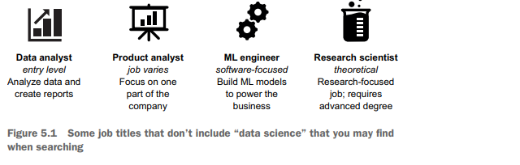

# Recruiting Business Analysts

## Introduction

These two chapters describe the recruiting process 
from the point of view of the job seeker, 
backed by insights gained from the hiring side of the market.

# Chapter 5: The Search

This chapter covers
- Finding open jobs that might be a good fit
- Decoding job descriptions to understand what 
the roles are really like
- Picking the jobs to apply for

Overview of Job Search Process

- Skills and portfolio are in place, but still need a data science job.
- Job search process can take time; expect at least a month for offers.
- Successful applications can often take several months.

Best Practices for Job Search

- Aim to make the job search process less painful.
- Focus on how to look for data science jobs effectively.

Finding Job Opportunities

- Explore various places to find job listings.
- Avoid narrowing options unintentionally.

Decoding Job Descriptions

- Learn to interpret job descriptions to identify necessary skills.
- Not all listed skills may be required.

Choosing the Right Jobs

- Use knowledge of data science skills and company types to select suitable positions.

## Finding jobs

Job Search Strategies
- Know where to send your résumé and cover letter.
- Use job boards like LinkedIn, Indeed, and Glassdoor.
- Check multiple websites since companies may not post on all platforms.
- For underrepresented groups in tech, use specialized sites like POCIT and Tech Ladies.
- Consider the type of job when choosing job boards (e. g. , start-ups on AngelList, technology on Dice).

Job Titles to Consider
- Data analyst: Often a junior role, ideal for newcomers without a STEM degree. Check for programming and statistics involvement.
- Quantitative, product, research, or other types of analysts: These roles can vary widely and may have responsibilities similar to data scientists or revolve around Excel.
- Machine learning engineer: Focuses on machine learning and typically requires a strong engineering background. Suitable for those with a computer science degree or software engineering experience.
- Research scientist: Usually requires a PhD, but a master’s in relevant fields may also be acceptable.

### Decoding descriptions

Job Descriptions in Data Science

Types of Job Postings
- Business Intelligence Analyst Position:
- Uses tools like Excel and Tableau, with minimal coding.
- Not suitable for those wanting to enhance coding skills or knowledge in machine learning or data engineering.

Unicorn Role:
- Requires extensive qualifications (e. g. , PhD, 5+ years as a data scientist).
- Involves diverse responsibilities and may indicate company uncertainty about role expectations.

Understanding Job Requirements
- Identify company needs:
- Determine if the role aims to build a new department or enhance an existing team.
- Assess if immediate contributions are expected or if extensive expertise is required.

Analyze Job Descriptions:
- Be cautious of phrases with deeper meanings (e. g. , "Work hard and play hard" suggests long hours and social obligations).
- "Self-starter and independent" indicates limited support.

Application Flexibility
- Job descriptions are wish lists:
- If you meet about 60% of qualifications, consider applying.
- Don't focus too much on "nice to haves. "

- Experience as a Proxy:
- Years of experience serve as a skill indicator; related experience (including grad school projects) can be relevant.

Common Terminology Confusion
- Similar terms can mean the same thing (e. g. , regression vs. supervised learning).
- Research unknown terms; your past experiences may align with different terminology.

Identifying Red Flags
- Watch for warning signs in job postings to detect potential negative work environments.

Degree Requirements
- Many data science roles require degrees in quantitative fields:
- Applicants without specific degrees can still apply if they have relevant coursework.
- Highlight projects and blog posts that demonstrate capabilities.

###  Watching for red flags

Job Search Process

- Finding a job involves both the employer and the applicant being selective.
- It’s important to avoid toxic workplaces or boring jobs.

Warning Signs to Watch For

No Job Description
- A lack of description for the company or role indicates a one-sided hiring process.
- May suggest the company doesn't consider the applicant's perspective.

Extensive, Broad Requirements
- Job descriptions that list multiple roles (like decision science, analytics, machine learning) as primary responsibilities should be approached cautiously.
- Expecting an individual to be an expert in all areas is unrealistic.

Mismatches Between Requirements and Description
- Be cautious if the job requirements don’t align with the job functions (e. g. , deep learning experience required but tasks involve dashboard creation).
- This may indicate the company is more focused on prestige than practical needs.

###  Setting your expectations

Standards for a Potential Job
- Have standards but avoid demanding perfection.
- Don't view the path to becoming a data scientist as a linear step-by-step process.

Reality of Data Science Jobs
- Common perception of data science as a highly desirable job with a great salary and job satisfaction is idealized.
- Working in data science involves facing challenges such as:
- Incomplete or messy data.
- Unforeseen issues arising during projects.
- Constant learning and adaptation is necessary.

Expectations from Companies
- Idealization of companies can be misleading.
- Companies often receive many job applications and set high bars for candidates.
- The appealing work you read about may not reflect the actual role available.

First Job Realities
- You may not land your dream job in your first data science role.
- Consider transitioning within your current field or incorporating data science into your existing role.
- Allow for some flexibility in job preferences while starting out.
- Job switching is common in the tech industry, and early positions can provide valuable experience.
- Learning from various job experiences—even negative ones—is beneficial.

### Attending meetups

Job Boards and Application Effectiveness
- Job boards are common for finding open positions but not very effective.
- Cold online applications usually have low response rates.
- Most employed data scientists find jobs through recruiters and personal connections.

Building Your Network Through Meetups
- Meetups are in-person meetings held on weekday evenings, often featuring speakers or panels.
- Generally free or have a small fee, sometimes for food.
- Vary in size; can range from 20 to 300 attendees.
- Frequency of meetings varies; some monthly, others a few times a year.
- Topics vary widely; from advanced natural language processing to introductory deep learning.
- Importance of finding enjoyable and welcoming meetups.

Finding Meetups
- Search for meetups on https://www. meetup. com using keywords like data science, machine learning, Python, R, or analytics.

Networking at Meetups
- Many meetups allow announcements about hiring opportunities.
- Approach recruiters; they can offer advice and connections.
- Informational interviews with attendees can provide insight into companies and fields.
- Avoid directly asking for job referrals from people you’ve just met.

Benefits of Attending Meetups
- Great for meeting like-minded individuals and expanding your social circle.
- Helpful for networking, finding mentors, and gaining job-hunting recommendations.
- Some talks may not be recorded, making attendance essential.

Drawbacks of Meetups
- Joining small groups can be intimidating; impostor syndrome may occur.
- Meetups can be insular or lack diversity based on organizers' inclusiveness.

### Using social media

Networking Strategies

- Data science meetups may not be available in rural areas.
- Utilize Twitter and LinkedIn to build a professional network.
- Follow well-known data scientists to discover more connections.
- Start gaining visibility and reputation in the field.

Using Twitter Effectively

- Sharing Work: Promote your own blog posts with brief descriptions.
- Sharing Others' Work: Highlight helpful resources or articles; tag original creators in posts.
- Asking for Help: Seek assistance for unresolved issues, using relevant hashtags or forums.
- Sharing Tips: Post quick tips or advice; even simple insights can help beginners.

Job Search Strategies

- Announce job search on social media to gather leads from personal networks.
- Effective platforms include LinkedIn, Twitter, and even Facebook for broader connections.
- Understand that early career networking can feel limiting; it’s important to build connections beforehand.

Maintaining Job Opportunities

- Avoid focusing solely on one job opportunity; continue applying elsewhere.
- Keep multiple opportunities at various interview stages.
- Don’t consider the job search over until a written offer is signed.

Dealing with Rejection

- Accept rejection as a normal part of job searching; it's often not personal.
- Reasons for rejections often lie outside your control.
- Process any feelings of disappointment in a healthy way.
- Having multiple options keeps motivation high and helps in moving forward.

Making Informed Job Decisions

- Multiple options allow for better decision-making.
- Be clear about non-negotiable job requirements to ensure they are met.
- Avoid waiting for an ideal job; prioritize positions that fulfill your key requirements.

## Deciding which jobs to apply for

Job Application Strategy
- You should have a list of at least a dozen jobs you’re interested in.
- Some people apply to many jobs to increase response chances, but this can weaken each application.
- Tailoring applications requires being selective about where to apply.

Understanding Data Science Roles
- Consider what aspects of data science you want to explore.
- Companies that are new to data science may allow for a broader scope of work.
- Established companies often have specialized roles but may offer better data resources.

Researching Companies
- Check if a company has a data science blog to understand the work of their data scientists.
- Include positive mentions of a company's blog in your cover letter.
- If unfamiliar with a company, visit their website to learn about their services and revenue sources.

Identifying Company Values
- Reflect on what's important to you, such as remote work and vacation days.
- Consider if the company offers support for conference attendance.
- Analyze the company culture based on its communication style—playful vs. family-friendly messaging.

Aligning Benefits with Priorities
- Consider if the company's advertised benefits match your personal priorities.
- Note that negotiation extends beyond salary to overall benefits, covered in later chapters.

#### R AND PYTHON

Job Application Considerations:

- Apply for jobs that use your main programming language.
- Knowing one programming language can help you learn another, but it can be challenging with new job demands.
- Be cautious about jobs that list one language as a plus; it might mean less coding work.
- Jobs requiring both languages may indicate that not everyone on the team knows both, potentially complicating collaboration.
- Clarify during interviews how often each language is used in the team to understand programming skill development opportunities.

Summary
- Search for general terms like data on job boards, and focus on the descriptions,
not the titles.
- Don't worry about meeting 100% of the qualifications listed.
- Remember the job-search process is a two-way street. Look out for red flags, and
think about what kind of data science you want to do.

# Chapter 7: The Interview

This chapter covers
- What interviewers are looking for
- Common types of interview questions
- Proper etiquette when communicating with a 
company

## What do companies want?

### The interview process

## Step 1: The initial phone screen interview

## Step 2: The on-site interview

### The technical interview

###  The behavioral interview

## Step 3: The case study

## Step 4: The final interview

## The offer

## Summary

- The interviewing process is similar across most companies for data science.
- For on-site interviews, expect technical and behavioral questions.
- Be prepared to do a data science case study.
- Take time to prepare for and practice answers to common interview subjects.
- Know what you want to learn about the company and role during your interview.

