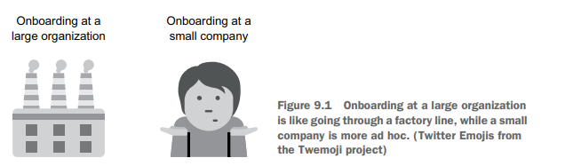

# Onboarding New Analysts

## Introduction

# Chapter 9: The First Months on the Job

This chapter covers

- What to expect in your first few weeks as a data 
scientist
- How to become productive by building 
relationships and asking questions
- What to do if you're in a bad work environment

What to Expect in Your First Few Weeks as a Data Scientist
- The first months significantly affect your job success.
- This is a crucial time to set up a system and a support network.

How to Become Productive by Building Relationships and Asking Questions
- Avoid the impulse to complete tasks quickly.
- Focus on doing tasks correctly rather than just accomplishing them.
- Use your new position to ask questions about processes and expectations.
- Recognize that you lack the institutional knowledge of past employees.

What to Do If You’re in a Bad Work Environment
- Consider how to address or manage challenges in a negative work setting.

##  The first month

Onboarding at Different Companies

Large Companies
- Many data scientists present
- Structured onboarding process
- Available resources and support

Small Companies
- Few or no data scientists
- Less formal onboarding
- Limited resources and support

Conclusion
- Onboarding experiences vary significantly
- Most companies will fall somewhere between large and small examples

### Onboarding at a large organization: A well-oiled machine

Onboarding at a Large Organization
- You start with many others during a formal onboarding process
- Received an email detailing instructions on location, arrival time, and required items
- You are issued a laptop and set it up
- Attend presentations on company culture, HR policies, and organizational structure
- The onboarding process is well-organized, having been done for thousands of employees

Data Science Onboarding
- Assistance is provided for setting up your coding environment
- Expect a checklist or documentation for data access procedures
- Access to a central repository of old reports and data documentation
- It’s normal not to deliver much immediately as co-workers anticipate a learning curve
- Completion of training and access approvals may take weeks

Work Approach and Expectations
- Treat any assignments seriously but prioritize the process over results
- Familiarize yourself with the unique practices of the data science team
- Asking questions is essential for future job performance
- Early months are key for learning processes and team dynamics

### Onboarding at a small company: What onboarding?

Onboarding Experience in a Startup
- Expect some unpreparedness when starting.
- Laptop and access to data may not be ready.
- May struggle to access poorly optimized data; e. g. , SQL queries on small tables can be slow.
- Onboarding sessions may not happen for weeks, depending on new hires.

Lack of Structure
- No established data science standards or guidelines.
- No direction on programming languages or analysis structuring.
- Expected to produce results quickly without comprehensive guidance.

Risks of Working in Chaos
- Potential for making mistakes without immediate feedback.
- Incorrect work may be relied upon for months unnoticed.
- Importance of asking questions to establish understanding.
- Avoid going from crisis to crisis to prevent burnout.
- Emphasize building personal processes for long-term success.

### Understanding and setting expectations

Importance of Meeting with Manager
- Schedule a meeting with your manager in the first weeks to discuss priorities.
- This meeting helps clarify job expectations and goals.

Understanding Job Priorities
- Different data science jobs have different focuses (analyses vs. model building).
- Job expectations can change from the interview process to the start date.
- Early discussions with your manager provide up-to-date information.

Defining Success
- Work with your manager to define what success looks like in your role.
- Success is often about contributing to team and managerial goals.
- Understand the team's problems and performance evaluation methods.

Performance Goals Clarification
- Performance goals are not solely about accuracy or using the latest models.
- Focus on the utility, insights, and maintainability of models rather than just accuracy.

Job Responsibilities and Teamwork
- Different companies have varied expectations regarding teamwork and project management.
- Some prioritize collaboration and quick shifts to assist others, while others focus on individual deliverables.
- Regular meetings with your direct supervisor are key to understanding expectations.

Feedback and Progress Monitoring
- Weekly one-on-ones provide a platform to discuss progress and challenges.
- Get explicit feedback instead of guessing what is expected.
- Short-term focus helps stay aligned before larger performance reviews.

#### Setting yourself up for success

- In larger companies, there is usually a formal performance review process.
- Ask about the performance review process and its schedule.
- Common practice involves reviews every six months, possibly with salary increases and promotions.
- Reviews may follow a 360 process, receiving feedback from managers and peers.
- Determine if you choose your peers for feedback or if your manager does.
- Established data science teams may have a matrix for evaluation criteria based on seniority levels.
- Junior data scientists may need foundational knowledge; mid-level may have one area of expertise; senior may be the expert in a specific area.
- If no matrix exists, work with your manager to identify evaluation areas.
- Plan a review with your manager after your first three months if it’s not standard.
- The review ensures alignment with your manager and updates on progress.
- Defining success doesn’t require excelling in every area initially.
- Most companies won’t formally evaluate employees in the first six months due to on-ramping.
- Defining success is about understanding your role and keeping the big picture in mind.

###  Knowing your data

Learning About Data Science

- Understand the importance of data science in your company.
- Start by reading reports written by employees for insights into data and communication styles.
- Learn how to convey information to nontechnical peers.
- Observe how reports simplify or complicate concepts for better communication.

Accessing Data

- Identify where the data is stored and how to access it.
- Familiarize yourself with data systems, such as SQL databases and HDFS.
- Review documentation about the data for quality issues and quirks.
- Avoid "mysteries" in the data by consulting documentation first.

Understanding Data Quality

- Analyze a few rows and summary statistics to identify potential issues.
- Consult with experts about unexpected findings in the data.
- Be cautious of mixed data from testing and real scenarios.
- Recognize that some datasets may include users with extreme behaviors affecting analysis.

Investigating Data Shape

- Assess the overall state of data in your company.
- Smaller companies may require collaboration with engineers for additional data.
- Larger companies may require navigating numerous tables to find relevant data.
- Well-maintained tables are crucial for core metrics, but less-documented areas may need further exploration.

Data Processes and Pipelines

- Understand how data moves through various systems before reaching your database.
- Different systems can alter data; know where to troubleshoot if data collection stops.
- Dealing with manually inputted data requires understanding potential human errors.

Documentation and "Gotchas"

- Document any issues ("gotchas") you encounter with the data.
- Create a map of where data is stored to assist future work.
- Good documentation benefits current team members and new hires.
- Store documentation in an accessible location for the whole company to improve data discovery.

## Becoming productive

Making Your Manager Look Good

- Initial performance may make things harder for your manager.
- It is expected to take time to become fully productive.
- Feeling frustrated during this period is normal due to the cognitive load of a new environment.

Understanding Workplace Norms

- Learn unspoken norms about lunch breaks, working hours, and communication styles.
- Familiarize yourself with the company's data systems.

Dealing with Impostor Syndrome

- Avoid the pressure of proving yourself quickly; ramp-up time is expected in most companies.
- Focus on delivering long-term value over immediate performance.

Early Contributions

- Initial contributions may require asking for resources and guidance.
- Deliver simple, descriptive analyses (e. g. , client size distribution, active user percentage) to provide early value.
- Familiarize yourself with the company's data and identify potential issues.

Manager Check-Ins

- Regularly share in-progress work with your manager to ensure proper direction.
- Avoid working on complex questions without understanding the details of the data first.

Identifying the Right Questions

- Stakeholders may ask complicated questions early on, but focus on the data questions behind them.
- Understand basic facts to guide your work effectively.

Strategies for Productivity

- Ask questions to speed up understanding of job details.
- Build relationships to better understand your role within the organization.

### Asking questions

The Importance of Asking Questions
- Fear of asking questions or admitting "I don’t know" can hinder career growth.
- Data science is vast; no one knows everything.
- Managers prefer employees who ask questions rather than struggle for days.

Types of Questions to Ask
- Technical questions: Examples include statistical tests used in analyses.
- Business questions: Examples include identifying the responsible team for a product.

Tips for Asking Better Questions
- Understand Question Culture: Observe how questions are typically asked in the company (in-person, Slack, forums, email).
- Be Proactive: Show prior research before asking questions.
- Avoid Simple Questions: Don’t ask easily found answers (e. g. , basic programming differences).
- Respect Experts' Time: Identify experts for specific questions and consider scheduling dedicated meetings instead of frequent interruptions.
- Avoid Criticism veiled as Questions: Seek genuine understanding rather than criticizing current methods or decisions (e. g. , complex systems and historical decisions).
- Pairing with Others: Learn by observing how colleagues find answers or solve problems in real-time.
- Maintain a Question List: Compile a list of non-urgent questions to discuss with a mentor or manager to prevent constant interruptions.

###  Building relationships

Building a Support Network

- Feeling comfortable in a new work environment requires building a support network.
- Engage in nontechnical talk with colleagues.
- Set up meetings with unfamiliar colleagues to learn about them and their work.
- Use questions to start conversations and show you are friendly and polite.

Connecting with Colleagues

- Message those you will be working closely with to arrange a 30-minute meeting.
- If in a large office, ask your manager for a list of important people to know.
- Identify individuals to turn to for specific questions or technical issues.
- Make an effort to introduce yourself to your skip-level boss for better recognition.

Meeting Stakeholders

- Meet all stakeholders you will collaborate with, especially in small teams.
- Hold informal meetings to avoid only being known as an email signature.
- Use video conferencing to connect faces, even if working remotely.

Listening and Learning

- Do a lot of listening during meetings and social events like lunch.
- Meet people in data-adjacent areas to understand their roles.
- Avoid rushing to make commitments or claims about improving their work.
- Get to know colleagues personally by asking about their lives outside of work.

Befriend the Office Manager

- Befriend the office manager, who influences daily comfort at work.
- Show appreciation for their hard work and the little things they manage.

#### Mentorship and Sponsorship 

- Finding a mentor is common career advice but can be hard to act on.
- A mentor provides career advice and helps with decision-making.
- There are no specific classes or books on how to find a mentor.

Finding a Mentor
- Mentorship does not always have to be a long-term commitment.
- Angela Bassa created a list for data science newcomers to connect with mentors at datahelpers. org.
- A mentor can assist with specific problems, like behavioral interviews or project development.

Role of a Sponsor
- A sponsor is more influential than a mentor.
- Sponsors provide opportunities such as project funding or promoting individuals.
- It’s crucial to show sponsors you can excel in the given opportunity.

Building Confidence with Sponsors
- Be responsive and polite in communications to build confidence with a sponsor.
- Share your relevant experiences to demonstrate capability even if you haven’t done the exact task before.

Long-Term Relationships with Mentors and Sponsors
- Keep mentors and sponsors informed about your progress and successes.
- Many mentors and sponsors enjoy seeing how their advice helps you.
- Avoid only reaching out when you need something to prevent appearing using them.

Community Connections
- Finding sponsors and mentors within your company is vital, especially in larger organizations.
- Data scientists often change jobs; building a network outside your company is beneficial.
- Create a positive reputation within the broader data science community for lasting connections.

## If you're the first data scientist

Challenges of Being the First Data Scientist

- Starting as the first data scientist presents unique challenges.
- Many small companies lack data scientists, making this situation common.
- Preparation is crucial when beginning this role.

Lack of Precedents

- No established guidelines for programming languages (Python, R, etc. ).
- Uncertainty about work management (e. g. , using agile practices).
- Decisions about code management need to be made (tools like GitHub or Microsoft TFS).
- Initial choices will set precedents for future team members.

Decision-Making Implications

- Personal preferences in tools may impact future data scientists.
- Aim for decisions that benefit future team dynamics.
- Balancing future considerations with current needs is important.
- Unproductive efforts can arise from over-planning for future hires.

Selling Data Science to the Organization

- Need to educate the organization on the role of data science.
- Fast understanding leads to better collaboration and support for data science.
- Manage expectations about what data science can achieve and how quickly.
- Regular communication about capabilities and goals is essential.

Workload and Visibility

- High visibility and accountability as the only data scientist.
- Quiet work on models is not feasible; active engagement is necessary.

Benefits of the Role

- Greater influence in technical decisions aligned with personal preferences.
- Increased recognition within the organization.
- Potential to lead the data science team as it grows, benefiting career advancement.

## When the job isn't what was promised

Reality of Data Science Jobs
- Entering a data science job can be disappointing.
- Expectations may not match reality, leading to frustration.
- Concerns about leaving a job too soon affecting résumé.

Challenges of Leaving
- Difficulty in managing a bad work environment.
- Uncertainty about whether to stay or leave.
- Question of whether a timeframe of a year is necessary.

Types of Problems
- Issues with the quality of work.
- Presence of a toxic work environment.

Mitigation Strategies
- No single solution available.
- Discussion of potential strategies to address these issues.

###  The work is terrible

Recognizing Expectations in Data Science

- Assess your expectations regarding data quality and preparation.
- Understand that data issues are common in all data science roles.
- Even large companies with many engineers face similar data challenges.
- Expect to improve or collaborate on data within your subareas.

Validating Expectations with Peers

- Discuss your data environment with other data scientists for perspective.
- Reach out to alumni or peers for their insights.
- Attend meetups or online communities, especially if you're in a small or rural area.
- Compare experiences with other data scientists at your company.

Dealing with Tedious Work

- Acknowledge the possibility of monotonous tasks (e. g. , just rerunning models).
- Look for opportunities to initiate side projects or automate processes.
- Use downtime to enhance your portfolio with projects, blog posts, or online courses.

Learning from Negative Experiences

- Find ways to tailor your job for better learning experiences.
- Identify areas for personal improvement despite challenging circumstances.
- Learn from mistakes in team-building and understand common pitfalls.
- Use experiences from a less-than-ideal job to better prepare for your next role.

### The work environment is toxic

Managing Toxic Work Environments

- Addressing unrealistic expectations from managers and stakeholders.
- Risk of being penalized for unachievable goals, like predicting lifetime value without data.
- Companies may expect data scientists to solve complex problems with little industry precedent.
- Importance of adjusting company expectations to avoid feeling like an underperformer.
- Speaking up is challenging, but there are often reasonable colleagues available for support.
- Warning signs include blaming individuals for failures that are beyond reasonable expectations.

Team Collaboration Issues

- Teams may fail to collaborate, leading to a competitive and toxic environment.
- A zero-sum game mentality can cause sabotage instead of teamwork.
- Lack of cooperation can result in wasted efforts and duplicated projects due to data sharing issues.

Workplace Hostility

- Toxic environments can be sexist, racist, homophobic, or generally hostile.
- Subtle issues, like being talked over or misgendered, contribute to discomfort in the workplace.
- Resolving these problems typically requires involvement from upper management.
- Toxicity may indicate poor leadership or may be exacerbated by a single problematic individual.

Considerations for Leaving

- Assess whether the work environment is manageable or needs a change.
- Consider leaving if attempting to improve the situation leads to burnout.

###  Deciding to leave

Deciding to Leave Your Job

- Leaving your job is a personal decision.
- No simple solution exists for making this choice.
- Consider the following questions:
- Do you have financial support such as savings, a partner's income, or family loans?
- Is your job negatively impacting your health or personal life?
- Have you discussed work issues with your manager to seek solutions?
- Can you switch teams or roles soon?

Next Steps If You Feel You Must Leave

- Start looking for new jobs if needed.
- Concerns about a short job stint on your résumé:
- If you've been employed for only a few weeks, consider returning to your previous job if you left positively.

Interview Tips for Short Job Stints

- Let the interviewer bring up your short work history; it may not be a concern.
- Share positive experiences or lessons learned from the job.
- Keep explanations for leaving concise:
- Use a neutral response such as, "The job requirements weren’t what I expected. "
- If applicable, mention insights gained about the work environment you prefer.

If You Can't Leave Your Job

- Remember, you are not your job; don’t take on company responsibilities.
- Focus on your health: maintain sleep, exercise, and social connections.
- Talk to someone for support; they can listen or give advice.
- Consider reporting any personal harassment to HR:
- Document your reports and maintain written records.
- If no action is taken, consider filing a claim with the Equal Employment Opportunity Commission.
- Be aware of potential retaliation from reporting harassment.
- Explore alternative options if leaving seems difficult:
- Acknowledge that staying in a toxic environment has long-term negative effects.
- A short-term sacrifice to leave may benefit you in the long run.

Final Thoughts

- Keep emergency information handy regarding job transitions.
- Job switching is common in the data science field; prioritize your comfort over job security in an unpleasant environment.

Summary

- Don't worry about becoming fully productive right away. Instead, focus on building relationships, tools, and your understanding of the data, which will make
you productive in the long term.
- If you're in a bad work situation, try to work to get control to mitigate the
impact on your health and career.

